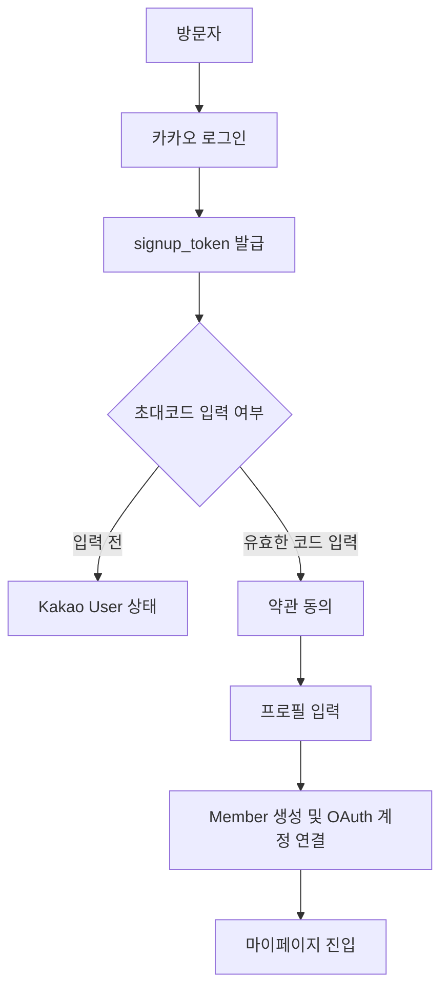
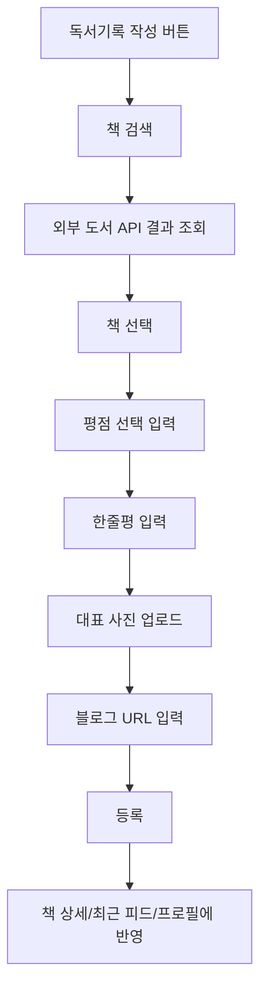
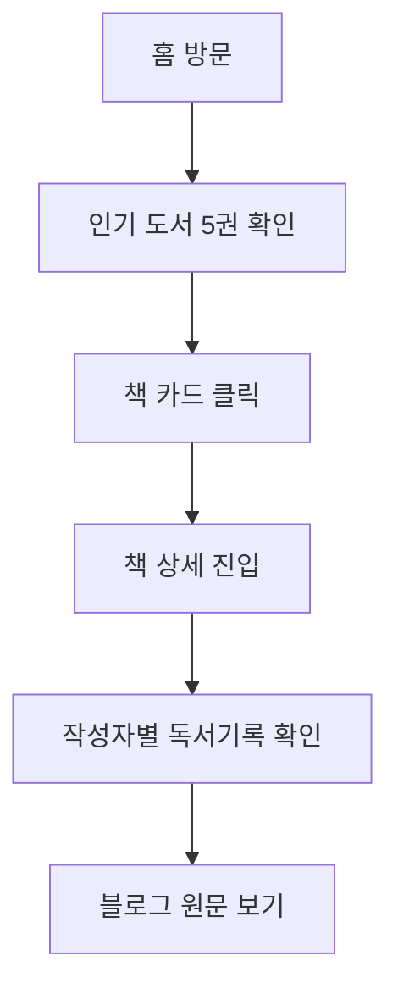
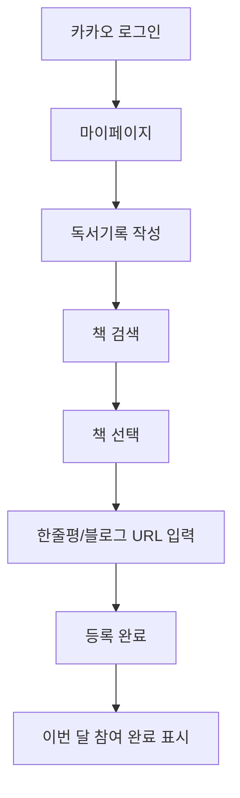
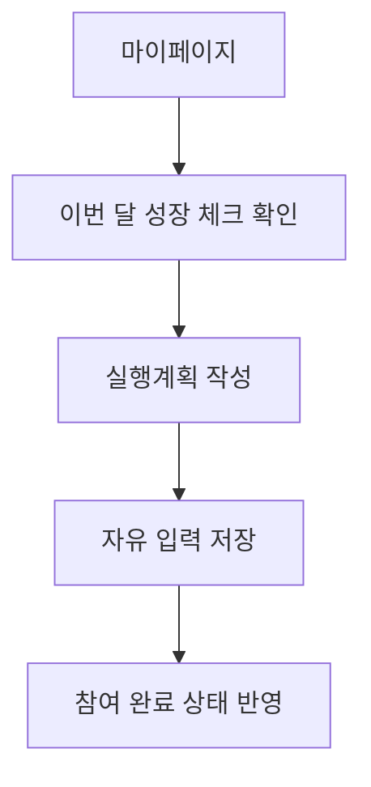
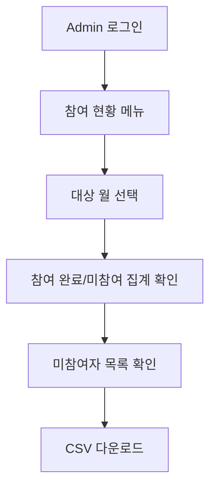
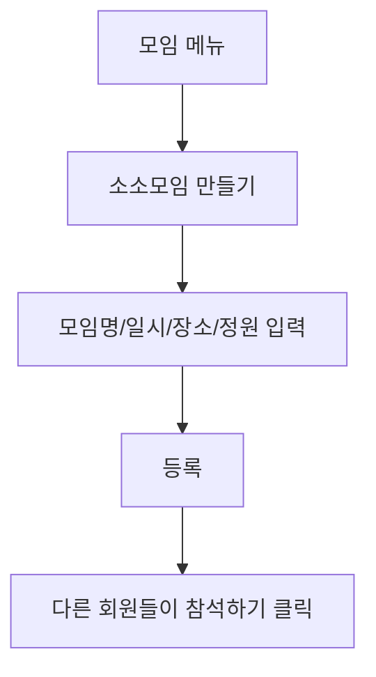

# PRD-001. 부자습관 만들기 - Growth Archive

> **읽고, 실행하고, 성장한 기록을 남기는 사람들**  
> 사람은 목표를 이루며 성장하지만, 성장은 기록될 때 자산이 된다.

---

## 문서 메타데이터

| 항목 | 내용 |
|---|---|
| 문서명 | PRD-001. 제품 비전 및 MVP 요구사항 |
| 서비스명 | 부자습관 만들기 - Growth Archive |
| 프로젝트명 | `growth-archive` |
| 문서 버전 | v1.1 Final Candidate |
| 작성일 | 2026-06-22 |
| 작성 목적 | MVP 개발 착수를 위한 제품 방향, 기능 범위, 운영 정책, 기술/디자인 원칙 정의 |
| 주요 대상 | 기획자, 디자이너, 백엔드 개발자, 프론트엔드 개발자, 운영진 |
| 문서 상태 | Final Candidate. 본 문서는 MVP 개발 기준 문서이며, 확정 대기 항목은 30장에 별도 관리한다. |


---

## 문서 검토 및 보완 기준

이 최종본은 기존 `PRD_001_Growth_Archive.md` 초안을 검토한 뒤, PRD가 단순 기능 목록이 아니라 **제품이 요구사항을 충족하는 형상을 팀 전체가 같은 그림으로 이해하게 만드는 기준 문서**가 되도록 보완한 버전이다.

보완 시 적용한 기준은 다음과 같다.

1. **요구사항의 주어를 명확히 한다.**  
   “기능이 있다”가 아니라 “어떤 사용자가 어떤 상황에서 무엇을 할 수 있어야 하는가”로 작성한다.

2. **제품의 형상을 손에 잡히게 만든다.**  
   비전 문장만 남기지 않고, 화면에 어떤 정보가 보이고 어떤 상태로 바뀌는지까지 기술한다.

3. **페르소나, 메인 시나리오, 유스케이스를 둔다.**  
   개발자와 디자이너가 같은 장면을 떠올릴 수 있도록 대표 사용자의 행동 흐름을 문서 안에 둔다.

4. **Source of Truth로 쓴다.**  
   개발 중 정책 판단이 필요할 때 이 문서를 먼저 확인한다. 아직 확정되지 않은 내용은 숨기지 않고 “결정 대기 항목”으로 남긴다.

5. **모호한 표현을 줄인다.**  
   “적절히”, “잘”, “편하게” 같은 표현은 가능한 한 입력 항목, 권한, 상태, 조건, 에러 메시지, Acceptance Criteria로 바꾼다.

---

## 문서 사용 원칙

### 이 문서가 결정하는 것

- MVP에서 만들 기능과 만들지 않을 기능
- Guest, Kakao User, Member, Admin의 권한
- 독서기록, 실행계획, 회고, 모임, 후기, 성장 프로필의 핵심 정책
- 월간 참여 현황과 투썸 아메리카노 커피 후원 대상자 계산 기준
- 모바일 웹뷰 대응, SEO, 이미지 처리, 보안, 개인정보의 기본 원칙

### 이 문서가 세부 구현까지 결정하지 않는 것

아래 항목은 별도 후속 문서에서 상세화한다.

- DB 테이블/컬럼/인덱스: TSD-001
- API URL, Request/Response, Error Code: TSD-002
- 화면 와이어프레임과 상세 상태: PRD-004
- 관리자 페이지 상세 UX: OPS-001 및 PRD-004
- 디자인 토큰, 색상, 폰트, 컴포넌트 규칙: DESIGN-001
- 배포/인프라/모니터링: TSD-001 및 OPS-001

### 해석 우선순위

개발 중 충돌이 발생하면 다음 순서로 판단한다.

1. 회원이 기록을 남기는 과정이 간편한가?
2. 기존 부자습관 만들기의 문화가 자연스럽게 이어지는가?
3. 운영진이 월간 참여 현황을 명확히 확인할 수 있는가?
4. 기록이 책별, 사람별, 월별로 장기적으로 쌓이는가?
5. 기능이 커뮤니티를 경쟁적으로 만들지 않는가?


## 0. 결정 사항 요약

이 문서는 지금까지 논의한 내용을 기반으로 작성된 **부자습관 만들기 - Growth Archive MVP의 기준 문서**다.  
기능을 많이 만드는 것보다, 커뮤니티의 실제 문화가 웹서비스 안에서 자연스럽게 이어지는 것을 최우선으로 한다.

### 0.1 제품 정체성

| 구분 | 내용 |
|---|---|
| 브랜드 | 부자습관 만들기 |
| 서비스 컨셉 | Growth Archive |
| 한 줄 소개 | 읽고, 실행하고, 성장한 기록을 남기는 사람들 |
| 핵심 방향 | 독서모임 홈페이지가 아니라, 사람 중심 성장 아카이브 |
| MVP 우선순위 | 기존 회원 기록 정리 → 브랜드/신뢰도 형성 → 독립 플랫폼화 → 신규 회원 모집 |

### 0.2 MVP 핵심 기능

1. 카카오 로그인 + 초대코드 기반 멤버 인증
2. 성장 프로필 / 성장하는 사람들
3. 독서기록 라이브러리
4. 책 검색 API 기반 도서 등록
5. 이달의 추천책 3~5권
6. 인기 도서 5권
7. 월간 실행계획 작성
8. 월간 회고 작성
9. 이번 달 참여 현황
10. 기본 모임 / 소소모임
11. 모임 후기 및 사진 업로드
12. 관리자 페이지
13. 기존 기록 이관을 위한 관리자 등록/CSV 업로드 기반 구조

### 0.3 확정된 주요 정책

| 영역 | 확정 정책 |
|---|---|
| 로그인 | 카카오 로그인 |
| 멤버 인증 | 초대코드 입력 시 자동 승인 |
| 초대코드 | 로컬 기본값은 `test`, 운영에서는 Admin이 관리하는 공용 코드 1개 |
| 운영진 권한 | 운영진 5명 권한 동일 |
| 프로필 공개 | 비공개 없음. 실명 공개 또는 닉네임 공개 중 선택 |
| 닉네임 | 중복 허용 안 함 |
| 프로필 사진 | 회원 업로드 이미지 → 카카오 프로필 → 기본 이미지 순서 |
| 직업 | MVP에서 수집하지 않음 |
| 생년월일 | 선택 입력, 공개 프로필 비노출 |
| 관심 분야 | 운영진 관리 태그 중 회원이 선택 |
| 50살의 나 | 프로필 상단에 크게 노출, 언제든 수정 가능 |
| 독서기록 방식 | 블로그 작성 후 링크 등록 |
| 독서기록 공개 | Guest도 조회 가능, 블로그 링크도 Guest 접근 가능 |
| 평점 | 선택 입력 |
| 대표 사진 | 책 표지 사진 또는 실제 독서 인증 사진 모두 가능 |
| 독서기록 메인 | 이달의 추천책, 인기 도서 5권, 최근 독서기록 |
| 책 상세 | 평균 평점, 독서기록 수, 읽은 사람, 작성자별 기록 카드 |
| 월간 실행계획 | 자유 입력, 멤버 공개, 매월 1개 기준 |
| 월간 회고 | 매월 자동 생성, 작성 의무 없음, 멤버 공개, 언제든 수정 가능 |
| 참여 규칙 | 매월 독서기록 1건 또는 월간 실행계획 1건 작성 시 참여 완료 |
| 미참여 기준 | 해당 월 독서기록 0건 AND 실행계획 0건 |
| 커피 후원 | 투썸 아메리카노 1잔 |
| 모임 참석 | 버튼 클릭 시 즉시 참석 |
| 소소모임 생성 | 승인된 멤버 누구나 가능 |
| 소소모임 수정 | 생성자만 가능 |
| 모임 후기 작성 | 시스템 참석 여부와 관계없이 Active Member 누구나 가능 |
| 후기 사진 | 최대 10장, 자동 리사이징, 가능하면 WebP 변환, 원본 저장 안 함 |
| 현재 모바일 전략 | 모바일 퍼스트 반응형 웹 + 웹뷰 대응 |
| 향후 모바일 전략 | PWA → 하이브리드/네이티브 앱 검토 |


### 0.4 결정 로그

| 결정 ID | 결정 내용 | 결정 이유 | 상태 |
|---|---|---|---|
| D-001 | 서비스명은 `부자습관 만들기 - Growth Archive`로 한다. | 기존 모임 정체성과 성장 아카이브 컨셉을 동시에 유지한다. | 확정 |
| D-002 | 프로젝트명은 `growth-archive`로 한다. | 독서기록을 넘어 성장 기록 전체를 담는다. | 확정 |
| D-003 | 백엔드는 Java 25 + Spring Boot 4.1.0으로 한다. | 운영자가 직접 구현/유지보수 가능한 기술을 우선한다. | 확정 |
| D-004 | DB는 Supabase PostgreSQL을 우선 검토한다. | 관리형 PostgreSQL을 사용해 초기 운영 부담을 낮춘다. | 확정 |
| D-005 | 카카오 로그인 + 초대코드 인증을 사용한다. | 한국 사용자 접근성과 초대 기반 커뮤니티 문화를 유지한다. | 확정 |
| D-006 | 월간 참여 완료 조건은 독서기록 1건 또는 실행계획 1건이다. | 오프라인 참석 여부보다 매월 하나의 성장 흔적을 남기는 문화를 우선한다. | 확정 |
| D-007 | 모임 참석은 참여 완료 조건에 포함하지 않는다. | 일정 문제로 참석하지 못해도 기록으로 참여할 수 있어야 한다. | 확정 |
| D-008 | 월간 회고는 자동 슬롯을 제공하되 작성 의무는 없다. | 회고는 성장 기록을 풍성하게 하는 선택 기능이다. | 확정 |
| D-009 | 모임 후기는 시스템 참석 여부와 관계없이 Active Member 누구나 작성 가능하며 사진은 최대 10장이다. | 모임의 분위기를 공개 자산으로 축적한다. | 확정 |
| D-010 | 디자인 구현 기준은 DESIGN-001의 `Premium Editorial 40% / Trevari-like Community Mood 25% / Notion-like Clean Archive 20% / GitHub Profile-like Growth Record 15%` 방향을 따른다. | 리얼 사진과 프리미엄 브랜드감을 강화하면서 차분한 기록실, 활동 히스토리, 커뮤니티 신뢰감을 균형 있게 담는다. | 확정 |

### 0.5 요구사항 작성 규칙

본 문서의 요구사항은 다음 형식을 따른다.

```text
[Actor]는/은 [상황]에서 [행동]을 할 수 있어야 한다.
시스템은 [조건]이 충족되면 [상태]를 [결과]로 변경해야 한다.
```

예시:

```text
Member는 독서기록 작성 화면에서 책 제목 또는 저자명으로 외부 도서 API를 검색할 수 있어야 한다.
시스템은 같은 월에 독서기록 1건 이상 또는 실행계획 1건이 존재하면 해당 Member의 월간 참여 상태를 완료로 계산해야 한다.
```


---

## 1. 제품 개요

### 1.1 서비스명

**부자습관 만들기 - Growth Archive**

### 1.2 태그라인

**읽고, 실행하고, 성장한 기록을 남기는 사람들**

### 1.3 제품 한 줄 정의

부자습관 만들기 - Growth Archive는 회원들이 읽고, 실행하고, 회고하고, 모임을 통해 성장한 흔적을 장기적으로 기록하고 검색할 수 있게 만드는 **사람 중심 성장 아카이브 플랫폼**이다.

### 1.4 제품이 아닌 것

이 서비스는 다음을 목표로 하지 않는다.

- 단순 독서모임 소개 홈페이지
- 트레바리 또는 탐독의 복제 서비스
- 카페형 게시판
- SNS형 피드 서비스
- 투두리스트 / OKR 관리 서비스
- 결제 기반 모임 플랫폼
- 채팅 플랫폼
- 랭킹/경쟁 기반 게이미피케이션 서비스

### 1.5 제품이 지향하는 것

이 서비스는 다음을 지향한다.

- 읽은 책이 사라지지 않고 쌓이는 라이브러리
- 각 회원이 어떤 방향으로 성장하고 있는지 보여주는 성장 프로필
- 모임이 한 번의 이벤트로 끝나지 않고 기록으로 남는 아카이브
- 매월 최소 하나의 성장 흔적을 남길 수 있게 돕는 가벼운 참여 시스템
- 기존 소모임 앱에 갇혀 있던 커뮤니티 자산을 독립 웹 플랫폼으로 옮기는 기반

---

## 2. 배경 및 문제 정의

### 2.1 현재 커뮤니티 운영 방식

부자습관 만들기 모임은 현재 소모임 앱을 중심으로 운영되고 있으며, 약 40명의 회원이 모두 조금씩 활동하고 있다. 핵심 운영진은 5명이다.

현재 진행 중인 주요 활동은 다음과 같다.

1. 매월 실행계획을 세우고 지난달 실행을 회고하는 오프라인 모임
2. 매월 읽은 책을 공유하고 이야기 나누는 독서기록 오프라인 모임
3. 단톡방에서 매일 인증글 및 좋은 자료 공유
4. 소모임 앱에 모임 후기, 독서기록, 가입인사, 공지 기록
5. 노션에 운영 자료 및 일부 기록 관리
6. 개인 블로그에 장문 독서기록 작성 후 소모임에 링크 등록

### 2.2 현재 데이터 저장 위치

| 데이터 | 현재 위치 | 문제점 |
|---|---|---|
| 독서기록 | 소모임 게시글, 개인 블로그, 노션 일부 | 책별/사람별 검색 어려움 |
| 모임 후기 | 소모임 게시글 | 시간이 지나면 묻힘 |
| 실행계획 | 소모임/오프라인/노션 등 분산 | 월별 참여 현황 추적 어려움 |
| 월간 회고 | 오프라인 대화 중심 | 장기 성장 히스토리로 남지 않음 |
| 가입인사 | 소모임 게시글 | 성장 프로필로 연결되지 않음 |
| 좋은 자료/인사이트 | 카카오톡 단톡방 | 휘발성이 높음 |

### 2.3 핵심 문제

#### 문제 1. 기록은 쌓이고 있으나 검색되지 않는다.

독서기록, 후기, 실행계획은 꾸준히 작성되고 있지만 소모임 앱 안에 흩어져 있어 책별, 사람별, 월별로 찾아보기 어렵다.

#### 문제 2. 커뮤니티의 실제 가치가 외부에서 보이지 않는다.

신규 회원은 가입 전 모임의 수준, 분위기, 활동량, 기록 문화를 충분히 확인하기 어렵다.

#### 문제 3. 회원 개인의 성장 과정이 단절되어 있다.

회원이 읽은 책, 작성한 실행계획, 참석한 모임, 작성한 후기가 각각 따로 존재하여 한 사람의 성장 히스토리로 연결되지 않는다.

#### 문제 4. 운영진의 월간 참여 확인 업무가 수동적이다.

현재는 매월 독서기록 또는 실행계획을 작성하지 않은 사람을 운영진이 수동으로 확인해야 한다. 커피 후원 대상자를 추리는 과정도 시스템화되어 있지 않다.

#### 문제 5. 소모임 앱 의존도가 높다.

진입점, 기록, 후기, 모임 안내가 모두 소모임 앱에 집중되어 있어 장기적으로 커뮤니티 독립성이 낮다.

---

## 3. 제품 비전과 원칙

### 3.1 제품 비전

> 사람은 목표를 이루며 성장하지만, 성장은 기록될 때 자산이 된다.

Growth Archive는 부자습관 만들기 회원들이 읽고, 실행하고, 회고하고, 함께한 흔적을 기록으로 보존한다.  
이 기록은 한 달의 인증을 넘어, 시간이 지나도 다시 꺼내볼 수 있는 개인과 커뮤니티의 자산이 된다.

### 3.2 핵심 가치

| 가치 | 설명 |
|---|---|
| 독서 | 좋은 책을 읽고 자기 삶과 연결한다. |
| 실행 | 읽고 느낀 것을 삶의 행동으로 옮긴다. |
| 회고 | 한 달을 돌아보고 다음 달을 준비한다. |
| 성장 | 어제보다 나은 방향으로 조금씩 나아간다. |
| 연결 | 같은 방향을 바라보는 사람들과 함께한다. |
| 기록 | 성장의 흔적을 사라지지 않는 자산으로 남긴다. |

### 3.3 제품 운영 철학

Growth Archive는 경쟁이 아니라 기록을 중심에 둔다.

- 랭킹을 만들지 않는다.
- 점수 경쟁을 만들지 않는다.
- 다른 사람과 비교하지 않는다.
- 한 달에 하나만 해도 뿌듯하게 느껴지도록 만든다.
- 운영진에게는 필요한 관리 정보를 제공하되, 회원에게는 부담보다 성취감을 준다.

### 3.4 사용자가 느껴야 하는 감정

홈 화면과 마이페이지에서 사용자가 느껴야 하는 감정은 다음과 같다.

1. “이 사람들 진짜 꾸준히 살고 있구나.”
2. “나도 여기에 기록을 남기고 싶다.”
3. “이번 달 하나는 해냈다.”
4. “내가 어디로 가고 있는지 조금 더 선명해졌다.”

---

## 4. 목표와 성공 지표

### 4.1 제품 목표

| 목표 ID | 목표 | 설명 |
|---|---|---|
| G-001 | 기록 이관 | 소모임/노션/블로그에 흩어진 기존 기록을 웹에서 조회 가능하게 만든다. |
| G-002 | 독서기록 라이브러리 | 책별/작성자별 독서기록을 검색하고 탐색할 수 있게 만든다. |
| G-003 | 성장 프로필 | 회원 개인의 독서, 실행, 회고, 모임 활동을 프로필에 축적한다. |
| G-004 | 월간 참여 관리 | 독서기록 또는 실행계획 작성 여부를 기준으로 월간 참여 현황을 자동 계산한다. |
| G-005 | 모임 아카이브 | 기본 모임과 소소모임을 만들고 참석자, 후기, 사진을 기록한다. |
| G-006 | 모바일 접근성 | 웹뷰에서도 자연스럽게 사용할 수 있는 모바일 퍼스트 웹을 만든다. |
| G-007 | 미래 확장성 | 향후 성장 로드맵, 앱, AI 리포트 확장을 고려한 데이터 구조를 만든다. |

### 4.2 MVP 성공 지표

초기 MVP의 성공은 신규 유입보다 **기존 회원의 기록 정착**으로 판단한다.

| 지표 | 의미 | 초기 목표안 |
|---|---|---|
| 회원 온보딩률 | 기존 활동 회원 중 프로필 생성 완료 비율 | 1개월 내 70% 이상 |
| 50살의 나 작성률 | 가입 완료 회원 중 50살의 나 작성 비율 | 1개월 내 60% 이상 |
| 월간 독서기록 수 | 한 달 동안 등록된 독서기록 수 | 월 20건 이상 |
| 월간 실행계획 작성 수 | 한 달 동안 작성된 실행계획 수 | 월 20건 이상 |
| 월간 참여 완료율 | 독서기록 또는 실행계획 중 하나 이상 완료한 멤버 비율 | 월 70% 이상 |
| 모임 후기 작성 수 | 월간 등록 후기 수 | 월 2건 이상 |
| 기존 기록 이관 수 | 소모임/노션에서 이관한 독서기록/후기 수 | 초기 100건 이상 |

> 위 숫자는 초기 가설이며, 실제 운영 데이터 확보 후 조정한다.

---

## 5. MVP 범위

### 5.1 MVP 포함 범위

| 영역 | 포함 기능 |
|---|---|
| 인증 | 카카오 로그인, 초대코드 입력, 멤버 자동 승인 |
| 회원 | 프로필, 50살의 나, 한 줄 소개, 관심 분야, 성장 통계 |
| 독서기록 | 책 검색, 독서기록 등록, 책 상세, 인기 도서 5권, 최근 독서기록 |
| 추천도서 | 이달의 추천책 3~5권, 추천 이유, 관리자 관리 |
| 실행 | 월간 실행계획 자유 입력 |
| 회고 | 월간 회고 자동 생성 슬롯, 선택 작성 |
| 참여 현황 | 월간 독서기록/실행계획 기준 참여 완료 여부 계산 |
| 모임 | 기본 모임 자동 생성, 참석하기, 참석자 프로필 표시 |
| 소소모임 | 멤버 생성, 정원 설정, 참석하기, 생성자 수정 |
| 후기 | Active Member 후기 작성, 사진 최대 10장 업로드 |
| 관리자 | 초대코드, 추천책, 태그, 회원, 모임, 후기 관리 |
| 데이터 이관 | 관리자 수기 등록 및 CSV 기반 이관 구조 |
| 모바일 | 모바일 퍼스트 반응형 웹, 웹뷰 대응 |

### 5.2 MVP 제외 범위

| 제외 기능 | 제외 이유 |
|---|---|
| 결제 | 커피 후원은 운영 확인용만 제공하고 결제/송금은 다루지 않는다. |
| 채팅 | 카카오톡 단톡방이 이미 존재하며 MVP 핵심이 아니다. |
| 댓글 | 운영 난이도와 알림/신고/관리 비용이 커진다. |
| 좋아요/응원하기 | MVP 이후 검토. 초기에는 기록 축적이 우선이다. |
| 포인트/랭킹 | 경쟁보다 기록 중심 철학에 맞지 않는다. |
| 네이티브 앱 | 초기에는 모바일 웹/웹뷰로 대응한다. |
| 고급 통계 | 기본 성장 통계만 제공하고, 상세 리포트는 Phase 2 이후 검토한다. |
| AI 요약/분석 | 기존 기록 구조화 이후 검토한다. |
| 실시간 알림 | MVP 이후 검토한다. |
| 대기자 관리 | 소소모임 정원 초과 시 대기 기능은 제외한다. |


### 5.3 MVP 기능 요구사항 매트릭스

아래 매트릭스는 MVP에서 반드시 구현되어야 하는 핵심 요구사항이다. 상세 화면과 API는 후속 PRD에서 분리하지만, 이 표의 요구사항은 MVP 범위 판단의 기준이 된다.

| ID | Actor | 요구사항 | 우선순위 | 성공 조건 |
|---|---|---|---|---|
| FR-001 | Guest | Guest는 로그인 없이 홈, 독서기록, 책 상세, 모임 후기, 공개 프로필을 조회할 수 있어야 한다. | P0 | 비로그인 상태에서 공개 URL 접근 가능 |
| FR-002 | Kakao User | Kakao User는 카카오 로그인 후 초대코드를 입력할 수 있어야 한다. | P0 | 올바른 코드 입력 시 `INVITE_VERIFIED` 상태로 변경되고 약관/온보딩 단계로 이동 |
| FR-003 | Admin | Admin은 초대코드를 변경할 수 있어야 한다. | P0 | 변경 즉시 신규 인증에 반영 |
| FR-004 | Member | Member는 가입 시 닉네임, 한 줄 소개, 관심 분야, 50살의 나를 필수로 입력하고, 생년월일/가입 이유/현재 고민/3년 뒤 목표는 선택 입력할 수 있어야 한다. | P0 | 필수값 누락 시 저장 불가, 선택값은 비어 있어도 저장 가능 |
| FR-005 | Member | Member는 프로필에서 50살의 나를 언제든 수정할 수 있어야 한다. | P0 | 저장 후 프로필 상단에 즉시 반영 |
| FR-006 | Member | Member는 책 검색 API를 통해 책을 선택하고 독서기록을 등록할 수 있어야 한다. | P0 | 등록 후 책 상세, 최근 기록, 프로필에 반영 |
| FR-007 | Guest | Guest는 독서기록의 블로그 원문 링크를 클릭해 외부 블로그로 이동할 수 있어야 한다. | P0 | 로그인 요구 없이 링크 이동 |
| FR-008 | Admin | Admin은 이달의 추천책을 3~5권 등록하고 추천 이유를 작성할 수 있어야 한다. | P0 | 홈/독서기록 라이브러리에 노출 |
| FR-009 | System | 시스템은 독서기록 수와 평균 평점을 기준으로 인기 도서 5권을 계산해야 한다. | P0 | 동률 시 최근 기록 순 정렬 |
| FR-010 | Member | Member는 월별 실행계획을 자유 입력으로 작성할 수 있어야 한다. | P0 | 같은 월 1개 기준으로 저장/수정 |
| FR-011 | System | 시스템은 독서기록 1건 이상 또는 실행계획 1건이 있는 Member를 해당 월 참여 완료로 계산해야 한다. | P0 | 마이페이지와 Admin 참여 현황에 반영 |
| FR-012 | Admin | Admin은 월별 미참여자 목록을 조회하고 CSV로 다운로드할 수 있어야 한다. | P0 | 투썸 아메리카노 후원 대상자 확인 가능 |
| FR-013 | System | 시스템은 매월 독서기록 모임과 실행계획 모임을 자동 생성해야 한다. | P1 | Admin이 날짜/장소/상태 수정 가능 |
| FR-014 | Member | Member는 기본 모임 또는 소소모임에 참석하기를 누르면 즉시 참석자 목록에 추가되어야 한다. | P1 | 참석자 프로필 이미지 표시 |
| FR-015 | Member | Member는 소소모임을 만들고 정원을 설정할 수 있어야 한다. | P1 | 생성자만 수정 가능 |
| FR-016 | Member | Active Member는 시스템 참석 여부와 관계없이 모임 후기를 작성하고 사진을 최대 10장 업로드할 수 있어야 한다. | P1 | 사진 WebP 변환 및 리사이징 |
| FR-017 | Member | Member는 월간 회고 슬롯에서 선택적으로 회고를 작성할 수 있어야 한다. | P2 | 작성하지 않아도 참여 현황에 영향 없음 |
| FR-018 | System | 시스템은 최근 성장 기록 피드에 공개 이벤트와 멤버 전용 이벤트를 권한에 맞게 노출해야 한다. | P1 | Guest/Member 노출 항목 분리 |

### 5.4 MVP 품질 기준

| 기준 | 설명 |
|---|---|
| 간편함 | Member가 독서기록 또는 실행계획을 1분 안에 작성 흐름으로 진입할 수 있어야 한다. |
| 기록성 | 작성된 기록은 사람, 책, 월, 모임 중 하나 이상의 축으로 다시 탐색 가능해야 한다. |
| 운영성 | Admin은 매월 미참여자를 수동 대조 없이 확인할 수 있어야 한다. |
| 확장성 | 성장 로드맵, PWA, 앱, AI 리포트를 나중에 붙일 수 있도록 핵심 이벤트 데이터를 남긴다. |
| 비경쟁성 | 랭킹, 점수, 포인트, 상대 비교 UI를 MVP에 넣지 않는다. |

### 5.5 대표 페르소나

#### Persona A. 기존 회원 “노아”

| 항목 | 내용 |
|---|---|
| 상태 | 이미 부자습관 만들기에서 활동 중인 기존 회원 |
| 목표 | 매월 독서기록 또는 실행계획을 간단히 남기고, 자신의 성장 기록을 프로필에 쌓고 싶다. |
| 어려움 | 소모임에 기록을 올려도 시간이 지나면 찾기 어렵다. |
| 핵심 행동 | 카카오 로그인 → 초대코드 인증 → 프로필 작성 → 독서기록/실행계획 작성 → 이번 달 참여 완료 확인 |

#### Persona B. 운영진 “리더”

| 항목 | 내용 |
|---|---|
| 상태 | 운영진 5명 중 한 명 |
| 목표 | 매월 누가 참여했는지 빠르게 확인하고, 추천책과 모임 정보를 관리하고 싶다. |
| 어려움 | 독서기록과 실행계획 작성 여부를 수동으로 확인하는 시간이 든다. |
| 핵심 행동 | Admin 로그인 → 참여 현황 조회 → 미참여자 확인 → CSV 다운로드 → 추천책/모임 관리 |

#### Persona C. 신규 방문자 “민지”

| 항목 | 내용 |
|---|---|
| 상태 | 돈을 더 벌고 싶고 성장하는 사람들과 어울리고 싶은 예비 회원 |
| 목표 | 가입 전 이 모임이 어떤 분위기인지, 어떤 책을 읽는지, 어떤 사람들이 있는지 확인하고 싶다. |
| 어려움 | 소모임 앱 안에서는 충분한 기록과 분위기를 보기 어렵다. |
| 핵심 행동 | 홈 방문 → 인기 도서 확인 → 책 상세에서 독서기록 보기 → 모임 후기 보기 → 성장하는 사람들 탐색 |

### 5.6 메인 시나리오

#### Main Scenario 1. 기존 회원이 이번 달 성장 흔적을 남긴다

1. Member는 모바일 웹뷰 또는 브라우저에서 Growth Archive에 접속한다.
2. Member는 카카오 로그인을 완료한다.
3. Member는 마이페이지에서 이번 달 성장 체크를 확인한다.
4. Member는 독서기록 작성 또는 실행계획 작성을 선택한다.
5. Member가 독서기록을 선택한 경우 책 검색 API로 책을 선택하고 한줄평과 블로그 URL을 입력한다.
6. Member가 실행계획을 선택한 경우 이번 달 계획을 자유 입력으로 저장한다.
7. 시스템은 해당 월의 참여 상태를 완료로 계산한다.
8. Member는 “이번 달 참여 완료” 상태를 확인하고 뿌듯함을 느낀다.

#### Main Scenario 2. 운영진이 커피 후원 대상자를 확인한다

1. Admin은 관리자 페이지에 접속한다.
2. Admin은 참여 현황 메뉴에서 대상 월을 선택한다.
3. 시스템은 해당 월의 독서기록과 실행계획 데이터를 기준으로 참여 완료/미참여자를 계산한다.
4. Admin은 미참여자 목록과 완료 근거를 확인한다.
5. Admin은 필요 시 CSV를 다운로드한다.
6. Admin은 외부 커뮤니케이션 도구에서 투썸 아메리카노 후원 안내를 진행한다.

#### Main Scenario 3. 신규 방문자가 커뮤니티의 신뢰를 확인한다

1. Guest는 검색 또는 공유 링크로 홈에 들어온다.
2. Guest는 최근 성장 기록, 이달의 추천책, 인기 도서 5권을 본다.
3. Guest는 관심 있는 책을 클릭한다.
4. Guest는 같은 책을 읽은 회원들의 한줄평과 블로그 원문 링크를 본다.
5. Guest는 모임 후기와 성장하는 사람들 페이지를 탐색한다.
6. Guest는 이 커뮤니티가 단순 독서모임이 아니라 실행하고 기록하는 사람들의 모임임을 이해한다.


---

## 6. 사용자 유형과 권한

### 6.1 사용자 유형

| 사용자 유형 | 설명 |
|---|---|
| Guest | 비로그인 방문자 |
| Kakao User | 카카오 로그인은 했으나 초대코드 인증 전 사용자 |
| Member | 카카오 로그인 + 초대코드 인증 + 약관/개인정보 동의 + 온보딩 프로필을 완료한 활성 멤버 |
| Admin | 운영진. 권한 동일 |

### 6.2 권한 매트릭스

| 기능 | Guest | Kakao User | Member | Admin |
|---|---:|---:|---:|---:|
| 홈 조회 | O | O | O | O |
| 독서기록 조회 | O | O | O | O |
| 독서기록 블로그 링크 이동 | O | O | O | O |
| 책 상세 조회 | O | O | O | O |
| 모임 후기 조회 | O | O | O | O |
| 공개 프로필 조회 | O | O | O | O |
| 카카오 로그인 | - | O | O | O |
| 초대코드 입력 | - | O | - | - |
| 프로필 작성/수정 | - | 제한 | O | O |
| 독서기록 작성 | - | - | O | O |
| 월간 실행계획 작성 | - | - | O | O |
| 월간 회고 작성 | - | - | O | O |
| 월간 회고 상세 조회 | - | - | O | O |
| 기본 모임 참석 | - | - | O | O |
| 소소모임 생성 | - | - | O | O |
| 소소모임 수정 | - | - | 생성자만 | 생성자만 |
| 모임 후기 작성 | - | - | O | O |
| 추천책 관리 | - | - | - | O |
| 태그 관리 | - | - | - | O |
| 초대코드 변경 | - | - | - | O |
| 회원 상태 관리 | - | - | - | O |
| 참여 현황 관리 | - | - | 본인만 | 전체 |

### 6.3 Admin 권한 정책

운영진 5명은 권한을 동일하게 가진다.  
Owner/Admin을 구분하지 않는다.

Admin은 다음 기능을 사용할 수 있다.

- 초대코드 변경
- 추천책 등록/수정/삭제
- 관심 분야 태그 관리
- 회원 상태 관리
- 모임 관리
- 소소모임 숨김/삭제
- 모임 후기 숨김/삭제
- 월간 참여 현황 조회
- 미참여자 목록 조회 및 CSV 다운로드
- 기존 기록 이관용 데이터 등록

---

## 7. 회원가입 및 온보딩

### 7.1 가입 플로우



### 7.2 카카오 로그인

- 카카오 OAuth를 사용한다.
- 서비스 자체 이메일/비밀번호 회원가입은 MVP에서 제공하지 않는다.
- 카카오 계정 식별값을 내부 사용자 계정과 매핑한다.
- 카카오 로그인만 완료한 사용자는 `members` 또는 `oauth_accounts` row를 만들지 않고 HttpOnly `signup_token`으로 가입 진행 상태를 관리한다.
- `members`와 `oauth_accounts`는 초대코드, 약관 동의, 온보딩 프로필 저장이 모두 성공한 시점에 함께 생성한다.
- 카카오 프로필 이미지는 사용자가 직접 프로필 사진을 업로드하지 않은 경우 fallback으로 사용한다.

### 7.3 초대코드

| 항목 | 정책 |
|---|---|
| 코드 형태 | 로컬 기본값 `test`, 운영에서는 Admin이 변경 가능한 공용 코드 |
| 코드 개수 | MVP에서는 활성 코드 1개 기준 |
| 코드 변경 | Admin 가능 |
| 코드 입력 성공 | 약관 동의 및 온보딩 프로필 입력 단계로 이동 |
| 코드 입력 실패 | 에러 메시지 표시 |
| 코드 입력 횟수 제한 | 보안 정책에서 정의 필요 |

#### 초대코드 에러 메시지 예시

- “초대코드가 올바르지 않습니다.”
- “운영진에게 안내받은 초대코드를 다시 확인해 주세요.”

### 7.4 가입 시 입력 항목

| 항목 | 필수 여부 | 입력 방식 | 설명 |
|---|---:|---|---|
| 닉네임 | 필수 | 직접 입력 | 중복 불가 |
| 한 줄 소개 | 필수 | 직접 입력 | 프로필 카드에 노출 |
| 생년월일 | 선택 | 날짜 입력 | 공개 프로필 비노출, 미래 날짜 불가 |
| 가입 이유 | 선택 | 장문 입력 | 가입 당시의 나 영역에 저장, Member 전용 |
| 현재 고민 | 선택 | 장문 입력 | 가입 당시의 나 영역에 저장 |
| 관심 분야 | 필수 | 태그 선택 | 운영진 관리 태그 중 복수 선택 |
| 3년 뒤 목표 | 선택 | 장문 입력 | 성장 프로필에 노출 가능 |
| 50살의 나 | 필수 | 장문 입력 | 프로필 상단 핵심 영역 |
| 공개 표시 방식 | 필수 | 라디오 | 실명 공개 또는 닉네임 공개 |
| 프로필 사진 | 선택 | 이미지 업로드 | 없으면 카카오 프로필 사용 |

### 7.5 닉네임 정책

- 닉네임은 중복을 허용하지 않는다.
- 닉네임은 프로필 URL slug 후보로 사용할 수 있다.
- 닉네임 변경 시 기존 URL 처리 정책은 후속 문서에서 정의한다.

### 7.6 관심 분야 태그 초기값

운영진이 관리하며, 회원은 선택만 가능하다.

초기 태그 후보는 다음과 같다.

- 사업
- 창업
- 투자
- 부동산
- 독서
- 커리어
- AI
- 개발
- 마케팅
- 운동
- 건강
- 인간관계
- 경제적 자유

---

## 8. 성장 프로필

### 8.1 메뉴명

회원 목록 메뉴명은 **성장하는 사람들**로 한다.

### 8.2 성장하는 사람들 목록

#### 목적

방문자가 “이 커뮤니티에는 어떤 사람들이 성장하고 있는가?”를 확인할 수 있게 한다.

#### 카드 노출 정보

| 정보 | 설명 |
|---|---|
| 프로필 사진 | 업로드 이미지 → 카카오 이미지 → 기본 이미지 |
| 표시명 | 실명 공개 선택 시 실명, 아니면 닉네임 |
| 한 줄 소개 | 가입 시 입력한 한 줄 소개 |
| 가입일 | YYYY.MM 형식 |
| 독서기록 수 | 누적 수 |
| 실행계획 수 | 누적 수 |
| 최근 활동 | 최근 1개 활동 |

### 8.3 성장 프로필 상세

프로필 상세는 한 사람의 성장 방향과 기록을 보여주는 공간이다.  
단순 회원정보 페이지가 아니라 **성장 명함**으로 설계한다.

#### 프로필 상단 구성

1. 프로필 사진
2. 표시명
3. 한 줄 소개
4. 가입일
5. 관심 분야 태그
6. 50살의 나

#### 50살의 나

- 프로필 상단에서 가장 크게 노출한다.
- 언제든 수정 가능하다.
- 서비스의 차별화 요소로 다룬다.
- 단순 목표가 아니라 “어디로 가고 있는 사람인가”를 보여주는 문장이다.

#### 성장 통계

| 통계 | 계산 기준 |
|---|---|
| 독서기록 수 | 작성한 독서기록 누적 수 |
| 실행계획 수 | 작성한 월간 실행계획 누적 수 |
| 월간 회고 수 | 작성 완료한 월간 회고 누적 수 |
| 모임 참석 수 | 참석 버튼을 누른 모임 누적 수 |
| 모임 후기 수 | 작성한 모임 후기 누적 수 |
| 소소모임 개설 수 | 생성한 소소모임 누적 수 |

#### 최근 활동 노출 정책

- 프로필 상세에는 최근 기록을 3개만 우선 노출한다.
- 전체 기록은 더보기 또는 탭에서 확인한다.
- 기록 목록이 길어져 프로필의 방향성이 흐려지지 않도록 한다.

#### 프로필 탭 구조 초안

| 탭 | 내용 |
|---|---|
| 개요 | 50살의 나, 통계, 최근 활동 3개 |
| 독서기록 | 작성한 독서기록 전체 |
| 실행계획 | 작성한 월간 실행계획 전체. 멤버 전용 |
| 회고 | 월간 회고 전체. 멤버 전용 |
| 모임 | 참석 모임, 개설 소소모임, 작성 후기 |

---

## 9. 독서기록 라이브러리

### 9.1 목적

독서기록 라이브러리는 Growth Archive의 첫 번째 핵심 기능이다.  
기존 소모임에 흩어진 독서기록을 책별, 사람별, 최신순, 인기순으로 탐색할 수 있게 만든다.

### 9.2 독서기록의 개념

현재 커뮤니티의 독서기록은 장문 글 자체가 아니라 다음 구조에 가깝다.

```text
독서기록 = 인덱스
개인 블로그 = 원문
```

따라서 MVP에서는 웹사이트 안에 장문 독후감을 작성하는 에디터를 제공하지 않는다.

### 9.3 독서기록 작성 플로우



### 9.4 책 검색

| 항목 | 요구사항 |
|---|---|
| 방식 | 외부 도서 API 연동 |
| 후보 | 네이버 도서 API, 카카오 책 검색 API, 알라딘 API 중 추후 선정 |
| 검색어 | 책 제목, 저자명 |
| 결과 표시 | 표지, 제목, 저자, 출판사, 출간일 |
| 선택 시 저장 | ISBN, 제목, 저자, 출판사, 출간일, 표지 URL, 외부 API 제공자 정보 |
| 중복 방지 | ISBN 기준 동일 도서 매칭 |

#### 책 검색 결과가 없을 때

MVP에서는 다음 중 하나를 지원해야 한다. 최종 방식은 TSD-001/TSD-002에서 확정한다.

1. 사용자가 직접 입력 후 임시 도서로 등록
2. 관리자에게 도서 등록 요청
3. 외부 API 검색어 수정 후 재검색

권장안은 **직접 입력 가능 + 관리자 검수 대상 표시**다. 기록을 쉽게 남기는 것이 서비스 철학에 맞기 때문이다.

### 9.5 독서기록 입력 항목

| 항목 | 필수 여부 | 설명 |
|---|---:|---|
| 책 | 필수 | 외부 도서 API 검색 후 선택 |
| 평점 | 선택 | 1~5점. 선택하지 않을 수 있음 |
| 한줄평 | 필수 | 짧은 감상 또는 추천 문장 |
| 대표 사진 | 선택 | 책 표지 사진 또는 독서 인증 사진 모두 가능 |
| 블로그 URL | 필수 | 개인 블로그 원문 링크 |

### 9.6 독서기록 공개 정책

| 항목 | 공개 범위 |
|---|---|
| 책 정보 | Guest 공개 |
| 한줄평 | Guest 공개 |
| 평점 | Guest 공개 |
| 작성자 표시명 | Guest 공개 |
| 대표 사진 | Guest 공개 |
| 블로그 URL | Guest 공개 |

독서기록은 신규 회원 유입과 SEO에 중요한 공개 자산으로 다룬다.

### 9.7 독서기록 라이브러리 메인 구성

#### 1. 이달의 추천책

- 상단 Hero Carousel 영역에 노출한다.
- 관리자 추천책 3~5권을 노출한다.
- 추천 이유를 함께 보여준다.
- 추천자 노출은 선택 가능하게 설계한다.

노출 정보:

- 책 표지
- 책 제목
- 저자
- 추천 이유
- 추천자
- 관련 독서기록 수

#### 2. 인기 도서 5권

인기 도서는 자동 계산한다.

MVP 기준 정렬 방식:

1. 독서기록 수 내림차순
2. 평균 평점 내림차순
3. 최근 독서기록 작성일 내림차순

평점은 선택 입력이므로 평균 평점은 평점을 입력한 기록만 대상으로 계산한다.

#### 3. 최근 독서기록

최신 독서기록을 카드 또는 리스트 형태로 보여준다.

노출 정보:

- 작성자 표시명
- 프로필 사진
- 책 제목
- 평점이 있는 경우 평점
- 한줄평
- 작성일
- 블로그 원문 보기 링크

### 9.8 책 상세 페이지

책 표지를 클릭하면 책 상세 페이지로 이동한다.

#### 책 상세 상단

| 항목 | 설명 |
|---|---|
| 책 표지 | 외부 API에서 가져온 표지 |
| 책 제목 | 도서명 |
| 저자 | 저자명 |
| 출판사 | 출판사 |
| 출간일 | API 제공 시 표시 |
| 평균 평점 | 평점 입력 기록 기준 |
| 독서기록 수 | 해당 책에 연결된 독서기록 수 |
| 읽은 사람 수 | 해당 책에 기록을 남긴 고유 회원 수 |

#### 이 책을 읽은 사람

- 해당 책에 독서기록을 작성한 회원 목록을 표시한다.
- 프로필 사진과 표시명을 작게 보여준다.
- 클릭 시 회원 성장 프로필로 이동한다.

#### 작성자별 독서기록

책 표지와 핵심 지표 아래에 카드형 목록으로 제공한다.
각 카드에는 표시명, 평점, 작성일, 한줄평, 대표 사진, 블로그 원문 링크를 함께 보여준다.

```text
노아 ★★★★★
한줄평: 결국 중요한 건 하나를 정하고 끝까지 밀어붙이는 힘이다.
대표 사진
블로그 원문 보기
작성일
```

---

## 10. 이달의 추천책

### 10.1 목적

이달의 추천책은 단순한 책 진열이 아니라 운영진의 시선과 커뮤니티의 방향성을 보여주는 영역이다.

### 10.2 추천책 정책

| 항목 | 정책 |
|---|---|
| 권한 | Admin만 등록/수정/삭제 가능 |
| 권장 개수 | 월 3~5권 |
| 노출 방식 | 슬라이드/캐러셀 |
| 추천 이유 | 필수 |
| 노출 기간 | `추천 월` 기준 노출. MVP에서는 시작일/종료일을 별도로 두지 않음 |
| 순서 | Admin이 직접 지정 |

### 10.3 관리자 입력 항목

| 항목 | 필수 여부 | 설명 |
|---|---:|---|
| 책 | 필수 | 책 검색 API로 선택 |
| 추천 월 | 필수 | YYYY-MM |
| 추천 이유 | 필수 | 운영진의 추천 문장 |
| 추천자 | 선택 | 운영진 이름 또는 닉네임 |
| 노출 순서 | 필수 | 1~5 |
| 노출 여부 | 필수 | 공개/숨김 |

---

## 11. 월간 실행계획

### 11.1 목적

월간 실행계획은 목표관리 도구가 아니라 **이번 달의 선언**이다.  
회원이 이번 달 무엇을 해볼지 자유롭게 남기고, 오프라인 실행계획 모임에서 서로 이야기할 수 있게 한다.

### 11.2 작성 정책

| 항목 | 정책 |
|---|---|
| 작성 대상 | Member |
| 작성 주기 | 월 1개 기준 |
| 작성 방식 | 자유 입력 |
| 공개 범위 | 멤버 전용 |
| 참여 현황 반영 | 작성 시 해당 월 참여 완료 조건 충족 |
| 수정 | 언제든 수정 가능 |
| 작성 의무 | 커뮤니티 참여 규칙상 독서기록을 쓰지 않은 경우 실행계획 작성으로 참여 완료 가능 |

### 11.3 입력 항목

| 항목 | 필수 여부 | 설명 |
|---|---:|---|
| 대상 월 | 필수 | 기본값은 현재 월 |
| 제목 | 선택 | 예: 7월 실행계획 |
| 내용 | 필수 | 자유 입력 |

예시:

```text
7월 실행계획

- 체중 73kg 달성
- 독서 2권
- 대학원 지원서 준비
- 사이드 프로젝트 MVP 개발
```

### 11.4 제외 기능

월간 실행계획 MVP에는 다음 기능을 넣지 않는다.

- 목표별 완료 체크박스
- 진행률
- 세부 KPI
- 알림
- 목표별 댓글
- 점수화

이 기능들이 들어가면 서비스가 투두앱처럼 변질될 수 있으므로 MVP에서는 자유로운 선언형 기록에 집중한다.

---

## 12. 월간 회고

### 12.1 목적

월간 회고는 한 달을 돌아보고 다음 달을 준비하는 선택적 성장 기록이다.  
작성하지 않아도 불이익은 없다.

### 12.2 생성 정책

| 항목 | 정책 |
|---|---|
| 생성 방식 | 매월 자동 생성 슬롯 제공 |
| 작성 의무 | 없음 |
| 참여 현황 반영 | 반영하지 않음 |
| 공개 범위 | 멤버 전용 |
| 작성 주기 | 월 1개 |
| 수정 | 언제든 가능 |

> 구현 관점에서는 실제 DB row를 매월 모든 회원에게 생성할지, 저장 시 row를 생성할지는 TSD-001에서 결정한다.
> UX 관점에서는 매월 “이번 달 회고 작성 가능” 상태가 자동으로 보이면 된다.

### 12.3 입력 항목

| 항목 | 필수 여부 | 설명 |
|---|---:|---|
| 대상 월 | 필수 | YYYY-MM |
| 이번 달 잘한 것 | 선택 | 자유 입력 |
| 아쉬운 점 | 선택 | 자유 입력 |
| 다음 달 집중할 것 | 선택 | 자유 입력 |

### 12.4 UX 원칙

- 회고 미작성 상태를 실패처럼 보이게 하지 않는다.
- “작성 가능” 또는 “기록해볼까요?” 같은 부드러운 문구를 사용한다.
- 회고 작성은 성장 히스토리를 풍성하게 만드는 선택 기능으로 다룬다.

---

## 13. 이번 달 참여 현황

### 13.1 목적

이번 달 참여 현황은 회원에게는 “이번 달 하나는 해냈다”는 뿌듯함을 주고, 운영진에게는 월간 미참여자를 확인할 수 있게 하는 내부 운영 도구다.

### 13.2 참여 완료 조건

매월 아래 중 하나 이상 충족하면 참여 완료로 본다.

```text
독서기록 1건 이상 작성
또는
월간 실행계획 1건 작성
```

### 13.3 미참여 조건

해당 월에 아래 조건을 모두 만족하면 미참여로 본다.

```text
독서기록 0건
그리고
월간 실행계획 0건
```

### 13.4 커피 후원 정책

| 항목 | 내용 |
|---|---|
| 대상 | 월간 미참여자 |
| 기준 | 독서기록 0건 AND 실행계획 0건 |
| 후원 | 투썸 아메리카노 1잔 |
| 결제 기능 | MVP 제외 |
| 시스템 역할 | 대상자 확인 및 운영진 관리용 |

### 13.5 회원용 마이페이지 UI

회원에게는 벌금이나 패널티를 강조하지 않는다.  
성장 체크를 긍정적인 방식으로 보여준다.

참여 완료 예시:

```text
2026년 7월
이번 달 성장 체크

☑ 독서기록 작성
☐ 실행계획 작성

🎉 이번 달 참여 완료
```

미참여 예시:

```text
2026년 7월
이번 달 성장 체크

☐ 독서기록 작성
☐ 실행계획 작성

아직 이번 달 기록이 비어 있어요.
독서기록이나 실행계획 중 하나를 남겨보세요.
```

### 13.6 관리자용 참여 현황

Admin은 월별 참여 현황을 조회할 수 있다.

노출 정보:

| 정보 | 설명 |
|---|---|
| 대상 월 | YYYY-MM |
| 전체 활성 멤버 수 | 해당 월 기준 참여 대상 멤버 |
| 참여 완료 수 | 조건 충족 인원 |
| 미참여 수 | 조건 미충족 인원 |
| 완료율 | 참여 완료 수 / 전체 활성 멤버 수 |
| 미참여자 목록 | 표시명, 닉네임, 연락 참고 정보 |
| 완료 근거 | 독서기록 / 실행계획 |
| CSV 다운로드 | 가능 |

### 13.7 참여 현황 계산 기준

| 항목 | 기준 |
|---|---|
| 시간대 | Asia/Seoul |
| 월 기준 | 매월 1일 00:00:00 ~ 말일 23:59:59 |
| 독서기록 기준 | recorded_at이 해당 월에 포함 |
| 실행계획 기준 | target_month가 해당 월이고 내용이 저장됨 |
| 삭제 시 | 해당 기록이 삭제되면 참여 상태 재계산 |

---

## 14. 모임

### 14.1 모임 유형

| 유형 | 설명 |
|---|---|
| 독서기록 모임 | 매월 읽은 책과 기록을 공유하는 기본 모임 |
| 실행계획 모임 | 지난달 회고와 이번 달 실행계획을 이야기하는 기본 모임 |
| 소소모임 | 회원이 직접 만드는 작은 모임 |

### 14.2 기본 모임 자동 생성

기본 모임은 매월 자동 생성된다.

예시:

```text
2026년 7월 독서기록 모임
2026년 7월 실행계획 모임
```

자동 생성 후 Admin이 날짜, 시간, 장소, 설명을 수정할 수 있다.

### 14.3 기본 모임 상태

| 상태 | 설명 |
|---|---|
| SCHEDULED | 예정된 모임 |
| HELD | 진행 완료된 모임 |
| CANCELED | 취소된 모임 |
| HIDDEN | Admin에 의해 숨김 처리됨 |
| DELETED | 삭제됨 |

### 14.4 참석하기

| 항목 | 정책 |
|---|---|
| 참석 권한 | Member |
| 참석 방식 | 버튼 클릭 시 즉시 참석 |
| 승인 절차 | 없음 |
| 참석자 표시 | 작은 프로필 이미지 목록 |
| 정원 | 기본 모임은 Admin 설정 가능 |

참석자 UI 예시:

```text
참석자 12명
[프로필] [프로필] [프로필] [프로필] ...
```

### 14.5 소소모임

소소모임은 승인된 멤버 누구나 만들 수 있다.  
부자습관 만들기 안에서 자연스럽게 파생되는 러닝, 임장, 사업수다, 카페 독서 같은 작은 만남을 담기 위한 기능이다.

#### 소소모임 생성 항목

| 항목 | 필수 여부 | 설명 |
|---|---:|---|
| 모임명 | 필수 | 예: 토요일 아침 러닝 |
| 설명 | 필수 | 모임 소개 |
| 일시 | 필수 | 날짜/시간 |
| 장소 | 선택 | 오프라인 장소 또는 온라인 링크 |
| 정원 | 필수 | 생성자가 설정 |
| 대표 이미지 | 선택 | 모임 카드 이미지 |

#### 소소모임 권한

| 기능 | 권한 |
|---|---|
| 생성 | Member |
| 수정 | 생성자 |
| 삭제 | 생성자 또는 Admin |
| 숨김 | Admin |
| 참석 | Member |

### 14.6 모임과 참여 현황의 관계

MVP 기준 모임 참석은 월간 참여 완료 조건에 포함하지 않는다.  
월간 참여 완료 조건은 오직 다음 두 가지다.

1. 독서기록 1건 이상
2. 월간 실행계획 1건

모임 참석은 성장 통계와 모임 히스토리에는 반영하지만, 커피 후원 대상 계산에는 반영하지 않는다.

---

## 15. 모임 후기

### 15.1 목적

모임 후기는 커뮤니티의 분위기와 신뢰를 보여주는 공개 자산이다.  
독서기록이 지식 자산이라면, 모임 후기는 관계와 문화의 증거다.

### 15.2 작성 권한

- 시스템 참석 여부와 관계없이 Active Member 누구나 작성 가능하다.
- Admin은 모든 후기를 숨김/삭제할 수 있다.

### 15.3 입력 항목

| 항목 | 필수 여부 | 설명 |
|---|---:|---|
| 연결 모임 | 필수 | 후기 대상 모임 |
| 제목 | 필수 | 후기 제목 |
| 내용 | 필수 | 자유 입력 |
| 사진 | 선택 | 최대 10장 |

### 15.4 사진 정책

| 항목 | 정책 |
|---|---|
| 최대 개수 | 10장 |
| 저장 형식 | 가능하면 WebP 변환, 지원 환경이 없으면 리사이즈된 JPEG |
| 리사이징 | 자동 리사이징 |
| 원본 저장 | 저장하지 않음 |
| 대표 이미지 | 첫 번째 사진 또는 사용자가 선택한 사진 |
| EXIF | 제거 권장 |

### 15.5 공개 정책

| 항목 | 공개 범위 |
|---|---|
| 후기 제목 | Guest 공개 |
| 후기 내용 | Guest 공개 |
| 후기 사진 | Guest 공개 |
| 작성자 표시명 | Guest 공개 |
| 연결 모임 정보 | Guest 공개 |

---

## 16. 최근 성장 기록 피드

### 16.1 목적

홈 화면의 최근 성장 기록 피드는 커뮤니티가 살아 움직이고 있음을 보여준다.

### 16.2 피드 포함 이벤트

| 이벤트 | Guest 노출 | Member 노출 | 설명 |
|---|---:|---:|---|
| 독서기록 작성 | O | O | 공개 자산 |
| 모임 후기 작성 | O | O | 공개 자산 |
| 기본 모임 진행 | O | O | 모임 활동성 표시 |
| 소소모임 생성 | O | O | 커뮤니티 활동성 표시 |
| 월간 실행계획 작성 | X | O | 멤버 전용 |
| 월간 회고 작성 | X | O | 멤버 전용 |

### 16.3 피드 노출 원칙

- 로그인하지 않은 방문자에게는 공개 콘텐츠 중심으로 보여준다.
- 멤버에게는 실행계획, 회고까지 포함해 더 풍부하게 보여준다.
- 모임 참석은 개인별로 피드에 올리지 않고, “모임이 진행되었습니다” 정도로만 보여준다.
- 좋아요, 프로필 수정, 로그인 같은 노이즈 이벤트는 피드에 올리지 않는다.

---

## 17. 홈 화면 구성

### 17.1 홈 Hero

예시 문구:

```text
부자습관 만들기
Growth Archive

읽고, 실행하고,
성장한 기록을 남기는 사람들
```

CTA 예시:

- 성장 기록 보기
- 독서기록 둘러보기
- 성장하는 사람들 보기

### 17.2 홈 섹션 순서 초안

1. Hero
2. 최근 성장 기록
3. 이달의 추천책
4. 인기 도서 5권
5. 최근 모임
6. 성장하는 사람들
7. 모임 소개 / 가입 안내

### 17.3 홈 화면의 역할

홈 화면은 신규 회원 모집용 랜딩 페이지가 아니라, 기존 커뮤니티의 생동감을 보여주는 진입점이다.  
방문자는 홈에서 다음 세 가지를 빠르게 이해해야 한다.

1. 이곳은 책만 읽는 모임이 아니다.
2. 이곳은 실행하고 기록하는 사람들의 커뮤니티다.
3. 이곳에는 실제 기록과 사람들이 쌓여 있다.

---

## 18. 관리자 기능

### 18.1 관리자 메뉴 초안

| 메뉴 | 기능 |
|---|---|
| 대시보드 | 월간 참여 현황, 최근 기록, 미처리 항목 |
| 회원 관리 | 회원 목록, 상태, 권한, 프로필 확인 |
| 초대코드 관리 | 현재 코드 조회/변경 |
| 추천책 관리 | 월별 추천책 3~5권 등록/수정/삭제 |
| 관심 태그 관리 | 태그 생성/수정/숨김 |
| 도서 관리 | 중복 도서 병합, 임시 도서 검수 |
| 독서기록 관리 | 숨김/수정 요청 대응, CSV 이관 |
| 실행계획 관리 | 월별 작성 현황 조회 |
| 모임 관리 | 기본 모임 수정, 소소모임 숨김/삭제 |
| 후기 관리 | 후기 숨김/삭제, 사진 관리 |
| 참여 현황 | 월별 미참여자 목록, CSV 다운로드 |

### 18.2 관리자 대시보드 핵심 카드

- 이번 달 전체 멤버 수
- 이번 달 참여 완료 수
- 이번 달 미참여 수
- 이번 달 독서기록 수
- 이번 달 실행계획 수
- 이번 달 모임 수
- 최근 등록된 후기
- 임시 등록된 도서 수

### 18.3 기존 기록 이관

기존 기록은 소모임, 노션, 개인 블로그에 분산되어 있다.  
MVP에서는 완전 자동 크롤링보다 관리자 수기 등록과 CSV 이관을 우선한다.

#### CSV 이관 대상

- 독서기록
- 모임 후기
- 도서 정보
- 회원 정보 일부

#### 독서기록 CSV 필드 예시

| 필드 | 설명 |
|---|---|
| member_nickname | 작성자 닉네임 |
| book_title | 책 제목 |
| author | 저자 |
| rating | 평점. 선택 |
| one_line_review | 한줄평 |
| blog_url | 블로그 URL |
| image_url | 기존 이미지 URL. 선택 |
| created_at | 작성일 |

---

## 19. 검색 및 탐색

### 19.1 검색 대상

| 검색 영역 | 검색 필드 |
|---|---|
| 도서 | 책 제목, 저자, 출판사 |
| 독서기록 | 한줄평, 작성자, 책 제목 |
| 회원 | 표시명, 닉네임, 관심 분야 |
| 모임 | 모임명, 설명, 장소 |
| 후기 | 제목, 내용 |

### 19.2 필터

#### 독서기록 라이브러리

- 최신순
- 인기순
- 평점순
- 작성자
- 책 제목
- 관심 분야/카테고리 추후 검토

#### 성장하는 사람들

- 관심 분야
- 최근 활동순
- 가입순

#### 모임

- 예정 모임
- 지난 모임
- 기본 모임
- 소소모임

---

## 20. SEO 정책

### 20.1 SEO가 중요한 페이지

| 페이지 | 인덱싱 |
|---|---|
| 홈 | O |
| 독서기록 라이브러리 | O |
| 책 상세 | O |
| 독서기록 상세/목록 | O |
| 모임 후기 상세 | O |
| 성장하는 사람들 목록 | O |
| 공개 프로필 | O |
| 월간 실행계획 | X |
| 월간 회고 | X |
| 관리자 페이지 | X |
| 마이페이지 | X |

### 20.2 SEO 목적

검색 유입 예시:

- 돈의 심리학 독서기록
- 원씽 독후감
- 하남 독서모임 후기
- 자기계발 독서모임
- 실행하는 사람들의 독서모임

### 20.3 메타데이터 원칙

책 상세 페이지는 다음 메타데이터를 제공한다.

- title: `{책 제목} 독서기록 | 부자습관 만들기 Growth Archive`
- description: `{책 제목}을 읽은 부자습관 만들기 회원들의 한줄평과 독서기록 모음`
- og:image: 책 표지 또는 대표 이미지

모임 후기 페이지는 다음 메타데이터를 제공한다.

- title: `{모임명} 후기 | 부자습관 만들기 Growth Archive`
- description: 모임 후기 내용 일부
- og:image: 후기 대표 이미지

---

## 21. 모바일 및 앱 전략

### 21.1 현재 전략

MVP는 모바일 퍼스트 반응형 웹으로 개발한다.  
모바일 웹뷰에서도 자연스럽게 사용할 수 있어야 한다.

### 21.2 웹뷰 대응 원칙

- 모바일 화면 360px 너비 기준에서 깨지지 않아야 한다.
- hover에 의존하는 인터랙션을 사용하지 않는다.
- 터치 타겟은 최소 44px 이상을 권장한다.
- 하단 고정 네비게이션을 고려한다.
- 카카오 로그인 리다이렉트가 웹뷰에서 정상 동작해야 한다.
- 이미지 업로드는 모바일 앨범/카메라 접근을 고려한다.

### 21.3 향후 앱 전략

단계적으로 확장한다.

1. 모바일 웹
2. PWA
3. 웹뷰 기반 하이브리드 앱
4. 필요 시 네이티브 앱

MVP에서는 앱 배포, 푸시 알림, 앱스토어 심사는 제외한다.

---

## 22. 기술 방향

### 22.1 현재 결정된 기술 방향

| 영역 | 기술 |
|---|---|
| Backend | Java 25, Spring Boot 4.1.0 |
| Database | Supabase PostgreSQL |
| Auth | Kakao Login + Spring Security OAuth2 기반 구현 |
| Storage | Supabase Storage 또는 S3-compatible Storage 검토. MVP는 Supabase Storage 우선 검토 |
| Deployment | 추후 결정 |

### 22.2 Frontend 권장 방향

Frontend는 아직 최종 확정 전이나, 아래 방향을 권장한다.

| 영역 | 권장 기술 |
|---|---|
| Framework | Next.js |
| Language | TypeScript |
| Styling | Tailwind CSS |
| UI Component | shadcn/ui 또는 자체 디자인 시스템 |

권장 이유:

- SEO 대응이 쉽다.
- 모바일 퍼스트 UI 구현이 편하다.
- 카드형 라이브러리, 프로필, 아카이브 화면에 적합하다.
- 향후 PWA/웹뷰 앱으로 확장하기 좋다.

### 22.3 아키텍처 원칙

- Supabase는 Backend 대체가 아니라 관리형 PostgreSQL/Storage로 사용한다.
- 핵심 비즈니스 로직은 Spring Boot 서버에 둔다.
- 인증/권한/참여 현황 계산은 서버에서 처리한다.
- 공개 페이지는 SEO를 고려해 서버 렌더링 또는 정적/동적 메타데이터를 지원한다.
- 이미지 변환은 서버 또는 Storage 레이어에서 처리한다.

---

## 23. 비기능 요구사항

### 23.1 성능

| 항목 | 목표 |
|---|---|
| 홈 초기 로딩 | 모바일 3초 이내 목표 |
| 책 상세 조회 | 2초 이내 목표 |
| 독서기록 목록 | 페이지네이션 또는 무한스크롤 적용 |
| 이미지 | 가능하면 WebP 변환, 지원 환경이 없으면 리사이즈된 JPEG |

### 23.2 보안

- 카카오 OAuth 인증을 사용한다.
- 멤버 전용 API는 서버에서 권한을 검증한다.
- Admin API는 Admin 권한을 별도 검증한다.
- 초대코드는 서버에서 검증한다.
- 이미지 업로드 확장자와 MIME 타입을 검증한다.
- URL 입력 시 악성 URL 방지를 위한 기본 검증을 수행한다.

### 23.3 개인정보

- 필요한 정보만 수집한다.
- 실명 공개/닉네임 공개 선택을 제공한다.
- 프로필 비공개는 제공하지 않는다.
- 회원이 직접 업로드한 프로필 사진은 수정/삭제 가능해야 한다.
- 관리자 페이지에는 불필요한 개인정보 노출을 최소화한다.

### 23.4 이미지 처리

- 후기 사진은 최대 10장까지 허용한다.
- 업로드 이미지는 가능하면 WebP로 변환하고, 서버 런타임에 WebP writer가 없으면 리사이즈된 JPEG로 저장한다.
- 원본은 저장하지 않는다.
- EXIF 제거를 권장한다.
- 대표 이미지는 첫 이미지 또는 사용자 선택 이미지로 설정한다.

### 23.5 접근성

- 모바일 터치 영역을 충분히 확보한다.
- 텍스트 대비를 유지한다.
- 중요한 버튼에는 명확한 라벨을 사용한다.
- 아이콘만으로 의미를 전달하지 않는다.

---

## 24. 디자인 방향

### 24.1 디자인 키워드

- 조용한 기록실
- 따뜻한 성장
- 오래 남는 아카이브
- 책방 같은 라이브러리
- 사람 중심 프로필
- 경쟁 없는 성취감

### 24.2 참고 감성 비율

| 참고 감성 | 비율 | 설명 |
|---|---:|---|
| Premium Editorial | 40% | 프리미엄, 브랜드감, 사진 중심 |
| Trevari-like Community Mood | 25% | 실제 커뮤니티 신뢰와 온도 |
| Notion-like Clean Archive | 20% | 미니멀, 기록, 아카이브 |
| GitHub Profile-like Growth Record | 15% | 활동, 히스토리, 통계 |

### 24.3 피해야 할 디자인

- 게시판 느낌
- 과한 배너
- 쇼핑몰 느낌
- 과도한 랭킹/경쟁 UI
- 너무 무거운 기업형 랜딩페이지

### 24.4 핵심 컴포넌트

- 책 카드
- 독서기록 카드
- 성장 프로필 카드
- 최근 성장 기록 피드
- 월간 성장 체크 카드
- 모임 카드
- 후기 사진 갤러리
- 작성자별 기록 카드

---

## 25. 주요 사용자 시나리오

### 25.1 Guest가 독서기록을 탐색한다



### 25.2 기존 회원이 독서기록을 등록한다



### 25.3 회원이 월간 실행계획을 작성한다



### 25.4 운영진이 월간 미참여자를 확인한다



### 25.5 회원이 소소모임을 만든다



---

## 26. Acceptance Criteria

### 26.1 인증/가입

- [ ] Guest는 카카오 로그인을 할 수 있다.
- [ ] 카카오 로그인 후 초대코드를 입력할 수 있다.
- [ ] 유효한 초대코드 입력 시 `INVITE_VERIFIED` 상태가 되고 약관/온보딩 단계로 이동한다.
- [ ] 잘못된 초대코드 입력 시 명확한 오류 메시지가 표시된다.
- [ ] Member는 가입 정보를 입력하고 프로필을 생성할 수 있다.
- [ ] 닉네임 중복 시 저장되지 않는다.

### 26.2 프로필

- [ ] 프로필에는 50살의 나가 상단에 크게 노출된다.
- [ ] 프로필 사진은 업로드 이미지 → 카카오 이미지 → 기본 이미지 순서로 표시된다.
- [ ] 성장 통계가 표시된다.
- [ ] 최근 활동은 3개만 우선 표시된다.
- [ ] 전체 기록은 더보기 또는 탭으로 볼 수 있다.

### 26.3 독서기록

- [ ] Member는 외부 도서 API로 책을 검색할 수 있다.
- [ ] 책을 선택한 뒤 독서기록을 등록할 수 있다.
- [ ] 평점은 입력하지 않아도 등록할 수 있다.
- [ ] 블로그 URL은 Guest도 접근할 수 있다.
- [ ] 책 상세에서 작성자별 독서기록 카드를 볼 수 있다.
- [ ] 책 상세에서 이 책을 읽은 사람을 볼 수 있다.

### 26.4 추천책/인기도서

- [ ] Admin은 이달의 추천책 3~5권을 등록할 수 있다.
- [ ] 추천 이유는 필수로 입력된다.
- [ ] 인기 도서 5권이 독서기록 수 기준으로 계산된다.

### 26.5 실행계획/회고

- [ ] Member는 대상 월별 실행계획을 자유 입력으로 작성할 수 있다.
- [ ] 실행계획 작성 시 해당 월 참여 완료 조건이 충족된다.
- [ ] 월간 회고는 매월 작성 가능한 슬롯이 보인다.
- [ ] 월간 회고를 작성하지 않아도 참여 현황에 불이익이 없다.

### 26.6 참여 현황

- [ ] Member는 마이페이지에서 이번 달 성장 체크를 볼 수 있다.
- [ ] 독서기록 1건 이상 또는 실행계획 1건 작성 시 참여 완료로 표시된다.
- [ ] 둘 다 없으면 참여 필요 상태로 표시된다.
- [ ] Admin은 월별 미참여자 목록을 볼 수 있다.
- [ ] Admin은 미참여자 목록을 CSV로 다운로드할 수 있다.

### 26.7 모임/후기

- [ ] 매월 독서기록 모임과 실행계획 모임이 자동 생성된다.
- [ ] Member는 참석하기 버튼으로 즉시 참석할 수 있다.
- [ ] 참석자 프로필 사진이 작게 표시된다.
- [ ] Member는 소소모임을 생성할 수 있다.
- [ ] 소소모임 생성자는 본인 모임을 수정할 수 있다.
- [ ] Active Member는 시스템 참석 여부와 관계없이 모임 후기를 작성할 수 있다.
- [ ] 후기 사진은 최대 10장 업로드할 수 있다.
- [ ] 업로드 이미지는 가능하면 WebP로 변환되고, 최소한 리사이징된 표시용 이미지로 저장된다.


### 26.8 핵심 인수 조건: Given / When / Then

#### AC-GWT-001. 초대코드 인증

```gherkin
Given 사용자가 카카오 로그인을 완료했고 아직 Member가 아닐 때
When 사용자가 현재 활성 초대코드를 입력하면
Then 시스템은 사용자의 권한을 Member로 변경하고 가입 정보 입력 화면으로 이동시켜야 한다.
```

#### AC-GWT-002. 독서기록 등록과 참여 완료

```gherkin
Given Member가 이번 달에 독서기록과 실행계획을 아직 작성하지 않았을 때
When Member가 책을 선택하고 한줄평과 블로그 URL을 입력해 독서기록을 저장하면
Then 시스템은 독서기록을 공개 라이브러리에 반영하고 해당 Member의 이번 달 참여 상태를 완료로 변경해야 한다.
```

#### AC-GWT-003. 실행계획 등록과 참여 완료

```gherkin
Given Member가 이번 달에 독서기록과 실행계획을 아직 작성하지 않았을 때
When Member가 이번 달 실행계획을 자유 입력으로 저장하면
Then 시스템은 해당 Member의 이번 달 참여 상태를 완료로 변경해야 한다.
```

#### AC-GWT-004. 월간 회고는 참여 현황에 영향 없음

```gherkin
Given Member가 이번 달 회고를 작성하지 않았을 때
When 시스템이 이번 달 참여 현황을 계산하면
Then 회고 미작성 여부는 참여 완료 또는 미참여 판단에 영향을 주지 않아야 한다.
```

#### AC-GWT-005. 미참여자 계산

```gherkin
Given 대상 월에 Member의 독서기록이 0건이고 실행계획도 없을 때
When Admin이 해당 월 참여 현황을 조회하면
Then 시스템은 해당 Member를 미참여자로 표시해야 한다.
```

#### AC-GWT-006. 책 상세 작성자별 기록

```gherkin
Given Guest가 책 상세 페이지에 접근했을 때
When Guest가 작성자별 독서기록 영역을 보면
Then 시스템은 작성자의 표시명, 평점이 있는 경우 평점, 한줄평, 대표 사진, 블로그 원문 링크를 보여줘야 한다.
```

#### AC-GWT-007. 모임 후기 사진 업로드

```gherkin
Given Active Member가 모임 후기를 작성할 때
When 사용자가 사진을 10장 이하로 업로드하면
Then 시스템은 이미지를 가능하면 WebP로 변환하고, 최소한 리사이징한 표시용 이미지로 후기와 연결해야 한다.
```

#### AC-GWT-008. 소소모임 수정 권한

```gherkin
Given Member가 다른 사람이 만든 소소모임 상세에 접근했을 때
When Member가 수정 버튼을 찾으면
Then 시스템은 수정 버튼을 보여주지 않거나 수정 요청을 거부해야 한다.
```


---

## 27. 리스크와 대응

| 리스크 | 설명 | 대응 |
|---|---|---|
| 기록 작성 부담 | 회원이 새 서비스에 기록을 추가로 해야 한다고 느낄 수 있음 | 기존 블로그 링크 등록 방식 유지 |
| 기능 과잉 | 성장 로드맵/통계/모임까지 한 번에 만들면 복잡해짐 | MVP는 기록 저장과 참여 체크 중심 |
| 이미지 저장 비용 | 후기 사진이 많아질수록 Storage 비용 증가 | 가능하면 WebP 변환, 원본 저장 안 함, 최대 10장 제한 |
| 도서 중복 | 같은 책이 다른 이름으로 중복 저장될 수 있음 | ISBN 기준 중복 방지, 관리자 병합 기능 |
| 월간 참여 기준 혼선 | 모임 참석과 실행계획 작성이 혼동될 수 있음 | 참여 조건을 독서기록/실행계획 작성으로 명확히 고정 |
| 공개 범위 민감성 | 실행계획/회고는 개인적 내용이 많음 | 멤버 전용으로 제한 |
| 운영진 업무 증가 | 추천책/태그/모임 관리가 늘어날 수 있음 | 관리자 화면 단순화, 기본값 자동 생성 |

---

## 28. 향후 확장 로드맵

### Phase 1. MVP

- 카카오 로그인/초대코드
- 성장 프로필
- 독서기록 라이브러리
- 이달의 추천책
- 인기 도서 5권
- 월간 실행계획
- 월간 회고
- 월간 참여 현황
- 모임/소소모임
- 모임 후기
- 관리자 기능

### Phase 2. 성장 히스토리 강화

- 성장 로드맵 시각화
- 자동 이벤트 + 수동 이벤트 기록
- 월별 활동 캘린더
- 개인 성장 리포트
- 응원하기 기능

### Phase 3. 운영 자동화

- 알림
- 푸시
- 참여 마감 리마인드
- 커피 후원 정산 상태 관리
- 기존 기록 자동 이관 도구 고도화

### Phase 4. 앱 확장

- PWA
- 웹뷰 앱
- 네이티브 앱

---

## 29. 성장 로드맵에 대한 현재 방향

성장 로드맵은 MVP 핵심 기능은 아니다.  
다만 향후 개인의 성장 히스토리를 시각화할 수 있도록 데이터 설계에서 고려한다.

### 29.1 너무 무겁게 만들지 않는다

서비스는 사용자가 모든 성취를 기록해야 하는 이력서가 되어서는 안 된다.  
기본은 간편하게 기록을 저장하는 느낌이어야 한다.

### 29.2 자동 이벤트 후보

- 독서기록 작성
- 월간 실행계획 작성
- 월간 회고 작성
- 모임 참석
- 소소모임 생성
- 모임 후기 작성

### 29.3 수동 이벤트 후보

회원이 원할 때만 직접 추가할 수 있다.

- 이직
- 창업
- 자격증 취득
- 체중 감량
- 대학원 합격
- 프로젝트 출시

### 29.4 핵심 원칙

- 모든 이벤트를 작성하지 않아도 된다.
- 자동 이벤트도 사용자가 프로필/로드맵에 노출할지 선택할 수 있어야 한다.
- 성장 로드맵은 경쟁이나 자랑이 아니라 개인의 발자취를 정리하는 기능이다.

---

## 30. 결정 대기 항목과 임시 기본값

아래 항목은 개발 착수 전 한 번 더 확인하면 좋다. 다만 개발이 막히지 않도록 MVP 임시 기본값을 함께 둔다.

| ID | 결정 대기 항목 | MVP 임시 기본값 | 영향 영역 | 우선순위 |
|---|---|---|---|---|
| OQ-001 | 실명 공개/닉네임 공개 설정을 가입 후 변경할 수 있는가? | 변경 가능 | 프로필/개인정보 | P1 |
| OQ-002 | 독서기록/실행계획/회고 삭제를 작성자에게 허용할 것인가? | 작성자 삭제 가능, Admin은 숨김 가능 | 데이터 정책 | P1 |
| OQ-003 | 도서 API 제공자는 무엇인가? | TSD-002 기준 Kakao Book Search API 확정 | 외부 연동 | P0 |
| OQ-004 | 책 검색 결과가 없을 때 직접 입력을 허용할 것인가? | 직접 입력 가능 + 관리자 검수 플래그 | 독서기록 UX | P1 |
| OQ-005 | 비활성 회원은 월간 참여 현황 계산에서 제외할 것인가? | Admin이 비활성 처리한 회원은 제외 | 운영 정책 | P1 |
| OQ-006 | 커피 후원 정산 완료 상태를 시스템에서 관리할 것인가? | MVP에서는 대상자 조회/CSV만 제공, 정산 상태 제외 | 관리자 기능 | P2 |
| OQ-007 | 기본 모임 자동 생성일은 언제인가? | PRD-004/TSD-001 기준 매월 1일 00:10 KST에 정기모임 2개 생성 | 모임 운영 | P1 |
| OQ-008 | 소소모임 참석 취소를 허용할 것인가? | SCHEDULED 상태에서는 참석 취소 가능 | 모임 UX | P1 |
| OQ-009 | 기존 기록 이관 범위는 어디까지인가? | 1차: 독서기록/모임후기. 2차: 가입인사/운영자료 | 데이터 이관 | P1 |
| OQ-010 | 도메인은 무엇으로 할 것인가? | `growtharchive.kr` 우선 검토 | 브랜딩/배포 | P2 |
| OQ-011 | Frontend 기술 스택은 무엇인가? | TSD-001 기준 Next.js + TypeScript 확정 | 기술 아키텍처 | P1 |

### 30.1 개발 차단 여부

- P0 항목은 TSD-001/TSD-002 기준으로 확정한다.
- P1 항목은 화면/DB 설계 단계에서 확정한다.
- P2 항목은 MVP 개발을 막지 않는다.

### 30.2 이번 문서에서 의도적으로 확정하지 않은 것

다음은 PRD-001에서 확정하지 않는다.

- 상세 DB 스키마
- API URL 및 에러코드
- 관리자 페이지 와이어프레임
- 디자인 토큰
- 배포 인프라
- 커피 후원 실제 결제/정산 방식

---

## 31. 다음 문서 계획

PRD-001은 제품 방향과 MVP 요구사항을 정의한다.  
다음 문서에서는 세부 설계를 진행한다.

| 문서 | 내용 |
|---|---|
| PRD-002 | 사용자, 권한, 온보딩 상세 |
| PRD-003 | 정보구조 IA 및 사이트맵 |
| PRD-004 | 화면별 UX/UI 요구사항 |
| DESIGN-001 | 디자인 시스템 |
| TSD-001 | 기술 아키텍처, DB ERD 및 데이터 모델 |
| TSD-002 | API 명세 |
| OPS-001 | 데이터 이관, 관리자 운영, 릴리즈 체크리스트 |
| IMPLEMENTATION_PLAN | MVP 구현 순서와 Phase 계획 |

---

## 32. 최종 요약

부자습관 만들기 - Growth Archive의 MVP는 화려한 커뮤니티 플랫폼이 아니다.  
처음부터 많은 기능을 붙이는 대신, 이미 존재하는 커뮤니티의 기록을 오래 남는 자산으로 바꾸는 것에 집중한다.

가장 먼저 만들어야 할 것은 다음 네 가지다.

1. 회원들이 남긴 독서기록을 책별/사람별로 볼 수 있는 라이브러리
2. 각 회원이 어디로 가고 있는지 보여주는 성장 프로필
3. 매월 최소 하나의 실행 흔적을 남기게 하는 참여 현황
4. 오프라인 모임과 소소모임의 흔적을 남기는 모임 아카이브

이 서비스의 중심은 책이 아니라 사람이다.  
책은 사람을 움직이게 하는 시작점이고, 실행계획은 이번 달의 선언이며, 회고는 지나온 길을 조용히 비추는 등불이다.

Growth Archive는 그 모든 흔적이 사라지지 않도록 보존하는 공간이다.


---

## 부록 A. PRD-001 검토 결과 요약

기존 초안은 기능 범위와 운영 정책은 충분히 상세했지만, PRD의 목적상 다음 요소가 부족했다.

1. 요구사항의 주어가 기능 중심으로 보이는 부분이 있었다.
2. 대표 페르소나와 메인 시나리오가 별도 장으로 분리되어 있지 않았다.
3. 개발자가 바로 검증할 수 있는 요구사항 ID와 Given/When/Then 형식의 인수 조건이 부족했다.
4. 아직 결정되지 않은 내용을 단순 Open Question으로 남겼으나, 개발 진행을 위한 임시 기본값이 없었다.

최종본에서는 위 네 가지를 보완했다. 따라서 본 문서는 PRD-002 이후 세부 문서의 기준 문서로 사용할 수 있다.
