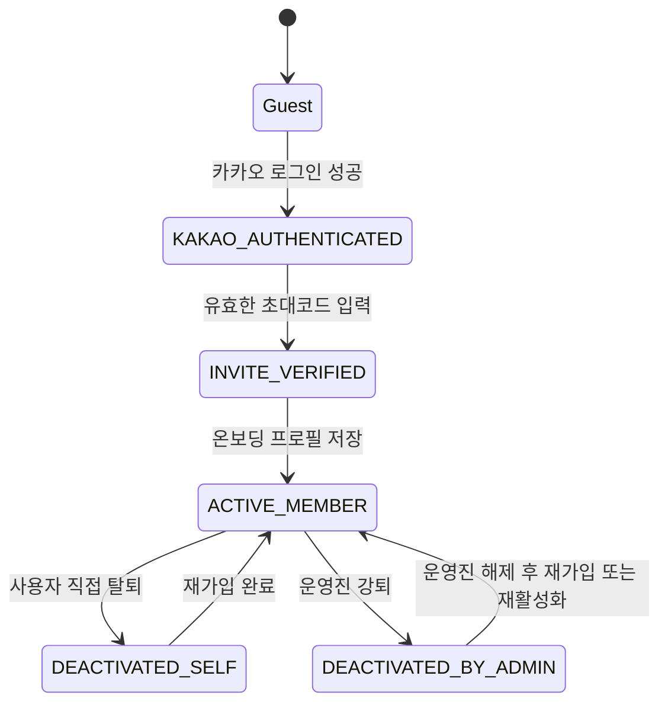
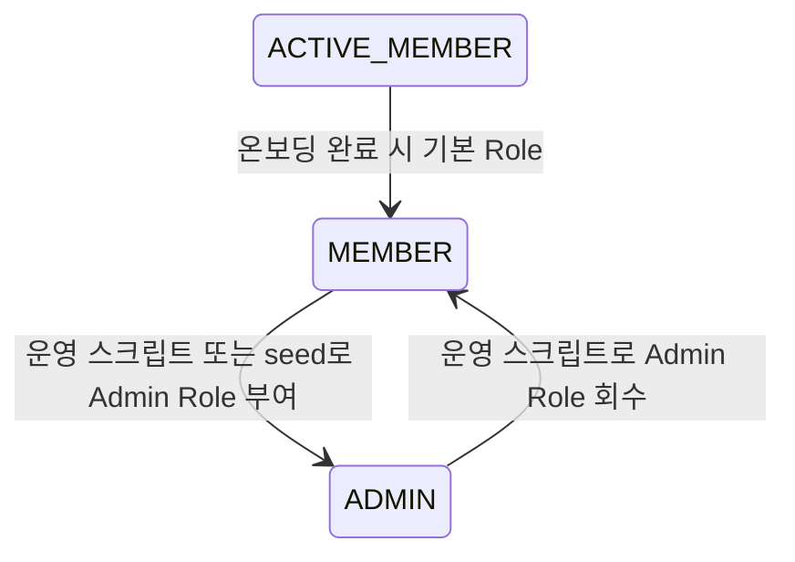
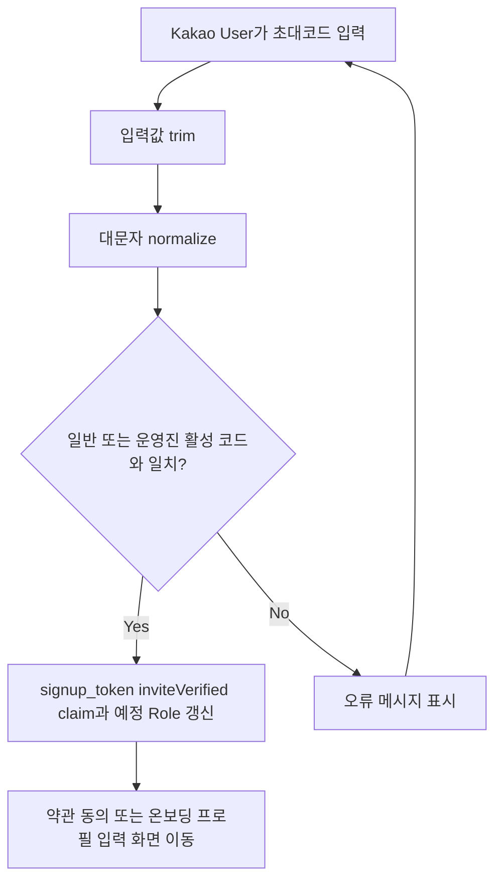
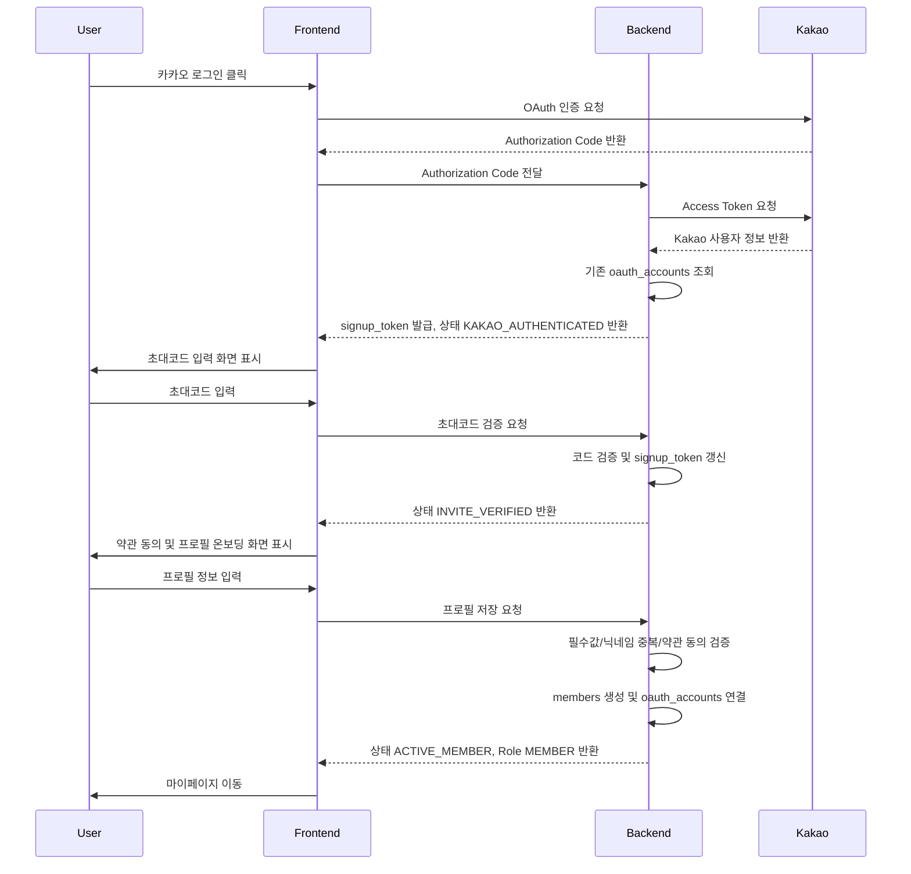

# PRD-002. 사용자 / 인증 / 권한 / 온보딩

> **부자습관 만들기 - Growth Archive**  
> 읽고, 실행하고, 성장한 기록을 남기는 사람들

---

## 문서 메타데이터

| 항목 | 내용 |
|---|---|
| 문서명 | PRD-002. 사용자 / 인증 / 권한 / 온보딩 |
| 서비스명 | 부자습관 만들기 - Growth Archive |
| 프로젝트명 | `growth-archive` |
| 문서 버전 | v1.2 Implementation Aligned |
| 작성일 | 2026-06-22 |
| 구현 기준 반영일 | 2026-07-05 |
| 선행 문서 | `PRD-001. 제품 비전 및 MVP 요구사항` |
| 작성 목적 | MVP 구현을 위한 사용자 상태, 로그인, 초대코드, 온보딩, 권한, 프로필 공개 정책을 상세 정의한다. |
| 주요 대상 | 백엔드 개발자, 프론트엔드 개발자, 디자이너, 운영진, Codex |
| 문서 상태 | IMPLEMENTATION_ALIGNED. 현재 코드와 배포 결과물을 기준으로 사용자/권한 기준을 정렬한다. |

---

## 0. 이 문서의 역할

### 0.1 이 문서가 결정하는 것

본 문서는 Growth Archive MVP에서 사용자가 서비스에 진입하고, 멤버로 전환되며, 각 권한에 따라 어떤 정보를 볼 수 있고 어떤 행동을 할 수 있는지를 정의한다.

구체적으로 다음을 결정한다.

1. 사용자 유형과 사용자 단계
2. Role 기반 권한 모델
3. 카카오 로그인 흐름
4. 초대코드 기반 멤버 인증 흐름
5. 회원가입 추가 정보 입력 항목과 검증 조건
6. 실명/닉네임 공개 정책
7. 프로필 사진 fallback 정책
8. 관심 분야 태그 선택 정책
9. Guest / Kakao User / Member / Admin 권한 매트릭스
10. 페이지 및 액션별 접근 제어
11. 온보딩 중단/재진입/오류 상태
12. 관리자 회원 관리 범위
13. 인수 조건과 예외 케이스

### 0.2 이 문서가 결정하지 않는 것

아래 항목은 후속 문서에서 상세 정의한다.

| 항목 | 후속 문서 |
|---|---|
| URL 구조와 라우팅 | PRD-003. IA / 사용자 흐름 / 화면 요구사항 |
| 화면별 와이어프레임 | PRD-003 또는 DESIGN-001 |
| DB 테이블/컬럼/인덱스 | TSD-001. 기술 아키텍처 / DB / ERD |
| API URL, Request/Response, Error Code | TSD-002. API 명세 |
| 디자인 토큰과 컴포넌트 | DESIGN-001. 디자인 시스템 |
| 기존 회원/기록 이관 정책 | OPS-001. 데이터 이관 / 운영 / 릴리즈 |
| 개인정보처리방침/이용약관 법무 문구 | OPS-001 또는 별도 Legal 문서 |

### 0.3 상위 원칙

PRD-001의 제품 철학을 따른다.

1. 기록을 남기는 과정은 간편해야 한다.
2. 기존 회원도 부담 없이 가입할 수 있어야 한다.
3. 기존 부자습관 만들기 커뮤니티 문화를 해치지 않아야 한다.
4. 신규 방문자는 커뮤니티의 분위기와 자산을 일부 확인할 수 있어야 한다.
5. 깊은 개인 정보와 멤버 전용 성장 기록은 외부에 노출하지 않는다.
6. 운영진은 참여 현황과 회원 상태를 명확하게 확인할 수 있어야 한다.
7. 권한 판단은 프론트엔드가 아니라 서버가 최종 책임을 가져야 한다.
8. MVP에서는 복잡한 역할 체계보다 단순한 권한 구조를 우선한다.
9. Admin은 계정 상태가 아니라 Role이다.
10. MVP에서는 별도 `account_status` enum을 저장하지 않고 timestamp 필드로 사용자 단계를 계산한다. `SUSPENDED`는 MVP 이후 확장으로 둔다.

---

## 1. Review 반영 결정 로그

| ID | 결정 항목 | 최종 결정 |
|---|---|---|
| D-002-001 | Admin 모델 | Admin은 사용자 단계가 아니라 Role로 관리한다. `활성 멤버 조건 + ADMIN role` 구조를 사용한다. |
| D-002-002 | 운영진 권한 | 운영진 5명은 동일 권한을 가진다. Owner/Admin 계층은 MVP에서 두지 않는다. |
| D-002-003 | 초대코드 | 일반 멤버용 활성 코드와 운영진용 활성 코드 2종을 유지한다. 일반 기본값은 `test`, 운영진 기본값은 `admin`이다. |
| D-002-004 | 온보딩 부담 | 기존 회원도 쉽게 가입할 수 있도록 필수 입력 항목을 최소화한다. |
| D-002-005 | 가입 이유 | 선택 입력으로 변경한다. 필수가 아니다. |
| D-002-006 | 직업 | MVP 온보딩/프로필 입력에서 수집하지 않는다. |
| D-002-007 | 생년월일 | 필수 입력으로 수집한다. Guest 공개 프로필에는 노출하지 않는다. |
| D-002-008 | 프로필 공개 | 비공개 옵션은 없다. 실명 공개 또는 닉네임 공개 중 선택한다. |
| D-002-009 | Guest 공개 프로필 | 성장하는 사람들 목록/프로필은 공개하되, 생년월일/가입 이유/현재 고민/3년 뒤 목표/실행계획/회고는 Member 전용 또는 본인/Admin 전용으로 둔다. |
| D-002-010 | 프로필 URL | MVP는 memberId 기반 URL을 사용한다. 예: `/people/{memberId}` |
| D-002-011 | 모임 후기 작성 | 시스템상 참석 버튼을 누르지 않았더라도 실제 참석한 경우가 있으므로, 후기 작성은 참석 여부로 제한하지 않는다. Active Member는 모임 후기를 작성할 수 있다. |
| D-002-012 | 회원 상태 | MVP 필수 사용자 단계는 timestamp 필드에서 계산한다. 활성 멤버는 `onboarding_completed_at IS NOT NULL AND deactivated_at IS NULL`, 비활성 회원은 `deactivated_at IS NOT NULL`로 판단한다. `SUSPENDED`는 MVP 이후로 둔다. |
| D-002-013 | 약관 동의 | MVP에서는 최소 형태로 이용약관/개인정보처리방침 동의 체크를 온보딩에 포함한다. |
| D-002-014 | 탈퇴/재가입 | 사용자 직접 탈퇴는 비활성 처리 후 재가입으로 복구 가능하게 하고, 운영진 강퇴는 운영진이 해제해야 재가입 가능하게 한다. 재가입 시 초대코드 종류에 따라 Role을 다시 부여한다. |

---

## 2. 결정 사항 요약

| 영역 | 결정 사항 |
|---|---|
| 로그인 | 카카오 로그인만 제공한다. 이메일/비밀번호 로그인은 MVP 제외. |
| 멤버 인증 | 카카오 로그인 후 초대코드 입력 시 자동 승인된다. |
| 초대코드 | 일반 멤버용 코드와 운영진용 코드 2종을 관리한다. 로컬 기본값은 일반 `test`, 운영진 `admin`이다. |
| 초대코드 변경 | 같은 종류의 새 코드가 활성화되면 기존 코드는 즉시 무효화된다. |
| 운영진 권한 | 운영진은 동일 권한을 가진다. Owner/Admin 구분 없음. |
| 사용자 유형 | Guest, Kakao User, Member, Admin으로 구분한다. |
| 사용자 단계 | `KAKAO_AUTHENTICATED`, `INVITE_VERIFIED`, `ACTIVE_MEMBER`, `DEACTIVATED`는 저장 enum이 아니다. 가입 완료 전 단계는 HttpOnly `signup_token`, 가입 완료 후 단계는 `members` timestamp 필드로 계산한다. |
| Role | `MEMBER`, `ADMIN`을 사용한다. Admin은 계정 상태가 아니라 Role이다. |
| SUSPENDED | MVP 이후 확장 상태로 둔다. MVP UI/API 필수 구현 범위에서 제외한다. |
| 프로필 공개 | 비공개 옵션 없음. 실명 공개 또는 닉네임 공개 중 선택. |
| 실명 | 가입/프로필 수정 시 필수 입력한다. 공개 표시 방식과 무관하게 저장한다. |
| 닉네임 | 중복 불가. 온보딩 및 수정 시 검증한다. |
| 프로필 URL | memberId 기반. `/people/{memberId}` |
| 한 줄 소개 | 가입 시 필수 입력. 공개 프로필 카드와 상세 상단에 노출. |
| 직업 | MVP에서 수집하지 않는다. |
| 생년월일 | 필수 입력. Guest에게는 노출하지 않는다. |
| 나이 | 직접 입력으로 수집하지 않는다. 필요 시 생년월일에서 계산한다. |
| 가입 이유 | 선택 입력. Member 전용 노출. |
| 현재 고민 | 선택 입력. Member 전용 노출. |
| 3년 뒤 목표 | 선택 입력. Member 전용 노출. |
| 관심 분야 | 운영진이 관리하는 태그 중 회원이 선택. 회원 직접 태그 생성 불가. |
| 50살의 나 | 필수 입력. 공개 프로필 상단 핵심 콘텐츠. 언제든 수정 가능. |
| 약관 동의 | 이용약관 동의, 개인정보처리방침 동의 필수. |
| 프로필 사진 | 회원 업로드 이미지 → 카카오 프로필 이미지 → 기본 이미지 순서. |
| 프로필 수정 | Member는 본인 프로필을 언제든 수정할 수 있다. |
| 모임 후기 작성 | 참석 여부 제한 없이 Active Member가 작성 가능. |
| Admin 회원 관리 | 회원 목록 조회, 비활성 처리, 재활성화, 프로필 확인, 참여 시작월 조정 가능. |
| Admin 권한 부여/회수 | Admin 회원관리 화면에서 일반 멤버와 운영진 Role을 변경할 수 있다. 서버가 최종 권한을 검증한다. |
| 탈퇴 | 사용자 직접 탈퇴는 비활성 처리한다. 작성 기록은 유지하되 개인정보 일부는 익명화한다. 운영진 강퇴는 재가입 차단 상태로 처리한다. |

---

## 3. 사용자 유형 정의

### 3.1 사용자 유형 목록

| 사용자 유형 | 정의 | 대표 상황 |
|---|---|---|
| Guest | 로그인하지 않은 방문자 | 검색/공유 링크로 들어와 공개 기록을 탐색하는 사람 |
| Kakao User | 카카오 로그인은 했지만 초대코드 인증 전이거나 온보딩 완료 전인 사용자 | 가입을 시작했지만 아직 멤버가 아닌 사람 |
| Member | 카카오 로그인 + 유효한 초대코드 인증 + 온보딩 완료 사용자 | 부자습관 만들기 승인 멤버 |
| Admin | 운영진 Role을 가진 Member | 운영진 5명. 권한 동일 |

### 3.2 사용자 유형별 핵심 목적

#### Guest

Guest의 목적은 커뮤니티를 탐색하는 것이다.

Guest는 다음을 이해할 수 있어야 한다.

1. 이곳은 단순 독서모임이 아니다.
2. 회원들이 실제로 독서기록과 실행계획을 남기고 있다.
3. 어떤 책이 많이 읽히고 어떤 모임 후기가 있는지 볼 수 있다.
4. 어떤 사람들이 함께 성장하고 있는지 일부 확인할 수 있다.
5. 가입하려면 카카오 로그인과 초대코드가 필요하다는 것을 알 수 있다.

#### Kakao User

Kakao User의 목적은 멤버 인증과 온보딩을 완료하는 것이다.

Kakao User는 다음을 할 수 있어야 한다.

1. 초대코드를 입력한다.
2. 초대코드가 틀렸을 경우 다시 입력한다.
3. 올바른 초대코드 입력 후 온보딩 프로필 작성 단계로 이동한다.
4. 온보딩을 완료하기 전까지 Member 전용 기능을 사용할 수 없다.

#### Member

Member의 목적은 성장 기록을 남기고 커뮤니티 활동에 참여하는 것이다.

Member는 다음을 할 수 있어야 한다.

1. 독서기록 작성
2. 월간 실행계획 작성
3. 월간 회고 작성
4. 기본 모임 참석
5. 소소모임 생성
6. 모임 후기 작성
7. 본인 프로필 수정
8. 이번 달 참여 현황 확인
9. 다른 멤버의 Member 전용 기록 조회

#### Admin

Admin의 목적은 커뮤니티 운영을 관리하는 것이다.

Admin은 다음을 할 수 있어야 한다.

1. 초대코드 변경
2. 관심 분야 태그 관리
3. 추천책 관리
4. 회원 목록 및 상태 관리
5. 참여 현황 조회
6. 미참여자 목록 확인, 수동 참여 처리, 운영 메모, 카카오톡 공유 문구 생성
7. 모임 관리
8. 소소모임 숨김/삭제
9. 모임 후기 숨김/삭제
10. 기존 기록 이관 지원

---

## 4. 사용자 단계와 Role 모델

### 4.1 핵심 원칙

사용자 단계와 Role은 분리한다.

```text
User Stage = 사용자가 서비스 흐름에서 어디에 있는가
Role = 사용자가 어떤 권한을 갖는가
```

예시:

```text
onboarding_completed_at IS NOT NULL
deactivated_at IS NULL
role = ADMIN
```

이는 “활성 멤버이면서 관리자 권한을 가진 사용자”를 의미한다.

### 4.2 사용자 단계 정의

아래 단계는 DB에 `account_status` enum으로 저장하지 않는다. 가입 완료 전 단계는 HttpOnly `signup_token` 기반 임시 가입 상태로 계산하고, 가입 완료 후 단계는 `members`의 timestamp 필드로 계산한다.

| 단계 코드 | 단계명 | 계산 기준 | 접근 가능 범위 | MVP 범위 |
|---|---|---|---|---|
| `KAKAO_AUTHENTICATED` | 카카오 로그인 완료 | 유효한 `signup_token`이 있고 초대코드 미인증 | 공개 페이지 + 초대코드 입력 | 포함 |
| `INVITE_VERIFIED` | 초대코드 인증 완료 | `signup_token.inviteVerified = true`이고 온보딩 미완료 | 약관 동의 + 온보딩 프로필 입력 | 포함 |
| `ACTIVE_MEMBER` | 활성 멤버 | `onboarding_completed_at IS NOT NULL AND deactivated_at IS NULL` | Member 기능 전체 | 포함 |
| `DEACTIVATED_SELF` | 사용자 탈퇴 비활성 | `deactivated_at IS NOT NULL`이고 운영진 강퇴 표시가 없음 | 재가입 플로우로 복구 가능 | 포함 |
| `DEACTIVATED_BY_ADMIN` | 운영진 강퇴 비활성 | 현재 구현은 별도 enum 없이 운영진이 `deactivated_at`을 설정하고 회원관리에서 재활성화한다. 운영 로그와 화면 문맥으로 운영진 처리를 구분한다. | 운영진 재활성화 전 이용 불가 | 포함 |
| `SUSPENDED` | 이용 제한 | MVP에서는 저장/계산하지 않음 | 제한 안내 | MVP 이후 |

> Guest는 계정이 없는 방문자이므로 사용자 단계 계산 대상이 아니다.

### 4.3 Role 정의

| Role | 설명 | 부여 방식 | MVP 범위 |
|---|---|---|---|
| `MEMBER` | 일반 멤버 권한 | 온보딩 완료 시 기본 부여 | 포함 |
| `ADMIN` | 운영진 권한 | 운영진 초대코드 또는 Admin 회원관리 화면에서 부여 | 포함 |

### 4.4 상태 전이



### 4.5 Role 전이



### 4.6 상태/Role 전이 원칙

1. `KAKAO_AUTHENTICATED` 상태만으로는 Member 전용 기능을 사용할 수 없다.
2. `INVITE_VERIFIED` 상태에서 온보딩을 완료하지 않으면 Member 전용 기능을 사용할 수 없다.
3. `ACTIVE_MEMBER`가 되기 전까지 독서기록, 실행계획, 회고, 모임 참석, 소소모임 생성은 불가하다.
4. Admin은 별도 계정 상태가 아니라 Member에 부여되는 Role이다.
5. MVP에서 Admin Role 부여/회수 UI는 필수 범위가 아니다. 초기 운영진은 seed data 또는 운영 스크립트로 지정한다.
6. 비활성 사용자는 Member/Admin 전용 기능을 사용할 수 없다.
7. `SUSPENDED`는 MVP 이후 확장으로 두며, PRD-002 v1.0에서는 구현 필수 범위가 아니다.
8. 카카오 로그인, 초대코드 인증, 약관 동의만으로는 `members` row 또는 `oauth_accounts` row를 만들지 않는다. `members`와 `oauth_accounts`는 온보딩 프로필 최종 저장 성공 시 함께 생성한다.
9. 사용자 직접 탈퇴 후 재가입하면 기존 계정을 복구하되, 일반 코드로 재가입하면 `MEMBER`, 운영진 코드로 재가입하면 `ADMIN` Role을 부여한다.
10. 운영진 강퇴 회원은 운영진이 강퇴 상태를 해제하기 전까지 재가입할 수 없다.

---

## 5. 인증 정책

### 5.1 인증 방식

MVP에서는 카카오 로그인만 제공한다.

| 항목 | 정책 |
|---|---|
| 로그인 방식 | 카카오 OAuth |
| 이메일/비밀번호 로그인 | MVP 제외 |
| 구글/애플 로그인 | MVP 제외 |
| 휴대폰 인증 | MVP 제외 |
| 자체 회원가입 | MVP 제외 |
| 세션/토큰 방식 | TSD-001/TSD-002에서 결정. 단, UX상 새로고침 후 로그인 상태가 유지되어야 한다. |

### 5.2 카카오 로그인에서 필요한 사용자 정보

MVP에서 필요한 카카오 정보는 최소화한다.

| 정보 | 사용 목적 | 필수 여부 |
|---|---|---:|
| Kakao Provider ID | 내부 계정 식별 | 필수 |
| 카카오 닉네임 | 초기 표시명 후보 또는 fallback | 선택 |
| 카카오 프로필 이미지 | 프로필 사진 fallback | 선택 |
| 카카오 이메일 | 계정 문의/관리용. 권한 범위와 동의 필요 | 선택 |

> 구현 원칙: 카카오에서 제공하는 값은 서비스 프로필의 초기값 또는 fallback으로만 사용한다. 최종 공개 프로필은 회원이 온보딩에서 직접 입력한 값이 기준이다.

### 5.3 로그인 성공 시 동작

#### 기존 활성 멤버

1. 사용자가 카카오 로그인을 완료한다.
2. 시스템은 Kakao Provider ID로 기존 계정을 찾는다.
3. 계산된 사용자 단계가 `ACTIVE_MEMBER`이고 Role이 `MEMBER` 또는 `ADMIN`이면 인증 세션을 발급한다.
4. 사용자는 원래 접근하려던 페이지 또는 마이페이지로 이동한다.

#### 신규 카카오 사용자

1. 사용자가 카카오 로그인을 완료한다.
2. 시스템은 Kakao Provider ID로 기존 계정을 찾지 못한다.
3. 시스템은 `members`와 `oauth_accounts`를 생성하지 않고, Kakao Provider ID와 카카오 프로필 fallback 정보를 담은 HttpOnly `signup_token`을 발급한다.
4. 사용자는 초대코드 입력 화면으로 이동한다.
5. 사용자가 가입 플로우를 완료하지 않고 이탈하면 회원 DB row는 남지 않는다.

#### 가입 진행 중 사용자

1. 사용자가 같은 브라우저에서 유효한 `signup_token`을 보유한 상태로 재방문한다.
2. 시스템은 `signup_token`의 claim으로 초대코드/약관 진행 단계를 계산한다.
3. 사용자는 아직 완료하지 않은 온보딩 단계로 이동한다.
4. 사용자가 로그아웃하거나 `signup_token`이 만료/삭제되면 가입 진행 상태는 폐기되며, 다음 카카오 로그인 시 초대코드 단계부터 다시 시작한다.

#### 온보딩 최종 완료 사용자

1. 사용자가 초대코드, 약관/개인정보 동의, 필수 프로필 입력을 모두 완료한다.
2. 시스템은 닉네임 중복과 필수값을 검증한다.
3. 시스템은 `members` row를 생성하고 `oauth_accounts`에 Kakao Provider ID를 연결한다.
4. 시스템은 정식 인증 쿠키를 발급하고 `signup_token`을 삭제한다.
5. 사용자는 마이페이지로 이동한다.

#### 비활성 사용자

1. 사용자가 카카오 로그인을 완료한다.
2. 시스템은 사용자 단계가 `DEACTIVATED`임을 확인한다.
3. 시스템은 인증 세션 발급을 차단하거나 제한 세션만 발급한다.
4. 사용자는 비활성 안내 화면으로 이동한다.

### 5.4 로그인 실패 시 동작

| 실패 상황 | 사용자 메시지 | 시스템 동작 |
|---|---|---|
| 카카오 인증 취소 | “카카오 로그인이 취소되었습니다.” | 로그인 전 화면으로 복귀 |
| 카카오 인증 실패 | “카카오 로그인에 실패했습니다. 잠시 후 다시 시도해 주세요.” | 오류 로그 기록 |
| 서버 오류 | “일시적인 문제가 발생했습니다.” | 재시도 안내 |
| 사용자 탈퇴 계정 | “탈퇴 처리된 계정입니다. 다시 가입하려면 초대코드 인증과 프로필 입력을 완료해 주세요.” | 재가입 플로우 안내 |
| 운영진 강퇴 계정 | “운영진에 의해 비활성화된 계정입니다. 재가입은 운영진에게 문의해 주세요.” | Member 기능 차단 |

### 5.5 로그아웃

Member와 Admin은 로그아웃할 수 있어야 한다.

로그아웃 시 시스템은 다음을 수행한다.

1. 서버 세션 또는 토큰을 무효화한다.
2. 클라이언트 인증 상태를 제거한다.
3. 공개 홈으로 이동한다.
4. 로그아웃 후 Member/Admin 전용 URL 접근 시 로그인 또는 접근 제한 화면으로 이동한다.

---

## 6. 초대코드 정책

### 6.1 초대코드의 목적

초대코드는 소모임 앱과 오프라인 모임에서 이미 관계가 형성된 사람을 Growth Archive의 Member로 전환하기 위한 장치다.

초대코드는 복잡한 심사나 관리자 승인 없이 커뮤니티의 닫힌 문화를 유지하는 **가벼운 문지방**이다.

### 6.2 초대코드 기본 정책

| 항목 | 정책 |
|---|---|
| 코드 형태 | 로컬 기본값 일반 `test`, 운영진 `admin`. 운영에서는 Admin이 변경 가능한 영문/숫자 조합 |
| 코드 종류 | 일반 멤버용 코드, 운영진용 코드 |
| 코드 개수 | MVP에서는 코드 종류별 활성 코드 1개씩 유지 |
| 코드 관리 | Admin이 변경 가능 |
| 코드 변경 효과 | 같은 종류의 새 코드 활성화 시 기존 코드는 즉시 무효화 |
| 코드 입력 대상 | `KAKAO_AUTHENTICATED` 사용자 |
| 코드 성공 결과 | `signup_token`을 `INVITE_VERIFIED` 상태로 갱신하고, 코드 종류에 따른 예정 Role을 담는다 |
| 코드 실패 결과 | 오류 메시지 표시, 상태 유지 |
| 대소문자 | MVP 기본값: 대소문자 구분 없이 처리한다. 입력값은 trim + uppercase normalize 한다. |
| 만료일 | MVP 기본값: 만료일 없음. 향후 확장 가능. |
| 사용 횟수 제한 | MVP 기본값: 제한 없음. 향후 코드별 제한 가능. |

### 6.3 초대코드 입력 화면 요구사항

화면은 간단해야 한다.

#### 노출 정보

1. 서비스명: 부자습관 만들기 - Growth Archive
2. 안내 문구: “운영진에게 안내받은 초대코드를 입력해 주세요.”
3. 초대코드 입력 필드
4. 확인 버튼
5. 코드가 없을 경우 안내 문구

#### CTA

- 확인
- 홈으로 돌아가기

### 6.4 초대코드 검증 동작



### 6.5 초대코드 오류 메시지

| 상황 | 메시지 |
|---|---|
| 빈 값 | “초대코드를 입력해 주세요.” |
| 불일치 | “초대코드가 올바르지 않습니다.” |
| 비활성 코드 | “현재 사용할 수 없는 초대코드입니다. 운영진에게 문의해 주세요.” |
| 과도한 실패 | “잠시 후 다시 시도해 주세요.” |

### 6.6 보안 요구사항

1. 초대코드는 서버에서 검증한다.
2. 초대코드는 클라이언트 번들에 포함하지 않는다.
3. 초대코드는 DB에 평문 저장하지 않는 것을 권장한다. 실제 저장 방식은 TSD-001에서 결정한다.
4. 초대코드 입력 실패는 보안 로그 또는 감사 로그에 기록할 수 있어야 한다.
5. MVP 기본값으로 동일 사용자 기준 10분 내 5회 실패 시 10분간 재입력 제한을 권장한다. 최종 구현은 TSD-002에서 확정한다.
6. 운영진 초대코드는 일반 사용자에게 노출하지 않는다.

---

## 7. 온보딩 정책

### 7.1 온보딩 목표

온보딩의 목적은 회원에게 긴 설문을 시키는 것이 아니다.

온보딩은 다음을 위한 최소한의 과정이다.

1. 회원을 식별할 수 있는 표시명을 만든다.
2. Growth Archive의 핵심인 성장 프로필을 생성한다.
3. 관심 분야 기반 탐색과 향후 추천의 기초 데이터를 만든다.
4. “50살의 나”라는 커뮤니티 고유의 방향성을 기록한다.
5. 기존 회원이 큰 부담 없이 웹서비스로 들어올 수 있게 한다.

### 7.2 온보딩 완료 조건

다음 필수 항목이 저장되어야 온보딩이 완료된다.

1. 닉네임
2. 한 줄 소개
3. 관심 분야 태그 1개 이상
4. 50살의 나
5. 공개 표시 방식
6. 실명
7. 생년월일
8. 이용약관 동의
9. 개인정보처리방침 동의

다음 항목은 선택 입력이다.

1. 프로필 사진
2. 가입 이유
3. 현재 고민
4. 3년 뒤 목표

### 7.3 온보딩 화면 구성

MVP에서는 사용자의 부담을 줄이기 위해 2~3단계 화면을 권장한다.

#### Step 1. 초대코드 입력

- 카카오 로그인 이후 노출
- 초대코드 성공 시 Step 2로 이동

#### Step 2. 기본 프로필

입력 항목:

1. 닉네임
2. 한 줄 소개
3. 프로필 사진
4. 공개 표시 방식
5. 실명
6. 생년월일
7. 관심 분야

#### Step 3. 성장 프로필

입력 항목:

1. 50살의 나
2. 가입 이유
3. 현재 고민
4. 3년 뒤 목표
5. 이용약관 동의
6. 개인정보처리방침 동의

#### Step 4. 완료

- “성장 프로필이 만들어졌습니다.”
- 마이페이지로 이동
- 독서기록 작성 CTA 또는 이번 달 실행계획 작성 CTA 노출

> 구현 단순화를 위해 MVP에서는 Step 2와 Step 3을 하나의 화면으로 합쳐도 된다. 단, 초대코드 입력과 프로필 입력은 구분되어야 한다.

### 7.4 온보딩 입력 항목 상세

| 항목 | 필수 | 입력 방식 | 검증 조건 | Guest 공개 | Member 공개 | 비고 |
|---|---:|---|---|---:|---:|---|
| 닉네임 | O | 직접 입력 | 2~20자, 중복 불가 | 표시 방식이 닉네임 공개일 때 O | O | 실명 공개 선택 시에도 내부 식별명으로 사용 |
| 실명 | O | 직접 입력 | 2~50자 | 표시 방식이 실명 공개일 때 O | O | 카카오 실명에 의존하지 않음 |
| 한 줄 소개 | O | 직접 입력 | 1~80자 | O | O | 프로필 카드 노출 |
| 프로필 사진 | 선택 | 이미지 업로드 | 이미지 파일, 최대 10MB | O | O | 없으면 카카오 이미지 사용 |
| 관심 분야 | O | 태그 선택 | 1~5개 선택 | O | O | 운영진 관리 태그만 선택 |
| 50살의 나 | O | 장문 입력 | 1~1000자 | O | O | 프로필 상단 핵심 |
| 생년월일 | O | 날짜 입력 | 미래 날짜 불가 | X | 본인/Admin 제한 | 공개 프로필에는 노출하지 않음 |
| 가입 이유 | 선택 | 장문 입력 | 1000자 이하 | X | O | 가입 당시의 나 |
| 현재 고민 | 선택 | 장문 입력 | 1000자 이하 | X | O | 가입 당시의 나 |
| 3년 뒤 목표 | 선택 | 장문 입력 | 1000자 이하 | X | O | 성장 프로필 확장 |
| 공개 표시 방식 | O | 라디오 | 실명 공개 / 닉네임 공개 중 1개 | O | O | 비공개 없음 |
| 이용약관 동의 | O | 체크박스 | 동의 필요 | X | X | 법적 고지 |
| 개인정보처리방침 동의 | O | 체크박스 | 동의 필요 | X | X | 법적 고지 |

### 7.5 수집하지 않는 정보

MVP에서는 아래 정보를 수집하지 않는다.

1. 나이
2. 주민등록번호
3. 주소
4. 휴대폰 번호 인증 정보
5. 결제 정보
6. 민감정보

### 7.6 닉네임 정책

#### 기본 정책

1. 닉네임은 중복을 허용하지 않는다.
2. 닉네임은 공백만으로 구성될 수 없다.
3. 닉네임 앞뒤 공백은 저장 시 제거한다.
4. 닉네임 변경 시에도 중복 검증을 수행한다.
5. 닉네임은 서비스 내 표시명 후보이자 검색 키워드로 사용된다.
6. 닉네임은 URL 식별자로 사용하지 않는다. URL은 memberId를 사용한다.

#### 허용 문자 MVP 기본값

- 한글
- 영문
- 숫자
- 공백
- `-`
- `_`
- `.`

#### 제한 문자 MVP 기본값

- 이모지
- URL 특수문자
- HTML 태그
- 스크립트성 문자열
- 운영진이 부적절하다고 판단한 단어

> 실제 금칙어 목록은 OPS-001에서 관리 가능하다. MVP에서는 최소한의 XSS/HTML escape를 우선한다.

### 7.7 공개 표시 방식

회원은 공개 표시 방식을 선택해야 한다.

| 옵션 | 표시 방식 | 조건 |
|---|---|---|
| 실명 공개 | 실명 표시 | 실명 입력 필수 |
| 닉네임 공개 | 닉네임 표시 | 닉네임 입력 필수 |

#### 정책

1. 비공개 옵션은 제공하지 않는다.
2. 공개 표시 방식은 가입 후 언제든 변경 가능하다.
3. 실명 공개에서 닉네임 공개로 변경하면 즉시 모든 공개 화면의 표시명이 닉네임으로 바뀐다.
4. 닉네임 공개에서 실명 공개로 변경하려면 실명 입력이 필요하다.
5. 과거 작성 기록의 작성자 표시명도 현재 공개 표시 방식에 따라 렌더링하는 것을 MVP 기본값으로 한다.

### 7.8 프로필 URL 정책

MVP에서는 memberId 기반 URL을 사용한다.

```text
/people/{memberId}
```

예시:

```text
/people/42
```

#### 정책

1. 닉네임이 변경되어도 URL은 유지되어야 한다.
2. URL에는 실명/닉네임을 포함하지 않는다.
3. 닉네임 기반 handle URL은 MVP 이후 확장으로 둔다.
4. 화면 표시명은 공개 표시 방식에 따라 실명 또는 닉네임으로 렌더링한다.

### 7.9 프로필 사진 정책

프로필 사진은 1장만 사용한다.

우선순위는 다음과 같다.

```text
회원 업로드 이미지
↓
카카오 프로필 이미지
↓
기본 프로필 이미지
```

#### 업로드 정책 MVP 기본값

| 항목 | 정책 |
|---|---|
| 개수 | 1장 |
| 최대 용량 | 10MB |
| 허용 형식 | jpg, jpeg, png, webp |
| 저장 방식 | 원본 저장 여부는 TSD-001에서 결정. 서비스 노출용은 리사이징 권장 |
| 권장 출력 크기 | 256x256 또는 512x512 정사각형 |
| 삭제 | 회원이 업로드 이미지를 삭제하면 카카오 프로필 이미지로 fallback |

### 7.10 관심 분야 태그 정책

관심 분야는 회원이 직접 생성하지 않고, 운영진이 관리하는 태그 중 선택한다.

#### 초기 태그

- 사업
- 창업
- 투자
- 부동산
- 독서
- 커리어
- AI
- 개발
- 마케팅
- 운동
- 건강
- 인간관계
- 경제적 자유

#### 선택 정책

| 항목 | 정책 |
|---|---|
| 최소 선택 수 | 1개 |
| 최대 선택 수 | 5개 권장 |
| 직접 입력 | 불가 |
| 태그 추가 | Admin 가능 |
| 태그 숨김 | Admin 가능 |
| 숨김 태그 처리 | 기존 회원 프로필에는 유지하되 신규 선택 목록에서는 제외 |

---

## 8. 권한 매트릭스

### 8.1 페이지 접근 권한

| 페이지 / 영역 | Guest | Kakao User | Member | Admin |
|---|---:|---:|---:|---:|
| 홈 | O | O | O | O |
| 독서기록 라이브러리 | O | O | O | O |
| 책 상세 | O | O | O | O |
| 독서기록 블로그 링크 이동 | O | O | O | O |
| 모임 후기 목록 | O | O | O | O |
| 모임 후기 상세 | O | O | O | O |
| 성장하는 사람들 목록 | O | O | O | O |
| 공개 프로필 상세 | O | O | O | O |
| 로그인 페이지 | O | O | O | O |
| 초대코드 입력 | - | O | - | - |
| 온보딩 프로필 입력 | - | `INVITE_VERIFIED`만 | - | - |
| 마이페이지 | - | - | O | O |
| 내 프로필 수정 | - | - | O | O |
| 월간 실행계획 상세 | - | - | O | O |
| 월간 회고 상세 | - | - | O | O |
| 모임 목록 | 기본 정보 공개 | 기본 정보 공개 | O | O |
| 모임 상세 | 기본 정보 공개 | 기본 정보 공개 | O | O |
| 모임 참석자 전체 | - | - | O | O |
| 소소모임 생성 | - | - | O | O |
| 관리자 페이지 | - | - | - | O |

### 8.2 액션 권한

| 액션 | Guest | Kakao User | Member | Admin |
|---|---:|---:|---:|---:|
| 카카오 로그인 | O | O | O | O |
| 로그아웃 | - | O | O | O |
| 초대코드 입력 | - | O | - | - |
| 온보딩 저장 | - | O | - | - |
| 본인 프로필 수정 | - | - | O | O |
| 공개 표시 방식 변경 | - | - | O | O |
| 프로필 사진 업로드/삭제 | - | - | O | O |
| 독서기록 작성 | - | - | O | O |
| 본인 독서기록 수정 | - | - | O | O |
| 본인 독서기록 삭제 | - | - | O | O |
| 월간 실행계획 작성 | - | - | O | O |
| 본인 실행계획 수정/삭제 | - | - | O | O |
| 월간 회고 작성/수정 | - | - | O | O |
| 기본 모임 참석/취소 | - | - | O | O |
| 소소모임 생성 | - | - | O | O |
| 본인 생성 소소모임 수정 | - | - | 생성자만 | 생성자만 |
| 소소모임 숨김/삭제 | - | - | 생성자 삭제 가능 | O |
| 모임 후기 작성 | - | - | O | O |
| 본인 모임 후기 수정/삭제 | - | - | O | O |
| 모임 후기 숨김/삭제 | - | - | - | O |
| 추천책 등록/수정/삭제 | - | - | - | O |
| 관심 분야 태그 관리 | - | - | - | O |
| 초대코드 변경 | - | - | - | O |
| 회원 비활성/재활성 처리 | - | - | - | O |
| 참여 현황 전체 조회 | - | - | 본인만 | O |
| 참여 현황 CSV export | - | - | - | O |

### 8.3 데이터 공개 범위

| 데이터 | Guest | Member | Admin |
|---|---|---|---|
| 책 정보 | 공개 | 공개 | 관리 가능 |
| 독서기록 한줄평 | 공개 | 공개 | 관리 가능 |
| 독서기록 평점 | 공개 | 공개 | 관리 가능 |
| 독서기록 대표 사진 | 공개 | 공개 | 관리 가능 |
| 독서기록 블로그 URL | 공개 | 공개 | 관리 가능 |
| 모임 후기 | 공개 | 공개 | 관리 가능 |
| 모임 후기 사진 | 공개 | 공개 | 관리 가능 |
| 프로필 표시명 | 공개 | 공개 | 관리 가능 |
| 프로필 사진 | 공개 | 공개 | 관리 가능 |
| 한 줄 소개 | 공개 | 공개 | 관리 가능 |
| 관심 분야 | 공개 | 공개 | 관리 가능 |
| 50살의 나 | 공개 | 공개 | 관리 가능 |
| 성장 통계 | 공개 요약 | 상세 | 상세 |
| 생년월일 | 비공개 | 본인만 | 조회 가능 |
| 가입 이유 | 비공개 | Member 전용 | 조회 가능 |
| 현재 고민 | 비공개 | Member 전용 | 조회 가능 |
| 3년 뒤 목표 | 비공개 | Member 전용 | 조회 가능 |
| 월간 실행계획 | 비공개 | Member 전용 | 관리 가능 |
| 월간 회고 | 비공개 | Member 전용 | 관리 가능 |
| 카카오 Provider ID | 비공개 | 비공개 | 시스템/관리 제한 |
| 이메일 | 비공개 | 본인만 | Admin 제한 조회 여부 후속 결정 |

---

## 9. 온보딩 사용자 흐름

### 9.1 신규 멤버 온보딩 플로우



### 9.2 온보딩 중단 후 재진입

| 중단 지점 | 재방문 시 이동 위치 |
|---|---|
| 카카오 로그인 전 이탈 | 홈 또는 로그인 CTA |
| 카카오 로그인 후 초대코드 미입력 | 유효한 `signup_token`이 있으면 초대코드 입력 화면 |
| 초대코드 인증 후 프로필 미작성 | 유효한 `signup_token`이 있으면 약관/프로필 온보딩 화면 |
| 프로필 일부 입력 중 이탈 | MVP 기본값: 임시저장 없음. 다시 입력 |
| 온보딩 완료 후 재방문 | 원래 접근 URL 또는 마이페이지 |

> 가입 진행 상태는 서버 DB에 영구 저장하지 않는다. 브라우저의 HttpOnly `signup_token`이 만료되거나 로그아웃으로 삭제되면 초대코드 단계부터 다시 시작한다.

### 9.3 원래 접근 URL 보존

Member 전용 페이지에 접근하려다 로그인이 필요한 경우, 시스템은 로그인 완료 후 원래 페이지로 돌아갈 수 있도록 redirect URL을 보존하는 것을 권장한다.

MVP 기본 정책:

1. Guest가 Member 전용 URL 접근
2. 로그인 페이지로 이동
3. 카카오 로그인 완료
4. 초대코드/온보딩이 필요한 경우 해당 단계 먼저 완료
5. 완료 후 원래 접근하려던 URL로 이동
6. 원래 URL이 없거나 권한이 부족하면 마이페이지로 이동

---

## 10. 프로필 수정 정책

### 10.1 수정 가능 항목

Member는 다음 항목을 언제든 수정할 수 있다.

| 항목 | 수정 가능 | 비고 |
|---|---:|---|
| 닉네임 | O | 중복 검증 필요. URL에는 영향 없음 |
| 실명 | O | 필수 입력. 실명 공개 선택 시 공개 표시명으로 사용 |
| 한 줄 소개 | O | 즉시 공개 프로필 반영 |
| 생년월일 | O | 공개 프로필에는 노출하지 않음 |
| 관심 분야 | O | 운영진이 관리하는 활성 태그 중 선택 |
| 50살의 나 | O | 언제든 수정 가능, 프로필 상단 반영 |
| 3년 뒤 목표 | O | Member 전용 |
| 현재 고민 | O | Member 전용 |
| 가입 이유 | O | Member 전용 |
| 프로필 사진 | O | 업로드/삭제 가능 |
| 공개 표시 방식 | O | 실명 공개/닉네임 공개 변경 가능 |
| 카카오 Provider ID | X | 시스템 값 |
| 가입일 | X | 시스템 값 |
| 회원 상태 | X | Admin 또는 시스템 관리 |
| Admin Role | X | 운영 정책에 따라 관리 |

### 10.2 프로필 수정 저장 동작

1. Member가 프로필 수정 화면에 진입한다.
2. 시스템은 현재 저장된 프로필 값을 표시한다.
3. Member가 값을 수정한다.
4. 저장 시 서버는 필수값과 형식을 검증한다.
5. 닉네임이 변경된 경우 중복 검증을 수행한다.
6. 저장 성공 시 공개 프로필과 마이페이지에 즉시 반영한다.
7. 저장 실패 시 해당 필드 아래에 오류 메시지를 표시한다.

### 10.3 프로필 수정 오류 메시지

| 상황 | 메시지 |
|---|---|
| 닉네임 중복 | “이미 사용 중인 닉네임입니다.” |
| 닉네임 빈 값 | “닉네임을 입력해 주세요.” |
| 한 줄 소개 빈 값 | “한 줄 소개를 입력해 주세요.” |
| 관심 분야 미선택 | “관심 분야를 1개 이상 선택해 주세요.” |
| 50살의 나 빈 값 | “50살의 나를 작성해 주세요.” |
| 실명 없음 | “실명을 입력해 주세요.” |
| 약관 미동의 | “이용약관에 동의해 주세요.” |
| 개인정보처리방침 미동의 | “개인정보처리방침에 동의해 주세요.” |
| 이미지 용량 초과 | “이미지 용량은 최대 10MB까지 업로드할 수 있습니다.” |
| 이미지 형식 오류 | “jpg, png, webp 형식의 이미지만 업로드할 수 있습니다.” |

---

## 11. Admin 회원 관리 정책

### 11.1 Admin 권한 기본 원칙

1. 운영진 5명은 동일 권한을 가진다.
2. MVP에서 Owner와 Admin은 구분하지 않는다.
3. 모든 Admin은 동일한 관리자 메뉴에 접근할 수 있다.
4. Admin 액션은 감사 로그를 남기는 것을 권장한다.
5. Admin 기능은 반드시 서버에서 Role을 검증해야 한다.

### 11.2 회원 목록 관리

Admin은 회원 목록에서 다음 정보를 볼 수 있어야 한다.

| 정보 | 설명 |
|---|---|
| 프로필 사진 | 현재 노출될 프로필 이미지 |
| 표시명 | 실명/닉네임 공개 정책에 따른 표시명 |
| 닉네임 | 내부 식별용 |
| 생년월일 | 회원 입력값. Admin 조회 가능 |
| 관심 분야 | 선택 태그 |
| 회원 상태 | ACTIVE_MEMBER, DEACTIVATED_SELF, DEACTIVATED_BY_ADMIN |
| Role | MEMBER, ADMIN |
| 가입일 | 온보딩 완료일 기준 |
| 최근 활동일 | 최근 독서기록/실행계획/모임 참석/후기 중 최신 |
| 이번 달 참여 상태 | 완료/참여 필요 |
| 참여 시작월 | 월간 참여 산정 시작월. Admin이 조정 가능 |

### 11.3 회원 상태 변경

MVP에서 Admin은 최소한 다음 상태 변경을 할 수 있어야 한다.

| 변경 | 설명 |
|---|---|
| 활성 → 사용자 탈퇴 비활성 | 회원 본인이 탈퇴를 요청한 경우. 재가입으로 복구 가능 |
| 활성 → 운영진 강퇴 비활성 | 운영진이 강퇴 처리한 경우. 운영진 해제 전 재가입 불가 |
| 사용자 탈퇴 비활성 → 활성 | 재가입 플로우 완료 시 복구 |
| 운영진 강퇴 비활성 → 활성 | 운영진 해제 후 재가입 또는 재활성화 처리 |

#### 비활성 계정 동작 MVP 기본값

- 사용자 탈퇴 비활성 계정은 로그인 시 재가입 플로우를 안내한다.
- 운영진 강퇴 비활성 계정은 로그인 시 운영진 문의 안내를 표시한다.
- 새로운 기록 작성은 불가하다.
- Member/Admin 전용 페이지 접근은 불가하다.
- 기존 공개 기록은 기본적으로 유지한다.
- 사용자 직접 탈퇴 시 `real_name`, 프로필 이미지 연결, 카카오 프로필 이미지 URL, 생년월일은 정리하거나 익명화한다.
- 작성 기록은 유지하며, 작성자 표시는 탈퇴 사용자임을 과하게 드러내지 않는 중립 표시명으로 처리한다.

### 11.4 SUSPENDED 정책

`SUSPENDED`는 MVP 이후 확장으로 둔다.

MVP에서는 다음을 구현하지 않는다.

1. 이용 제한 UI
2. 제한 사유 입력
3. 제한 해제 플로우
4. 제한 상태 전용 권한 처리

단, TSD-001에서 향후 확장성을 위해 enum 또는 상태 테이블 설계 시 `SUSPENDED`를 고려할 수 있다.

### 11.5 Admin Role 부여/회수

MVP 기본값:

- Admin Role은 초기 seed data 또는 운영 스크립트로 지정한다.
- 관리자 페이지에서 Admin Role 부여/회수 UI는 MVP 필수 범위에서 제외한다.
- 추후 운영진이 늘어날 경우 Admin Role 관리 UI를 추가한다.

이유:

1. 운영진 수가 현재 5명으로 작다.
2. 권한 실수로 인한 리스크가 크다.
3. MVP에서는 회원/기록/참여 현황 구현이 더 중요하다.

---

## 12. Member 전용 접근 제어

### 12.1 Member 전용 데이터

다음 데이터는 Member 또는 Admin만 접근할 수 있다.

1. 가입 이유
2. 현재 고민
3. 3년 뒤 목표
4. 월간 실행계획 상세
5. 월간 회고 상세
6. 모임 참석자 전체 목록
7. 소소모임 생성/수정 화면
8. 본인 마이페이지
9. 이번 달 참여 현황의 개인 상세

다음 데이터는 본인 또는 Admin만 접근할 수 있다.

1. 생년월일

### 12.2 접근 차단 UX

Guest 또는 Kakao User가 Member 전용 URL에 접근하면 다음과 같이 처리한다.

| 사용자 상태 | 이동 위치 | 메시지 |
|---|---|---|
| Guest | 로그인 페이지 | “멤버 전용 공간입니다. 카카오 로그인 후 이용해 주세요.” |
| Kakao Authenticated | 초대코드 입력 화면 | “초대코드 인증 후 이용할 수 있습니다.” |
| Invite Verified | 온보딩 프로필 입력 화면 | “프로필을 완성하면 이용할 수 있습니다.” |
| Deactivated | 비활성 안내 화면 | “비활성화된 계정입니다.” |

### 12.3 서버 권한 검증 원칙

1. 모든 Member/Admin 전용 API는 서버에서 인증 상태를 검증한다.
2. 프론트엔드의 버튼 숨김은 보조 장치일 뿐이다.
3. 작성자 본인만 수정/삭제 가능한 리소스는 서버에서 owner check를 수행한다.
4. Admin은 owner check를 우회할 수 있는 리소스가 있으나, 이 경우 감사 로그를 남기는 것을 권장한다.
5. Guest 공개 API와 Member 전용 API는 명확히 분리한다.

---

## 13. 화면별 권한 요구사항 요약

### 13.1 홈

| 항목 | 정책 |
|---|---|
| 접근 | 전체 공개 |
| CTA | Guest: 카카오 로그인/둘러보기, Member: 마이페이지/기록 작성 |
| 최근 성장 기록 | Guest는 공개 이벤트만. Member는 멤버 전용 이벤트 포함 가능. |

### 13.2 독서기록 라이브러리

| 항목 | 정책 |
|---|---|
| 접근 | 전체 공개 |
| 작성 버튼 | Member/Admin만 노출 |
| 블로그 링크 | Guest도 접근 가능 |
| 작성자 표시명 | 실명/닉네임 공개 설정 반영 |

### 13.3 성장하는 사람들

| 항목 | 정책 |
|---|---|
| 목록 접근 | 전체 공개 |
| 상세 접근 | 전체 공개. 단, 멤버 전용 항목은 Member에게만 노출 |
| Guest 공개 항목 | 표시명, 사진, 한 줄 소개, 관심 분야, 50살의 나, 공개 성장 통계 요약 |
| Member 전용 항목 | 가입 이유, 현재 고민, 3년 뒤 목표, 실행계획, 회고 |
| URL | `/people/{memberId}` |

### 13.4 마이페이지

| 항목 | 정책 |
|---|---|
| 접근 | Member/Admin |
| 주요 노출 | 이번 달 참여 현황, 내 프로필, 최근 기록, 작성 CTA |
| Guest 접근 시 | 로그인 페이지 이동 |
| Kakao User 접근 시 | 초대코드 입력 또는 온보딩 화면으로 이동 |

### 13.5 모임 후기

| 항목 | 정책 |
|---|---|
| 목록/상세 접근 | Guest 공개 |
| 작성 권한 | Active Member/Admin |
| 참석 여부 제한 | 없음. 시스템에 참석을 누르지 않아도 실제 참석한 경우가 있으므로 제한하지 않는다. |
| 수정/삭제 | 작성자 본인 가능 |
| 숨김/삭제 관리 | Admin 가능 |

### 13.6 관리자 페이지

| 항목 | 정책 |
|---|---|
| 접근 | Admin만 |
| Member 접근 시 | 403 또는 접근 권한 없음 화면 |
| Guest 접근 시 | 로그인 페이지 이동 |
| 모든 Admin 액션 | 감사 로그 권장 |

---

## 14. 기능 요구사항

### 14.1 인증/온보딩 요구사항 매트릭스

| ID | Actor | Requirement | Priority | Acceptance Summary |
|---|---|---|---|---|
| AUTH-001 | Guest | Guest는 카카오 로그인 버튼을 클릭해 카카오 OAuth를 시작할 수 있어야 한다. | P0 | 카카오 인증 화면으로 이동 |
| AUTH-002 | System | 시스템은 카카오 로그인 성공 시 Kakao Provider ID로 내부 계정을 조회하거나 생성해야 한다. | P0 | 기존/신규 계정 분기 처리 |
| AUTH-003 | System | 신규 카카오 사용자는 초대코드 입력 화면으로 이동해야 한다. | P0 | 상태 `KAKAO_AUTHENTICATED` |
| AUTH-004 | Kakao User | Kakao User는 운영진이 안내한 초대코드를 입력할 수 있어야 한다. | P0 | 유효 코드 입력 시 다음 단계 이동 |
| AUTH-005 | System | 시스템은 유효한 초대코드 입력 시 사용자를 `INVITE_VERIFIED` 상태로 변경해야 한다. | P0 | 프로필 온보딩 화면 이동 |
| AUTH-006 | System | 시스템은 유효하지 않은 초대코드에 대해 명확한 오류 메시지를 표시해야 한다. | P0 | 상태 변경 없음 |
| AUTH-007 | Admin | Admin은 활성 초대코드를 변경할 수 있어야 한다. | P0 | 새 코드 활성화, 기존 코드 무효화 |
| ONB-001 | Invite Verified User | 사용자는 최소 필수 프로필 정보를 입력해 Member 온보딩을 완료할 수 있어야 한다. | P0 | 상태 `ACTIVE_MEMBER`, Role `MEMBER` |
| ONB-002 | System | 시스템은 닉네임 중복을 허용하지 않아야 한다. | P0 | 중복 시 저장 불가 |
| ONB-003 | System | 시스템은 공개 표시 방식과 무관하게 실명 입력을 필수로 검증해야 한다. | P0 | 실명 없으면 저장 불가 |
| ONB-004 | System | 시스템은 관심 분야를 1개 이상 선택했는지 검증해야 한다. | P0 | 미선택 시 저장 불가 |
| ONB-005 | System | 시스템은 약관/개인정보처리방침 동의를 검증해야 한다. | P0 | 미동의 시 저장 불가 |
| ONB-006 | System | 시스템은 온보딩 완료 후 마이페이지로 이동시켜야 한다. | P0 | 이번 달 참여 현황 노출 |
| PERM-001 | System | 시스템은 Member 전용 URL 접근 시 사용자 상태에 따라 적절한 화면으로 redirect 해야 한다. | P0 | Guest/Kakao/Invite/Member 분기 |
| PERM-002 | System | 시스템은 Admin API 요청에 대해 Admin Role을 서버에서 검증해야 한다. | P0 | 비Admin 403 처리 |
| PROF-001 | Member | Member는 본인 프로필을 수정할 수 있어야 한다. | P0 | 저장 후 즉시 반영 |
| PROF-002 | Member | Member는 50살의 나를 언제든 수정할 수 있어야 한다. | P0 | 프로필 상단 반영 |
| PROF-003 | Member | Member는 실명 공개/닉네임 공개를 변경할 수 있어야 한다. | P0 | 공개 화면 표시명 즉시 변경 |
| PROF-004 | Member | Member는 프로필 사진을 업로드하거나 삭제할 수 있어야 한다. | P1 | fallback 정책 적용 |
| REVIEW-001 | Member | Active Member는 참석 표시 여부와 관계없이 모임 후기를 작성할 수 있어야 한다. | P0 | 작성 가능 |
| ADM-001 | Admin | Admin은 회원 목록과 상태를 조회할 수 있어야 한다. | P0 | 회원 관리 화면 노출 |
| ADM-002 | Admin | Admin은 회원을 비활성/재활성 처리할 수 있어야 한다. | P1 | 상태 반영 |
| ADM-003 | Admin | Admin은 초대코드를 변경할 수 있어야 한다. | P0 | 이후 신규 인증에 반영 |

### 14.2 P0 / P1 구분

#### P0. MVP 필수

- 카카오 로그인
- 초대코드 입력
- 초대코드 변경 시 기존 코드 무효화
- 온보딩 프로필 작성
- 닉네임 중복 검증
- 약관/개인정보처리방침 동의 검증
- Member 상태 전환
- Role 기반 Admin 권한 분기
- 공개/멤버/관리자 권한 분기
- 본인 프로필 수정
- 모임 후기 작성 권한: Active Member면 가능
- Admin 초대코드 변경
- Admin 회원 목록 조회

#### P1. MVP 우선 구현 권장

- 프로필 사진 업로드/삭제
- 회원 직접 탈퇴 UI
- 회원 비활성/재활성 처리 UI
- 초대코드 실패 횟수 제한
- Admin 감사 로그
- 원래 접근 URL 보존

#### P2. MVP 이후 가능

- Admin Role 부여/회수 UI
- 일반/운영진 2종을 초과하는 초대코드 여러 개 관리
- 초대코드 만료일/사용 횟수 제한
- SUSPENDED 상태 및 이용 제한 플로우
- 실명 인증
- 구글/애플 로그인

---

## 15. 인수 조건

### 15.1 카카오 로그인 - 신규 사용자

```gherkin
Given 사용자가 로그인하지 않은 Guest이고
When 카카오 로그인 버튼을 클릭해 인증을 완료하면
Then 시스템은 Kakao Provider ID로 기존 계정을 조회하고
And 기존 계정이 없으면 members와 oauth_accounts를 생성하지 않고 signup_token을 발급하고
And 사용자를 초대코드 입력 화면으로 이동시켜야 한다.
```

### 15.2 카카오 로그인 - 기존 Member

```gherkin
Given 사용자가 기존 ACTIVE_MEMBER이고
When 카카오 로그인을 완료하면
Then 시스템은 기존 계정을 찾아 인증 세션을 발급하고
And 사용자를 마이페이지 또는 원래 접근하려던 페이지로 이동시켜야 한다.
```

### 15.3 초대코드 성공

```gherkin
Given 사용자가 KAKAO_AUTHENTICATED 상태이고
When 유효한 초대코드를 입력하면
Then 시스템은 signup_token을 INVITE_VERIFIED 상태로 갱신하고
And 프로필 온보딩 화면으로 이동시켜야 한다.
```

### 15.4 초대코드 실패

```gherkin
Given 사용자가 KAKAO_AUTHENTICATED 상태이고
When 유효하지 않은 초대코드를 입력하면
Then 시스템은 사용자 상태를 변경하지 않고
And “초대코드가 올바르지 않습니다.” 메시지를 표시해야 한다.
```

### 15.5 초대코드 변경

```gherkin
Given Admin이 활성 초대코드를 test에서 rich2027로 변경했고
When 신규 Kakao User가 test를 입력하면
Then 시스템은 초대코드 인증을 실패 처리해야 한다.

Given Admin이 활성 초대코드를 rich2027로 변경했고
When 신규 Kakao User가 rich2027을 입력하면
Then 시스템은 초대코드 인증을 성공 처리해야 한다.
```

### 15.6 온보딩 완료

```gherkin
Given 사용자가 INVITE_VERIFIED 상태이고
When 필수 프로필 정보와 약관 동의를 모두 입력하고 저장하면
Then 시스템은 members row를 생성하고
And oauth_accounts에 Kakao Provider ID를 연결하고
And 사용자 상태를 ACTIVE_MEMBER로 변경하고
And Role을 MEMBER로 부여하고
And 성장 프로필을 생성하고
And signup_token을 삭제하고 정식 인증 쿠키를 발급하고
And 마이페이지로 이동시켜야 한다.
```

### 15.7 닉네임 중복

```gherkin
Given 이미 “노아”라는 닉네임이 존재하고
When 사용자가 온보딩 또는 프로필 수정에서 “노아”를 입력하고 저장하면
Then 시스템은 저장을 거부하고
And “이미 사용 중인 닉네임입니다.” 메시지를 표시해야 한다.
```

### 15.8 실명 필수 검증

```gherkin
Given 사용자가 온보딩 또는 프로필 수정을 진행하고
When 실명 입력 없이 저장을 시도하면
Then 시스템은 저장을 거부하고
And “실명을 입력해 주세요.” 메시지를 표시해야 한다.
```

### 15.9 약관 동의 검증

```gherkin
Given 사용자가 온보딩 필수 프로필 정보를 입력했고
When 이용약관 또는 개인정보처리방침에 동의하지 않은 상태로 저장을 시도하면
Then 시스템은 저장을 거부하고
And 어떤 동의가 누락되었는지 메시지를 표시해야 한다.
```

### 15.10 Member 전용 페이지 접근 - Guest

```gherkin
Given 사용자가 Guest이고
When 마이페이지 URL에 접근하면
Then 시스템은 로그인 페이지로 이동시키고
And “멤버 전용 공간입니다. 카카오 로그인 후 이용해 주세요.” 메시지를 표시해야 한다.
```

### 15.11 Member 전용 페이지 접근 - Kakao User

```gherkin
Given 사용자가 KAKAO_AUTHENTICATED 상태이고
When 월간 실행계획 페이지에 접근하면
Then 시스템은 초대코드 입력 화면으로 이동시키고
And “초대코드 인증 후 이용할 수 있습니다.” 메시지를 표시해야 한다.
```

### 15.12 Admin 페이지 접근 - Member

```gherkin
Given 사용자가 ACTIVE_MEMBER이고 Admin Role이 없으며
When 관리자 페이지에 접근하면
Then 시스템은 접근을 차단하고
And 403 또는 권한 없음 화면을 표시해야 한다.
```

### 15.13 프로필 표시명 변경

```gherkin
Given 사용자가 닉네임 공개 상태이고
When 실명을 입력하고 공개 표시 방식을 실명 공개로 변경하면
Then 공개 프로필, 독서기록 작성자명, 모임 후기 작성자명은 실명으로 표시되어야 한다.
```

### 15.14 프로필 URL 안정성

```gherkin
Given 사용자의 프로필 URL이 /people/42이고
When 사용자가 닉네임을 변경하면
Then 프로필 URL은 /people/42로 유지되어야 한다.
```

### 15.15 모임 후기 작성 권한

```gherkin
Given 사용자가 ACTIVE_MEMBER이고 특정 모임에 시스템상 참석자로 등록되어 있지 않으며
When 해당 모임 후기를 작성하면
Then 시스템은 참석 여부 때문에 작성을 차단하지 않아야 한다.
```

### 15.16 프로필 사진 fallback

```gherkin
Given 사용자가 업로드한 프로필 사진이 없고 카카오 프로필 이미지가 존재하면
When 프로필 카드가 렌더링될 때
Then 시스템은 카카오 프로필 이미지를 표시해야 한다.
```

```gherkin
Given 사용자가 업로드한 프로필 사진도 없고 카카오 프로필 이미지도 없으면
When 프로필 카드가 렌더링될 때
Then 시스템은 기본 프로필 이미지를 표시해야 한다.
```

---

## 16. UX 문구 초안

### 16.1 로그인 CTA

```text
카카오로 시작하기
```

보조 문구:

```text
부자습관 만들기 멤버라면 카카오 로그인 후 초대코드를 입력해 주세요.
```

### 16.2 초대코드 화면

제목:

```text
초대코드를 입력해 주세요
```

설명:

```text
운영진에게 안내받은 초대코드를 입력하면 Growth Archive 멤버로 등록됩니다.
```

### 16.3 온보딩 화면 안내

```text
성장 프로필을 가볍게 만들어 주세요.
나중에 언제든 수정할 수 있어요.
```

공개 안내:

```text
표시명, 프로필 사진, 한 줄 소개, 관심 분야, 50살의 나는 공개 프로필에 노출될 수 있습니다.
가입 이유, 현재 고민, 3년 뒤 목표는 멤버에게만 보여집니다.
생년월일은 공개 프로필에 노출되지 않습니다.
```

### 16.4 온보딩 완료

```text
성장 프로필이 만들어졌어요.
이제 읽고, 실행하고, 성장한 기록을 남겨볼 수 있어요.
```

CTA:

```text
마이페이지로 가기
독서기록 작성하기
이번 달 실행계획 쓰기
```

### 16.5 접근 제한

```text
멤버 전용 공간입니다.
카카오 로그인 후 초대코드 인증을 완료해 주세요.
```

### 16.6 비활성 계정

```text
비활성화된 계정입니다.
재활성화가 필요하다면 운영진에게 문의해 주세요.
```

---

## 17. 데이터 요구사항

> 실제 DB 설계는 TSD-001에서 확정한다. 이 장은 제품 관점에서 필요한 데이터 개념을 정리한다.

### 17.1 Signup Token 개념 데이터

가입 완료 전 상태는 DB row가 아니라 HttpOnly `signup_token`으로 관리한다.

| 필드 | 설명 | 필수 |
|---|---|---:|
| provider | `KAKAO` | O |
| kakao_provider_id | 카카오 계정 식별값 | O |
| kakao_profile_image_url | 카카오 프로필 이미지 URL fallback | 선택 |
| kakao_nickname | 카카오 닉네임 fallback | 선택 |
| email | 카카오 이메일. 동의 범위에 따라 선택 | 선택 |
| invite_verified | 초대코드 인증 여부 | O |
| terms_agreed | 이용약관 동의 여부 | O |
| privacy_agreed | 개인정보처리방침 동의 여부 | O |
| issued_at | 토큰 발급 시각 | O |
| expires_at | 토큰 만료 시각 | O |

`signup_token`이 만료되거나 로그아웃으로 삭제되면 가입 진행 상태는 폐기된다.

### 17.2 Member / OAuth Account 개념 데이터

`members`와 `oauth_accounts`는 온보딩 프로필 최종 저장이 성공할 때 함께 생성한다.

| 필드 | 설명 | 필수 |
|---|---|---:|
| member_id | 내부 회원 ID | O |
| kakao_provider_id | 카카오 계정 식별값 | O |
| kakao_profile_image_url | 카카오 프로필 이미지 URL | 선택 |
| kakao_nickname | 카카오 닉네임 | 선택 |
| email | 카카오 이메일. 동의 범위에 따라 선택 | 선택 |
| invite_verified_at | 초대코드 인증 완료 시각 | O |
| terms_agreed_at | 이용약관 동의 시각 | O |
| privacy_agreed_at | 개인정보처리방침 동의 시각 | O |
| onboarding_completed_at | 온보딩 완료 시각. 값이 있으면 Member 기능 사용 가능 | O |
| deactivated_at | 비활성 처리 시각. 값이 있으면 비활성 회원 | 선택 |
| role | `MEMBER`, `ADMIN` | O |
| created_at | 회원 생성일. 온보딩 완료 시각과 동일한 기준 | O |
| last_login_at | 최근 로그인 | 선택 |

### 17.3 Member Profile 개념 데이터

| 필드 | 설명 | 필수 |
|---|---|---:|
| member_id | 회원 ID. 프로필 URL에 사용 | O |
| nickname | 닉네임, 중복 불가 | O |
| real_name | 실명. 공개 표시 방식과 무관하게 필수 저장 | O |
| display_name_type | REAL_NAME / NICKNAME | O |
| bio | 한 줄 소개 | O |
| join_reason | 가입 이유 | 선택 |
| current_concern | 현재 고민 | 선택 |
| goal_3_years | 3년 뒤 목표 | 선택 |
| future_self_50 | 50살의 나 | O |
| uploaded_profile_image_url | 회원 업로드 이미지 | 선택 |
| joined_at | Member 전환 또는 온보딩 완료일 | O |
| profile_completed_at | 온보딩 완료일 | O |
| updated_at | 수정일 | O |

### 17.4 Agreement 개념 데이터

| 필드 | 설명 | 필수 |
|---|---|---:|
| agreement_id | 동의 기록 ID | O |
| user_id | 사용자 ID | O |
| terms_agreed | 이용약관 동의 여부 | O |
| privacy_agreed | 개인정보처리방침 동의 여부 | O |
| terms_version | 약관 버전 | 선택 |
| privacy_version | 개인정보처리방침 버전 | 선택 |
| agreed_at | 동의 시각 | O |

### 17.4 Interest Tag 개념 데이터

| 필드 | 설명 | 필수 |
|---|---|---:|
| tag_id | 태그 ID | O |
| name | 태그명 | O |
| is_active | 신규 선택 가능 여부 | O |
| sort_order | 노출 순서 | 선택 |
| created_by | 생성 Admin | 선택 |

### 17.5 Invitation Code 개념 데이터

| 필드 | 설명 | 필수 |
|---|---|---:|
| invitation_code_id | 코드 ID | O |
| code_hash | 초대코드 해시값 권장 | O |
| code_type | MEMBER 또는 ADMIN | O |
| display_label | Admin 화면 표시용 라벨 | 선택 |
| is_active | 활성 여부 | O |
| updated_by | 변경 Admin | O |
| updated_at | 변경일 | O |

### 17.6 Audit Log 개념 데이터

| 필드 | 설명 | 필수 |
|---|---|---:|
| audit_log_id | 로그 ID | O |
| actor_member_id | 실행 Admin/사용자 | O |
| action | 수행 액션 | O |
| target_type | 대상 유형 | O |
| target_id | 대상 ID | 선택 |
| before_value | 변경 전 값 | 선택 |
| after_value | 변경 후 값 | 선택 |
| created_at | 생성일 | O |

---

## 18. 개인정보 및 보안 요구사항

### 18.1 개인정보 최소 수집

MVP에서 수집하는 개인정보는 서비스 목적에 필요한 최소한으로 제한한다.

수집하는 정보:

1. 카카오 계정 식별값
2. 닉네임
3. 실명
4. 한 줄 소개
5. 관심 분야
6. 50살의 나
7. 프로필 이미지
8. 생년월일은 필수 수집하되 공개 프로필에는 노출하지 않는다.
9. 가입 이유, 현재 고민, 3년 뒤 목표는 선택 수집한다.
10. 이메일은 카카오 동의 범위에 따라 선택 수집한다.

수집하지 않는 정보:

- 나이
- 주민등록번호
- 주소
- 결제 정보
- 휴대폰 번호 인증 정보
- 민감정보

### 18.2 공개 데이터 주의사항

회원이 온보딩에서 입력하는 일부 정보는 공개된다.

Guest에게 공개될 수 있는 정보:

- 표시명
- 프로필 사진
- 한 줄 소개
- 관심 분야
- 50살의 나
- 성장 통계 요약

Member에게만 공개되는 정보:

- 가입 이유
- 현재 고민
- 3년 뒤 목표
- 실행계획
- 회고

본인 또는 Admin에게만 공개되는 정보:

- 생년월일

따라서 온보딩 화면에는 다음 안내를 노출해야 한다.

```text
표시명, 프로필 사진, 한 줄 소개, 관심 분야, 50살의 나는 공개 프로필에 노출될 수 있습니다.
가입 이유, 현재 고민, 3년 뒤 목표는 멤버에게만 보여집니다.
생년월일은 공개 프로필에 노출되지 않습니다.
```

### 18.3 서버 권한 원칙

1. Admin 권한은 서버에서만 최종 판단한다.
2. 작성자 본인 확인은 서버에서 수행한다.
3. 클라이언트에 Role을 내려주더라도, 클라이언트 Role은 UI 표시용으로만 사용한다.
4. Kakao Provider ID는 공개 API 응답에 포함하지 않는다.
5. 로그에는 카카오 Access Token, Refresh Token, DB 비밀번호, 초대코드 원문을 남기지 않는다.

### 18.4 세션 보안 UX 요구사항

1. 사용자는 새로고침 후에도 로그인 상태를 유지해야 한다.
2. 로그아웃 시 모든 인증 상태가 제거되어야 한다.
3. 세션 만료 시 사용자는 다시 로그인할 수 있어야 한다.
4. 작성 중 세션이 만료되면 저장 실패 안내를 표시해야 한다.

---

## 19. 분석 지표

PRD-002 영역에서 추적하면 좋은 지표는 다음과 같다.

| 지표 | 설명 | 목적 |
|---|---|---|
| 카카오 로그인 시작 수 | 로그인 버튼 클릭 | 진입 의도 확인 |
| 카카오 로그인 성공 수 | OAuth 성공 | 인증 성공률 확인 |
| 초대코드 입력 시도 수 | 코드 입력 횟수 | 가입 마찰 확인 |
| 초대코드 성공률 | 성공 / 시도 | 코드 안내 품질 확인 |
| 온보딩 완료율 | 온보딩 완료 / 초대코드 성공 | 가입 전환 확인 |
| 닉네임 중복 오류 수 | 중복 검증 실패 | UX 개선 |
| 프로필 사진 업로드율 | 업로드 회원 / 전체 회원 | 프로필 완성도 확인 |
| 50살의 나 작성률 | 작성 회원 / 전체 회원 | 핵심 문화 정착 확인 |
| 월간 활성 멤버 수 | 해당 월 로그인 또는 기록 작성 | 활성도 확인 |

---

## 20. Codex 구현 지침

Codex가 이 문서를 기반으로 구현할 때는 다음 원칙을 따른다.

### 20.1 구현 우선순위

1. 사용자 상태 모델 구현
2. Role 모델 구현
3. 카카오 로그인 연결부 스텁 또는 실제 연동 구조 구현
4. 초대코드 검증 API 구현
5. 온보딩 프로필 저장 API 구현
6. 약관/개인정보처리방침 동의 저장 구현
7. 권한 미들웨어/가드 구현
8. 프로필 조회/수정 구현
9. Admin 회원 목록/초대코드 관리 구현

### 20.2 임의 구현 금지

Codex는 다음을 임의로 추가하지 않는다.

- 이메일/비밀번호 로그인
- 회원가입 승인 대기 시스템
- 포인트/랭킹
- 실명 인증
- 휴대폰 인증
- 일반/운영진 2종을 초과하는 다중 초대코드 복잡 정책
- Admin 계층 구조
- 하드 삭제 방식의 회원 탈퇴
- SUSPENDED 이용 제한 플로우
- 닉네임 기반 프로필 URL
- 참석자만 모임 후기 작성 가능하도록 제한

### 20.3 TODO로 남길 항목

아래 항목은 구현 중 임의 결정하지 말고 TODO 또는 Open Question으로 남긴다.

1. 실제 Kakao OAuth 앱 키와 Secret
2. 실제 운영진 초기 Admin 계정 목록
3. 개인정보처리방침/이용약관 URL
4. 개인정보처리방침/이용약관 문구 및 버전
5. Admin Role 관리 UI 필요 여부
6. 셀프 탈퇴 정책
7. 초대코드 해시 알고리즘과 저장 방식
8. 세션/JWT 최종 선택

### 20.4 테스트 필수 시나리오

1. 신규 카카오 로그인 → 초대코드 → 온보딩 → Member 전환
2. 잘못된 초대코드 입력
3. Admin의 초대코드 변경 후 기존 코드 실패
4. 닉네임 중복 검증
5. 실명 공개 선택 후 실명 누락 검증
6. 약관/개인정보처리방침 미동의 검증
7. Guest가 Member 전용 페이지 접근
8. Member가 Admin 페이지 접근
9. Admin이 회원 목록 조회
10. 프로필 수정 후 공개 프로필 반영
11. 프로필 URL이 memberId 기반으로 유지되는지 확인
12. 프로필 사진 fallback 동작
13. 시스템상 미참석 Member도 모임 후기 작성 가능
14. 로그아웃 후 Member 전용 페이지 접근 차단

---

## 21. Open Questions

아래 항목은 최종 구현 전에 확인이 필요하다. MVP 구현 시에는 “MVP 기본값”을 사용한다.

| ID | 질문 | MVP 기본값 | 결정 필요 시점 |
|---|---|---|---|
| OQ-002-001 | 카카오 이메일을 필수 동의로 받을 것인가? | 필수 아님. Provider ID 중심. | Kakao OAuth 설정 시 |
| OQ-002-002 | 초대코드 실패 횟수 제한을 MVP에서 구현할 것인가? | 권장하지만 P1. 구현 여력에 따라. | 보안 구현 시 |
| OQ-002-003 | 비활성 회원의 기존 공개 기록 표시명을 어떻게 처리할 것인가? | 기존 표시명 유지. 삭제/익명화는 운영 정책에서 결정. | OPS-001 작성 시 |
| OQ-002-004 | 이용약관/개인정보처리방침 문구와 URL은 어디에 둘 것인가? | `/terms`, `/privacy` 경로 권장. | PRD-003 URL 설계 시 |
| OQ-002-005 | 실제 운영진 초기 Admin 계정은 누구인가? | seed/운영 스크립트에 별도 지정. | TSD-001/OPS-001 작성 시 |
| OQ-002-006 | 성장하는 사람들 Guest 카드의 보조 설명은 무엇으로 구성할 것인가? | 한 줄 소개 + 관심 분야 사용. | DESIGN-001/PRD-003 작성 시 |

---

## 22. 완료 기준

PRD-002가 구현되었다고 판단하려면 다음 조건을 만족해야 한다.

### 22.1 사용자 진입

- [ ] Guest는 공개 페이지를 볼 수 있다.
- [ ] Guest는 카카오 로그인으로 가입 흐름을 시작할 수 있다.
- [ ] 신규 카카오 사용자는 초대코드 입력 화면으로 이동한다.
- [ ] 유효한 초대코드 입력 시 온보딩 화면으로 이동한다.
- [ ] 온보딩 필수값과 약관 동의 입력 후 Member가 된다.

### 22.2 권한

- [ ] Guest는 Member 전용 화면에 접근할 수 없다.
- [ ] 초대코드 미인증 사용자는 Member 기능을 사용할 수 없다.
- [ ] 온보딩 미완료 사용자는 Member 기능을 사용할 수 없다.
- [ ] Member는 Admin 화면에 접근할 수 없다.
- [ ] Admin은 관리자 화면에 접근할 수 있다.
- [ ] Admin은 사용자 단계가 아니라 Role로 판별된다.

### 22.3 프로필

- [ ] 닉네임 중복이 방지된다.
- [ ] 한 줄 소개, 관심 분야, 50살의 나가 저장된다.
- [ ] 생년월일은 필수 입력으로 저장되며, 가입 이유, 현재 고민, 3년 뒤 목표는 선택 입력으로 저장 가능하다.
- [ ] 실명/닉네임 공개 방식이 반영된다.
- [ ] 프로필 URL은 `/people/{memberId}` 형식이다.
- [ ] 프로필 사진 fallback이 동작한다.
- [ ] Member는 본인 프로필을 수정할 수 있다.

### 22.4 운영

- [ ] Admin은 초대코드를 변경할 수 있다.
- [ ] 초대코드 변경 시 기존 코드는 즉시 무효화된다.
- [ ] Admin은 회원 목록을 조회할 수 있다.
- [ ] Admin은 회원 상태를 확인할 수 있다.
- [ ] Admin은 회원을 비활성/재활성 처리할 수 있다.
- [ ] Admin 권한은 서버에서 검증된다.

### 22.5 모임 후기 권한

- [ ] Active Member는 모임 참석 여부 표시와 관계없이 모임 후기를 작성할 수 있다.
- [ ] 본인 후기는 본인이 수정/삭제할 수 있다.
- [ ] Admin은 후기를 숨김/삭제할 수 있다.

---

## 23. 변경 이력

| 버전 | 날짜 | 변경 내용 |
|---|---|---|
| v0.1 | 2026-06-22 | PRD-001 기준으로 사용자/인증/권한/온보딩 상세 초안 작성 |
| v1.0 | 2026-06-22 | Review 반영. Admin Role 분리, memberId URL 확정, 온보딩 부담 완화, 직업/가입이유 Member 전용, 후기 작성 참석 제한 제거, ACTIVE/DEACTIVATED 중심 상태 정책 확정, 약관 동의 추가 |
| v1.1 | 2026-06-26 | 가입 완료 전에는 members/oauth_accounts row를 생성하지 않고 HttpOnly signup_token으로 가입 진행 상태를 관리하도록 갱신. 직업 수집 제거, 당시 생년월일 입력 기준, 프로필 이미지 10MB 기준 반영 |
| v1.2 | 2026-06-29 | 일반/운영진 초대코드 2종, 생년월일 필수, 사용자 탈퇴/운영진 강퇴 구분, 재가입 Role 재부여 정책 반영 |
