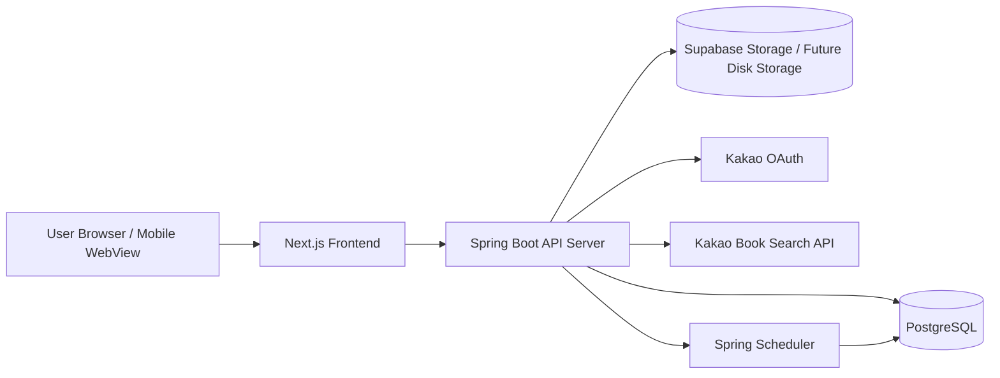
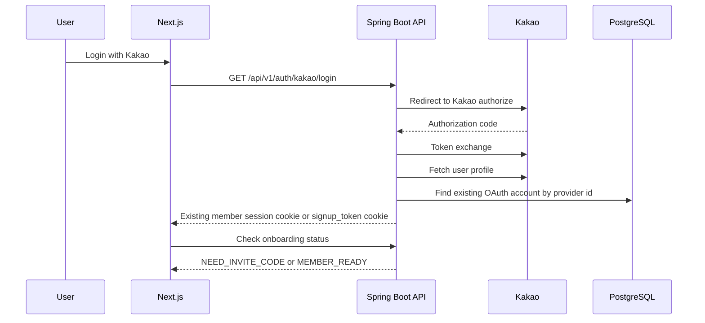
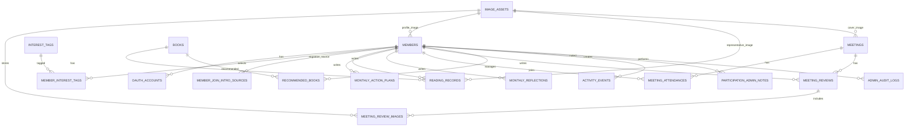

# TSD-001. Technical Architecture / DB / ERD

Project: **부자습관 만들기 - Growth Archive**
Tagline: **읽고, 실행하고, 성장한 기록을 남기는 사람들**
Version: **1.2 FINAL**
Status: **Final**
Last Updated: **2026-06-29**
Owner: **Noah**
Related Docs:

- `docs/prd/PRD_001_Growth_Archive.md`
- `docs/prd/PRD_002_Users_Auth_Permissions_Onboarding.md`
- `docs/prd/PRD_003_IA_User_Flows_Screen_Requirements.md`
- `docs/prd/PRD_004_Core_Feature_Requirements.md`
- `docs/design/DESIGN_001_Design_System.md`

---

## 0. Document Purpose

이 문서는 Growth Archive MVP의 기술 아키텍처, 백엔드/프론트엔드 구성, DB 엔티티, ERD, 핵심 데이터 정책을 정의한다.

이 문서는 다음 작업의 기준이 된다.

1. Spring Boot 백엔드 프로젝트 생성
2. Next.js 프론트엔드 프로젝트 생성
3. Supabase PostgreSQL 테이블 설계
4. Flyway 마이그레이션 작성
5. API 명세서 작성
6. Codex MVP 구현 작업

---

## 1. Architecture Principles

### 1.1 Product-first Technical Principles

Growth Archive는 커뮤니티 기록 서비스다.
기술 구조는 다음 원칙을 따른다.

```text
간편하게 기록할 수 있어야 한다.
책 검색 실패가 기록 작성을 막으면 안 된다.
회원의 개인 기록은 작성자 중심으로 보호한다.
Admin은 운영을 돕되, 회원의 기록 내용을 임의 수정하지 않는다.
MVP는 작고 단단하게 만든다.
Phase 2 확장 가능성을 DB 구조에 남긴다.
```

### 1.2 Implementation Principles for Codex

Codex는 구현 시 다음 원칙을 따라야 한다.

```text
PRD에 없는 기능을 임의로 추가하지 않는다.
문서에 남은 애매한 요구사항은 임의 결정하지 않고 TODO로 남긴다.
DB 마이그레이션은 되돌리기 어렵기 때문에 신중하게 작성한다.
권한 검증은 Controller가 아니라 Service/Security Layer에서 일관되게 처리한다.
이미지 업로드는 원본 저장보다 리사이징된 표시용 이미지 저장을 우선한다. 브라우저에서 우선 WebP 변환/리사이징/압축을 수행하고, 서버는 10MB/MIME/purpose 검증과 방어용 최적화를 수행한다.
```

---

## 2. High-level System Architecture

### 2.1 Recommended Stack

| Layer | Technology | Notes |
|---|---|---|
| Frontend | Next.js + TypeScript | 모바일 퍼스트 웹, 향후 웹뷰/PWA 대응 |
| Styling | Tailwind CSS + shadcn/ui | DESIGN-001의 컬러/컴포넌트 토큰 반영 |
| Backend | Java 25 + Spring Boot 4.1.0 | REST API 서버, stateless 구조 |
| Security | Spring Security + Kakao OAuth + JWT Cookie | Kakao Login, Role 기반 인가, HttpOnly Secure Cookie |
| DB | Local Docker PostgreSQL / Supabase PostgreSQL | local은 Docker PostgreSQL, dev/prod는 Supabase PostgreSQL |
| DB Access / Query | Spring Data JPA + Querydsl | 엔티티 중심 CRUD는 JPA, 목록/통계/관리 화면 쿼리는 Querydsl을 우선 사용한다. JdbcTemplate은 특별한 사유가 있을 때만 예외적으로 사용한다. |
| Migration | Flyway | SQL 기반 마이그레이션. Runtime ORM schema validation은 사용하지 않는다. |
| Storage | Supabase Storage → Self-hosted disk-backed storage | MVP/dev는 Supabase Storage, 최종 개인 서버 디스크 기반 저장소로 전환 가능 |
| Scheduler | Spring Scheduler | 정기모임 자동 생성, 향후 책 검증 스케줄러 |
| Deployment | Docker Compose local + Vercel frontend + Render backend + Supabase DB/Storage + Kubernetes-ready future | local은 Docker Compose, 현재 dev 배포는 Vercel/Render 무료 플랜, 향후 AWS EC2 또는 개인 서버 Kubernetes/k3s로 이전 가능 |
| Observability | Spring Actuator + structured logging | `/actuator/health`, container health check 제공 |

### 2.2 External Integrations

| Integration | Purpose | MVP Decision |
|---|---|---|
| Kakao OAuth | 로그인 | 사용 |
| Kakao Book Search API | 책 검색 | MVP 기본 제공자 |
| Supabase PostgreSQL | DB | 사용 |
| Supabase Storage | 이미지 저장 | MVP 기본 저장소 |
| Self-hosted disk-backed storage | 최종 개인 서버 저장소 | Phase 2/운영 전환 후보 |
| Naver Book API | 도서 검색 fallback | MVP 이후 또는 fallback 후보 |
| Aladin API | 도서 큐레이션 보조 | Phase 2 후보 |

### 2.3 Logical Architecture



### 2.4 Important Boundary

Frontend는 Supabase DB에 직접 접근하지 않는다.

```text
Frontend
  -> Spring Boot API
    -> Supabase PostgreSQL
```

Supabase는 Firebase처럼 직접 클라이언트에서 사용하는 구조가 아니라, **관리형 PostgreSQL + Storage**로 사용한다.

---

## 3. Runtime Architecture

### 3.1 Backend Runtime

```text
Java 25
Spring Boot 4.1.0
Spring Security
Spring Data JPA
Querydsl
Flyway
PostgreSQL Driver
Validation
Actuator
```

### 3.2 Frontend Runtime

```text
Next.js
TypeScript
Tailwind CSS
shadcn/ui
Mobile-first responsive layout
```

### 3.3 Database Runtime

```text
Local: Docker PostgreSQL exposed on localhost:5432
Dev/Prod: Supabase PostgreSQL
Connection through backend only
Flyway-managed schema
```

### 3.4 Connection Strategy

MVP 기본값:

```text
Backend is a long-running server.
Use Supabase direct connection or session pooler.
Avoid transaction pooler unless deployment is serverless.
```

주의:

```text
Supabase transaction pooler mode may not support prepared statements.
If transaction pooler is used, Hibernate/JDBC prepared statement behavior must be reviewed.
```

### 3.5 Local Development Runtime

MVP 구현 기준은 로컬에서 Docker Compose로 실행 가능해야 한다.

```text
Required:
- backend Dockerfile
- frontend Dockerfile
- docker-compose.yml
- .env.example
- health check endpoint
```

로컬 개발 구성:

```text
Docker Compose starts:
- frontend container
- backend container
- PostgreSQL container

Local PostgreSQL is exposed on localhost:5432 for IntelliJ/DataGrip access.
Backend container connects to PostgreSQL through postgres:5432 inside the Compose network.
```

Codex 구현 시에는 `frontend`, `backend`, `postgres` 컨테이너 실행이 가능해야 하며, DB 연결 정보는 환경변수로 주입한다.

### 3.6 Current Dev Deployment Direction

현재 dev 배포 기준은 무료 플랜을 우선 사용한다. 프론트엔드는 Vercel, 백엔드는 Render Free Web Service, DB/Storage는 Supabase를 사용한다.

Dev deployment direction:

```text
- Frontend: Vercel, https://growth-archive.vercel.app
- Backend: Render Free Web Service, https://growth-archive-api.onrender.com
- DB: Supabase PostgreSQL
- Image/upload storage: Supabase Storage
- Frontend browser API base: /api/v1
- Vercel rewrite target: Render backend /api/v1
- Kakao redirect URI 권장값: https://growth-archive.vercel.app/api/v1/auth/kakao/callback

Frontend and backend build/deploy pipelines must be separable.
```

Render Free는 비활성 상태에서 sleep 될 수 있으므로 초기 요청 지연이 발생할 수 있다. 주기적 health check는 임시 완화책이며, 장기 운영은 유료 인스턴스 또는 자체 서버로 이전한다.

DuckDNS + 로컬 데스크톱 서버, AWS EC2 Docker 구조는 현재 기본 배포안이 아니라 후속 이전/대안으로 OPS-002에서 관리한다.

배포 확장 기준은 Kubernetes-ready다.

Future deployment direction:

```text
- Personal desktop/server Kubernetes/k3s or equivalent self-hosted environment
- Self-hosted disk-backed storage may replace Supabase Storage later
```

MVP에서 Helm Chart나 Kubernetes manifest를 반드시 구현하지는 않는다.
다만 애플리케이션은 처음부터 Kubernetes에 올릴 수 있는 형태로 설계한다.

Required application properties:

```text
Stateless backend
Environment-variable based configuration
Containerized frontend and backend
Health check endpoints
Graceful shutdown support
No ephemeral container filesystem dependency for persistent business data
```

Frontend deployment direction:

```text
Next.js must also be containerizable.
Frontend can be deployed into Kubernetes together with backend.
```

Kubernetes manifest, Helm Chart, Ingress, ConfigMap, CronJob 운영 설계는 `OPS-001` 또는 별도 infra 문서에서 다룬다.

### 3.7 Future Self-hosted Kubernetes Storage

집 또는 사무실 데스크톱에 Kubernetes/k3s를 구축하면 물리 하드디스크를 스토리지로 사용할 수 있다.

가능한 방식:

```text
- hostPath: 단일 노드 실험/개발용. 노드 이동과 장애 대응에 약함.
- local PersistentVolume: 특정 노드의 디스크를 PVC로 사용. 단일 노드 k3s에 적합.
- local-path-provisioner: k3s에서 흔히 쓰는 단순 동적 local PV 방식.
- Longhorn: 여러 디스크/노드가 있을 때 복제와 UI를 제공하는 분산 블록 스토리지.
- NFS: NAS 또는 별도 디스크 서버를 여러 Pod가 공유할 때 사용.
```

주의:

```text
- 컨테이너 내부 파일시스템은 영구 저장소로 쓰지 않는다.
- 이미지/업로드 파일은 PVC 또는 외부 Storage에 저장한다.
- 디스크 장애, 전원 장애, 백업 실패에 대비한 별도 백업이 필요하다.
- Supabase Storage에서 self-hosted disk로 옮길 수 있도록 StorageService 추상화를 유지한다.
```

---

## 4. Authentication / Authorization Architecture

### 4.1 Auth Flow



### 4.2 Account and Member Model

MVP에서는 별도의 `account_status` enum을 사용하지 않는다.
회원의 접근 가능 상태는 `members` 테이블의 timestamp 필드를 기반으로 계산한다.

```text
oauth_accounts:
- 카카오 OAuth identity 저장
- 온보딩 최종 완료 시 members와 함께 생성
- 카카오 로그인, 초대코드, 약관 동의만으로는 row를 만들지 않음

members:
- 서비스 회원의 중심 엔티티
- role은 MEMBER / ADMIN만 가진다
- 초대코드 인증, 약관 동의, 온보딩 완료, 비활성화 여부는 *_at timestamp로 판단한다
```

`*_at` suffix는 boolean이 아니라 **TIMESTAMPTZ** 값을 의미한다.

```text
null      = 아직 해당 단계가 완료되지 않음
not null  = 해당 단계가 특정 시각에 완료됨
```

예:

```text
invite_verified_at = null
→ 초대코드 인증 전

invite_verified_at = 2026-06-22 21:30:00+09
→ 2026년 6월 22일 21시 30분에 초대코드 인증 완료
```

### 4.3 Role and Derived Access Level Model

Admin은 계정 상태가 아니라 Role이다.

```text
Role:
- MEMBER
- ADMIN
```

권한 판단은 DB enum 상태가 아니라 아래 조건으로 계산한다.

```text
PUBLIC:
- 비로그인 사용자도 접근 가능

AUTHENTICATED:
- 카카오 로그인 완료
- 온보딩 전일 수 있음

INVITE_VERIFIED:
- invite_verified_at IS NOT NULL
- deactivated_at IS NULL
- 약관 동의와 온보딩은 아직 완료 전일 수 있음

MEMBER:
- onboarding_completed_at IS NOT NULL
- deactivated_at IS NULL

ADMIN:
- MEMBER 조건 충족
- role = ADMIN
```

비활성 회원은 `deactivated_at IS NOT NULL`로 판단한다.

MVP 이후 `SUSPENDED` 같은 세부 상태가 필요해지면 별도 정책 문서에서 재검토한다.

### 4.4 Token Strategy

MVP 인증 상태 저장 방식은 **JWT + HttpOnly Secure Cookie**로 확정한다.

```text
Kakao OAuth login success
↓
Backend issues access token and refresh token
↓
Tokens are stored in HttpOnly Secure Cookie
↓
Frontend does not store token in localStorage/sessionStorage
↓
Browser sends cookie automatically on API requests
```

Recommended token lifetime:

```text
Access Token: 30 minutes
Refresh Token: 14 days
```

Cookie policy:

```text
HttpOnly: true
Secure: true in production
SameSite: Lax by default
Path: /
```

Mobile WebView compatibility must be verified during QA.

### 4.5 Authorization Rules

```text
Guest:
- no authenticated cookie
- public pages only

Kakao Authenticated User:
- valid auth cookie
- invite_verified_at, terms_agreed_at, privacy_agreed_at, onboarding_completed_at may be null
- can access onboarding flow only

Member:
- onboarding_completed_at IS NOT NULL
- deactivated_at IS NULL
- can create reading records, action plans, meetings, and reviews

Admin:
- Member conditions are satisfied
- role = ADMIN
- can manage invite code, tags, recommended books, hidden/deleted content, and participation dashboard
```

Admin is not an account status. Admin is a role layered on top of an active member.

---

## 5. Package Structure

Backend package recommendation:

```text
com.growtharchive
├─ GrowthArchiveApplication
├─ common
│  ├─ config
│  ├─ error
│  ├─ response
│  ├─ security
│  └─ util
├─ auth
├─ member
├─ tag
├─ book
├─ reading
├─ actionplan
├─ reflection
├─ participation
├─ meeting
├─ review
├─ recommendation
├─ activity
├─ storage
└─ admin
```

Frontend recommendation:

```text
src/
├─ app/
│  ├─ (public)/
│  ├─ (member)/
│  ├─ admin/
│  └─ api/
├─ components/
│  ├─ common/
│  ├─ layout/
│  ├─ book/
│  ├─ member/
│  ├─ meeting/
│  └─ review/
├─ lib/
├─ hooks/
├─ styles/
└─ types/
```

---

## 6. Database Design Overview

### 6.1 Primary Entities

| Entity | Purpose |
|---|---|
| `oauth_accounts` | Kakao OAuth 계정 연결 |
| `members` | 서비스 회원 |
| `interest_tags` | 관심 분야 태그 |
| `member_interest_tags` | 회원-관심분야 연결 |
| `member_join_intro_sources` | 기존 가입인사 이관 원문/프리필 후보 |
| `invite_codes` | 일반 멤버용/운영진용 활성 초대코드 |
| `books` | 도서 정보 |
| `reading_records` | 독서기록 |
| `monthly_action_plans` | 월간 실행계획 |
| `monthly_reflections` | 월간 회고 |
| `meetings` | 정기모임/소소모임 |
| `meeting_attendances` | 모임 참석 |
| `meeting_reviews` | 모임 후기 |
| `meeting_review_images` | 후기 사진 |
| `recommended_books` | 추천책 |
| `activity_events` | 최근 성장 기록 피드 |
| `image_assets` | 업로드 이미지 |
| `participation_admin_notes` | 월별 참여 현황 운영 메모 |
| `admin_audit_logs` | 관리자 작업 로그 |

---

## 7. ERD



---

## 8. Table Specifications

### 8.1 `members`

서비스 회원의 중심 테이블.

| Column | Type | Null | Notes |
|---|---|---:|---|
| `id` | BIGINT GENERATED IDENTITY | N | Public profile URL uses this ID |
| `role` | VARCHAR(20) | N | `MEMBER`, `ADMIN` |
| `display_type` | VARCHAR(20) | N | `REAL_NAME`, `NICKNAME` |
| `real_name` | VARCHAR(50) | N | 필수 입력. 실명 공개 선택 시 공개 표시명으로 사용 |
| `nickname` | VARCHAR(20) | N | 중복 불가, 2~20자 |
| `one_line_intro` | VARCHAR(80) | N | 한 줄 소개, 1~80자 |
| `birth_date` | DATE | N | 필수 입력. 공개 프로필에는 노출하지 않음 |
| `job` | VARCHAR(50) | Y | 레거시/이관 호환용. MVP 온보딩/프로필에서는 수집하지 않음 |
| `profile_image_id` | BIGINT | Y | image_assets FK |
| `kakao_profile_image_url` | TEXT | Y | fallback profile image |
| `fifty_year_old_me` | TEXT | N | Guest 공개 가능 |
| `join_reason` | TEXT | Y | Member 전용 |
| `current_concern` | TEXT | Y | Member 전용 |
| `three_year_goal` | TEXT | Y | Member 전용 |
| `participation_start_month` | DATE | N | 매월 1일 날짜로 저장 |
| `invite_verified_at` | TIMESTAMPTZ | Y | 초대코드 검증 완료 시각 |
| `terms_agreed_at` | TIMESTAMPTZ | Y | 온보딩 중 약관 동의 시각 |
| `privacy_agreed_at` | TIMESTAMPTZ | Y | 온보딩 중 개인정보처리방침 동의 시각 |
| `onboarding_completed_at` | TIMESTAMPTZ | Y | 값이 있으면 Member 기능 사용 가능 |
| `created_at` | TIMESTAMPTZ | N | |
| `updated_at` | TIMESTAMPTZ | N | |
| `deactivated_at` | TIMESTAMPTZ | Y | 값이 있으면 비활성 회원 |
| `withdrawn_at` | TIMESTAMPTZ | Y | 사용자 직접 탈퇴 시각. 재가입으로 복구 가능 |
| `admin_deactivated_at` | TIMESTAMPTZ | Y | 운영진 강퇴 시각. 운영진 해제 전 재가입 불가 |
| `admin_deactivation_reason` | TEXT | Y | 운영진 강퇴 사유 또는 운영 메모 |

Indexes:

```sql
CREATE UNIQUE INDEX uk_members_nickname ON members (lower(nickname));
CREATE INDEX idx_members_deactivated_at ON members (deactivated_at);
CREATE INDEX idx_members_withdrawn_at ON members (withdrawn_at);
CREATE INDEX idx_members_admin_deactivated_at ON members (admin_deactivated_at);
CREATE INDEX idx_members_onboarding_completed_at ON members (onboarding_completed_at);
CREATE INDEX idx_members_participation_start_month ON members (participation_start_month);
```

Additional validation rules:

```text
Active member:
onboarding_completed_at IS NOT NULL
AND deactivated_at IS NULL

Self-deactivated member:
withdrawn_at IS NOT NULL
AND admin_deactivated_at IS NULL

Admin-deactivated member:
admin_deactivated_at IS NOT NULL

사용자 직접 탈퇴 시 real_name, profile_image_id, kakao_profile_image_url, birth_date는 정리 또는 익명화한다.
작성 기록은 보존하되 Member/Admin 기능은 차단한다.
재가입 시 일반 초대코드는 MEMBER, 운영진 초대코드는 ADMIN Role로 복구한다.
운영진 강퇴 회원은 운영진이 admin_deactivated_at을 해제하기 전까지 재가입할 수 없다.
```

Rules:

```text
닉네임 중복 불가.
닉네임은 2~20자.
한 줄 소개는 1~80자.
나이는 MVP에서 수집하지 않는다.
직업은 MVP 온보딩/프로필에서 수집하지 않는다. 컬럼은 기존 데이터 이관 또는 운영 호환을 위해 남겨둔다.
50살의 나는 필수 입력이며 1~1000자.
가입 이유, 현재 고민, 3년 뒤 목표는 선택 입력이며 각각 1000자 이하.
프로필 URL은 /people/{memberId}.
MVP에서는 별도 account_status enum을 사용하지 않는다.
`*_at` 컬럼은 boolean이 아니라 TIMESTAMPTZ 값이다.
`*_at IS NULL`이면 아직 해당 단계가 완료되지 않은 것이고, `*_at IS NOT NULL`이면 해당 시각에 완료된 것이다.
활성 회원은 onboarding_completed_at IS NOT NULL AND deactivated_at IS NULL 로 계산한다.
비활성 회원은 deactivated_at IS NOT NULL 로 계산한다.
Admin은 role=ADMIN 이면서 활성 회원 조건을 만족할 때만 인정한다.
```

---

### 8.1.1 `member_join_intro_sources`

기존 가입인사 이관 원문과 프로필 프리필 후보를 보관하는 내부 운영 테이블.

| Column | Type | Null | Notes |
|---|---|---:|---|
| `id` | BIGINT GENERATED IDENTITY | N | |
| `member_id` | BIGINT | Y | members FK, 회원 매핑 전 null 가능 |
| `migration_key` | VARCHAR(100) | N | OPS CSV 기준 고유 키 |
| `member_alias` | VARCHAR(100) | Y | 원천 데이터의 이름/별칭 |
| `raw_intro_text` | TEXT | N | 기존 가입인사 원문, Guest 공개 금지 |
| `parsed_join_reason` | TEXT | Y | 가입 이유 프리필 후보 |
| `parsed_current_concern` | TEXT | Y | 현재 고민 프리필 후보 |
| `parsed_interests_text` | TEXT | Y | 관심 분야 파싱 후보 |
| `parsed_three_year_goal` | TEXT | Y | 3년 뒤 목표 프리필 후보 |
| `source_created_at` | TIMESTAMPTZ | Y | 원천 가입인사 작성 시각 |
| `import_status` | VARCHAR(30) | N | `PENDING`, `MAPPED`, `IGNORED`, `FAILED` |
| `created_at` | TIMESTAMPTZ | N | |
| `updated_at` | TIMESTAMPTZ | N | |

Rules:

```text
Guest 공개 금지.
회원 본인 확인/수정 없이 공개 프로필에 자동 반영하지 않는다.
Member 온보딩 프리필 또는 Admin 마이그레이션 검수 용도로만 사용한다.
```

Indexes:

```sql
CREATE UNIQUE INDEX uk_member_join_intro_sources_migration_key ON member_join_intro_sources (migration_key);
CREATE INDEX idx_member_join_intro_sources_member ON member_join_intro_sources (member_id);
CREATE INDEX idx_member_join_intro_sources_status ON member_join_intro_sources (import_status);
```

---

### 8.2 `oauth_accounts`

카카오 OAuth 계정 연결 테이블.

| Column | Type | Null | Notes |
|---|---|---:|---|
| `id` | BIGINT GENERATED IDENTITY | N | |
| `provider` | VARCHAR(30) | N | `KAKAO` |
| `provider_user_id` | VARCHAR(100) | N | Kakao user id |
| `member_id` | BIGINT | Y | onboarding 완료 후 연결 |
| `email` | VARCHAR(255) | Y | Kakao 제공 시 |
| `profile_nickname` | VARCHAR(100) | Y | Kakao profile |
| `profile_image_url` | TEXT | Y | Kakao profile |
| `last_login_at` | TIMESTAMPTZ | Y | |
| `created_at` | TIMESTAMPTZ | N | |

Indexes:

```sql
CREATE UNIQUE INDEX uk_oauth_provider_user ON oauth_accounts (provider, provider_user_id);
CREATE INDEX idx_oauth_member_id ON oauth_accounts (member_id);
```

---

### 8.3 `invite_codes`

초대코드 테이블. MVP에서는 일반 멤버용 활성 코드 1개와 운영진용 활성 코드 1개를 유지한다.

| Column | Type | Null | Notes |
|---|---|---:|---|
| `id` | BIGINT GENERATED IDENTITY | N | |
| `code_hash` | VARCHAR(255) | N | 원문 저장 금지 권장 |
| `code_type` | VARCHAR(20) | N | `MEMBER`, `ADMIN` |
| `code_preview` | VARCHAR(30) | Y | Admin 표시용 |
| `is_active` | BOOLEAN | N | code_type별 true는 1개만 |
| `created_by_member_id` | BIGINT | Y | Admin |
| `created_at` | TIMESTAMPTZ | N | |
| `deactivated_at` | TIMESTAMPTZ | Y | |

Rules:

```text
초대코드는 대소문자 구분 없이 처리한다.
Admin이 새 코드를 등록하면 같은 code_type의 기존 활성 코드는 즉시 비활성화한다.
MVP에서 활성 코드는 code_type별 1개만 허용한다.
일반 코드는 온보딩 완료 시 MEMBER Role, 운영진 코드는 ADMIN Role을 부여한다.
```

---

### 8.4 `interest_tags`

운영진이 관리하는 관심 분야 태그.

| Column | Type | Null | Notes |
|---|---|---:|---|
| `id` | BIGINT GENERATED IDENTITY | N | |
| `name` | VARCHAR(50) | N | |
| `slug` | VARCHAR(80) | N | |
| `display_order` | INT | N | |
| `is_active` | BOOLEAN | N | |
| `created_at` | TIMESTAMPTZ | N | |

Initial tags:

```text
사업
창업
투자
부동산
독서
커리어
AI
개발
마케팅
운동
건강
인간관계
경제적 자유
```

---

### 8.5 `member_interest_tags`

| Column | Type | Null | Notes |
|---|---|---:|---|
| `member_id` | BIGINT | N | |
| `interest_tag_id` | BIGINT | N | |
| `created_at` | TIMESTAMPTZ | N | |

Primary key:

```sql
PRIMARY KEY (member_id, interest_tag_id)
```

---

### 8.6 `books`

도서 마스터 테이블.

| Column | Type | Null | Notes |
|---|---|---:|---|
| `id` | BIGINT GENERATED IDENTITY | N | |
| `source` | VARCHAR(30) | N | `KAKAO`, `MANUAL`, future `NAVER`, `ALADIN` |
| `source_book_id` | VARCHAR(100) | Y | external id if available |
| `isbn10` | VARCHAR(20) | Y | |
| `isbn13` | VARCHAR(20) | Y | |
| `title` | VARCHAR(255) | N | |
| `authors_text` | VARCHAR(255) | N | |
| `publisher` | VARCHAR(120) | Y | |
| `published_date` | DATE | Y | |
| `thumbnail_url` | TEXT | Y | |
| `status` | VARCHAR(30) | N | `VERIFIED`, `UNVERIFIED` |
| `created_by_member_id` | BIGINT | Y | manual registration |
| `source_payload` | JSONB | Y | raw external data |
| `created_at` | TIMESTAMPTZ | N | |
| `updated_at` | TIMESTAMPTZ | N | |

Rules:

```text
Kakao 검색 결과로 등록된 책은 VERIFIED.
검색 결과가 없어 Member가 직접 등록한 책은 UNVERIFIED.
책 검색 실패가 독서기록 작성을 막으면 안 된다.
UNVERIFIED 책은 향후 Admin 또는 Scheduler가 검증/병합할 수 있도록 설계한다.
```

Indexes:

```sql
CREATE INDEX idx_books_title ON books USING gin (to_tsvector('simple', title));
CREATE INDEX idx_books_isbn13 ON books (isbn13);
CREATE INDEX idx_books_status ON books (status);
```

---

### 8.7 `reading_records`

독서기록 테이블.

| Column | Type | Null | Notes |
|---|---|---:|---|
| `id` | BIGINT GENERATED IDENTITY | N | |
| `member_id` | BIGINT | N | 작성자 |
| `book_id` | BIGINT | N | |
| `rating` | SMALLINT | Y | 1~5 정수. DB는 이관/기존 데이터 호환을 위해 nullable이나, 현재 create/update API는 필수로 검증 |
| `one_line_review` | VARCHAR(300) | N | |
| `blog_url` | TEXT | N | Guest 공개 |
| `representative_image_id` | BIGINT | Y | 책 표지/인증 사진 둘 다 가능 |
| `status` | VARCHAR(30) | N | `ACTIVE`, `HIDDEN`, `DELETED` |
| `recorded_at` | TIMESTAMPTZ | N | 기록 기준 시각. 신규 작성은 저장 시각, 마이그레이션은 원천 `recorded_at` |
| `created_at` | TIMESTAMPTZ | N | |
| `updated_at` | TIMESTAMPTZ | N | |
| `hidden_at` | TIMESTAMPTZ | Y | Admin 관리 |
| `deleted_at` | TIMESTAMPTZ | Y | soft delete |

Rules:

```text
작성자만 수정 가능.
Admin은 내용 직접 수정 불가.
Admin은 숨김/삭제만 가능.
rating은 null 허용.
blog_url은 Guest도 접근 가능.
월별 참여 계산과 월별 목록 기준은 recorded_at이다.
```

Indexes:

```sql
CREATE INDEX idx_reading_records_member ON reading_records (member_id, recorded_at DESC);
CREATE INDEX idx_reading_records_book ON reading_records (book_id, recorded_at DESC);
CREATE INDEX idx_reading_records_status ON reading_records (status);
CREATE INDEX idx_reading_records_month ON reading_records (date_trunc('month', recorded_at));
```

---

### 8.8 `monthly_action_plans`

월간 실행계획.
실행계획은 투두리스트가 아니라 “이번 달의 선언”이다.

| Column | Type | Null | Notes |
|---|---|---:|---|
| `id` | BIGINT GENERATED IDENTITY | N | |
| `member_id` | BIGINT | N | |
| `target_month` | DATE | N | 해당 월의 1일 |
| `title` | VARCHAR(120) | Y | |
| `content` | TEXT | N | 자유 입력 |
| `status` | VARCHAR(30) | N | `ACTIVE`, `HIDDEN`, `DELETED` |
| `created_at` | TIMESTAMPTZ | N | |
| `updated_at` | TIMESTAMPTZ | N | |
| `deleted_at` | TIMESTAMPTZ | Y | |

Rules:

```text
Member당 target_month별 1개만 작성 가능.
언제든 수정 가능.
Member 전용 공개.
참여 현황 계산에 반영된다.
```

Indexes:

```sql
CREATE UNIQUE INDEX uk_action_plan_member_month_active
ON monthly_action_plans (member_id, target_month)
WHERE status <> 'DELETED';
```

---

### 8.9 `monthly_reflections`

월간 회고.
회고 슬롯은 매월 제공되지만, 실제 row는 저장할 때만 생성한다.

| Column | Type | Null | Notes |
|---|---|---:|---|
| `id` | BIGINT GENERATED IDENTITY | N | |
| `member_id` | BIGINT | N | |
| `target_month` | DATE | N | 해당 월의 1일 |
| `well_done` | TEXT | Y | 이번 달 잘한 것 |
| `regret` | TEXT | Y | 아쉬운 점 |
| `next_focus` | TEXT | Y | 다음 달 집중할 것 |
| `status` | VARCHAR(30) | N | `ACTIVE`, `HIDDEN`, `DELETED` |
| `created_at` | TIMESTAMPTZ | N | 실제 저장 시 |
| `updated_at` | TIMESTAMPTZ | N | |
| `deleted_at` | TIMESTAMPTZ | Y | |

Rules:

```text
작성 의무 없음.
패널티 없음.
참여 현황에 반영하지 않음.
실제 저장 시에만 activity_event 생성.
```

Indexes:

```sql
CREATE UNIQUE INDEX uk_reflection_member_month_active
ON monthly_reflections (member_id, target_month)
WHERE status <> 'DELETED';
```

---

### 8.10 `meetings`

정기모임과 소소모임을 함께 관리한다.

| Column | Type | Null | Notes |
|---|---|---:|---|
| `id` | BIGINT GENERATED IDENTITY | N | |
| `meeting_type` | VARCHAR(30) | N | `REGULAR_READING`, `REGULAR_ACTION`, `SMALL` |
| `title` | VARCHAR(120) | N | |
| `description` | TEXT | Y | |
| `meeting_at` | TIMESTAMPTZ | N | |
| `region_text` | VARCHAR(120) | N | Guest 공개 |
| `detail_address` | TEXT | Y | Member 전용 |
| `capacity` | INT | Y | 소소모임 생성 시 설정 |
| `cost_amount` | INT | N | 기본 0 |
| `cover_image_id` | BIGINT | Y | |
| `host_member_id` | BIGINT | Y | 소소모임 생성자 |
| `status` | VARCHAR(30) | N | `SCHEDULED`, `HELD`, `CANCELED`, `HIDDEN`, `DELETED` |
| `target_month` | DATE | Y | 정기모임 월 |
| `is_auto_generated` | BOOLEAN | N | |
| `created_at` | TIMESTAMPTZ | N | |
| `updated_at` | TIMESTAMPTZ | N | |
| `deleted_at` | TIMESTAMPTZ | Y | |

Rules:

```text
Guest는 region_text만 볼 수 있다.
Member는 detail_address를 볼 수 있다.
정기모임은 매월 1일 00:10 KST에 자동 생성한다.
정기모임이 이미 생성되어 있으면 중복 생성하지 않는다.
소소모임은 생성자만 수정 가능.
Admin은 소소모임 내용을 직접 수정하지 않고 숨김/삭제만 가능.
```

Regular meeting defaults:

```text
월간 독서기록모임:
- 매월 2번째 일요일
- 오전 10시

월간 실행수다모임:
- 매월 4번째 일요일
- 오전 10시
```

Indexes:

```sql
CREATE INDEX idx_meetings_type_month ON meetings (meeting_type, target_month);
CREATE INDEX idx_meetings_status_at ON meetings (status, meeting_at);
CREATE UNIQUE INDEX uk_regular_meeting_month_type
ON meetings (meeting_type, target_month)
WHERE meeting_type IN ('REGULAR_READING', 'REGULAR_ACTION') AND status <> 'DELETED';
```

---

### 8.11 `meeting_attendances`

| Column | Type | Null | Notes |
|---|---|---:|---|
| `meeting_id` | BIGINT | N | |
| `member_id` | BIGINT | N | |
| `status` | VARCHAR(30) | N | `JOINED`, `CANCELED` |
| `created_at` | TIMESTAMPTZ | N | |
| `updated_at` | TIMESTAMPTZ | N | |

Primary key:

```sql
PRIMARY KEY (meeting_id, member_id)
```

Rules:

```text
참석 버튼 클릭 시 즉시 JOINED.
Member는 참석 취소 가능.
Guest에게는 아주 작은 프로필 이미지 일부를 보여줄 수 있으나 이름/클릭은 불가.
Member는 참석자 목록과 프로필 이동 가능.
```

---

### 8.12 `meeting_reviews`

모임 후기.

| Column | Type | Null | Notes |
|---|---|---:|---|
| `id` | BIGINT GENERATED IDENTITY | N | |
| `meeting_id` | BIGINT | N | |
| `member_id` | BIGINT | N | 작성자 |
| `title` | VARCHAR(150) | N | |
| `content` | TEXT | N | |
| `representative_image_id` | BIGINT | Y | 첫 이미지 기본값 |
| `status` | VARCHAR(30) | N | `ACTIVE`, `HIDDEN`, `DELETED` |
| `created_at` | TIMESTAMPTZ | N | |
| `updated_at` | TIMESTAMPTZ | N | |
| `hidden_at` | TIMESTAMPTZ | Y | |
| `deleted_at` | TIMESTAMPTZ | Y | |

Rules:

```text
Active Member 누구나 후기 작성 가능.
시스템 참석 여부로 후기 작성을 제한하지 않는다.
사진은 최대 10장.
사진 업로드 시 공개 안내 문구를 표시한다.
Guest도 후기 본문과 사진을 볼 수 있다.
```

---

### 8.13 `meeting_review_images`

| Column | Type | Null | Notes |
|---|---|---:|---|
| `id` | BIGINT GENERATED IDENTITY | N | |
| `meeting_review_id` | BIGINT | N | |
| `image_asset_id` | BIGINT | N | |
| `display_order` | INT | N | |
| `created_at` | TIMESTAMPTZ | N | |

Indexes:

```sql
CREATE UNIQUE INDEX uk_review_image_order
ON meeting_review_images (meeting_review_id, display_order);
```

---

### 8.14 `image_assets`

업로드 이미지 메타데이터.

| Column | Type | Null | Notes |
|---|---|---:|---|
| `id` | BIGINT GENERATED IDENTITY | N | |
| `owner_member_id` | BIGINT | Y | |
| `bucket` | VARCHAR(80) | N | |
| `object_key` | TEXT | N | |
| `public_url` | TEXT | Y | |
| `image_type` | VARCHAR(50) | N | `PROFILE`, `READING_RECORD`, `MEETING_COVER`, `MEETING_REVIEW`, `BOOK` |
| `mime_type` | VARCHAR(50) | N | `image/webp` or resized `image/jpeg` fallback |
| `width` | INT | Y | |
| `height` | INT | Y | |
| `size_bytes` | BIGINT | Y | |
| `created_at` | TIMESTAMPTZ | N | |

Rules:

```text
모임 후기 사진은 최대 10장.
브라우저에서 우선 WebP 변환/리사이징/압축 후 업로드한다.
서버는 최대 10MB, MIME type, purpose를 검증하고 방어적으로 1600px 이하 재최적화를 수행할 수 있다.
원본 저장은 MVP에서 기본 제외.
어느 도메인에도 연결되지 않은 image_asset은 24시간 유예 후 백엔드 스케줄러가 스토리지 객체와 DB row를 정리한다.
```

---

### 8.15 `recommended_books`

추천책.

| Column | Type | Null | Notes |
|---|---|---:|---|
| `id` | BIGINT GENERATED IDENTITY | N | |
| `book_id` | BIGINT | N | |
| `target_month` | DATE | N | 해당 월의 1일. 현재 공개 조회 필터에는 사용하지 않고 운영 기록/향후 월별 큐레이션 확장용으로 유지 |
| `reason` | TEXT | N | 추천 이유 |
| `recommended_by_member_id` | BIGINT | Y | Admin |
| `display_order` | INT | N | 노출 순서. 현재 DB 제약은 1~5 |
| `status` | VARCHAR(30) | N | `ACTIVE`, `HIDDEN`, `DELETED` |
| `created_at` | TIMESTAMPTZ | N | |
| `updated_at` | TIMESTAMPTZ | N | |

Rules:

```text
공개 화면은 `ACTIVE` 상태 추천책 전체를 `display_order ASC, id ASC`로 노출한다.
1권 이상이면 등록된 만큼 노출 가능.
0권이면 섹션 숨김 또는 준비 중 표시.
Admin 화면에서는 월별 조회도 가능하지만 공개 디스플레이는 월별 필터를 적용하지 않는다.
현재 스키마는 `target_month`와 `display_order`를 유지하므로, 운영진은 공개 화면에 남길 추천책만 ACTIVE로 두고 이전 추천책은 HIDDEN 처리한다.
```

Indexes:

```sql
CREATE UNIQUE INDEX uk_recommended_books_month_order
ON recommended_books (target_month, display_order)
WHERE status <> 'DELETED';
```

---

### 8.16 `activity_events`

최근 성장 기록 피드.

| Column | Type | Null | Notes |
|---|---|---:|---|
| `id` | BIGINT GENERATED IDENTITY | N | |
| `member_id` | BIGINT | Y | 모임 진행 이벤트는 null 가능 |
| `event_type` | VARCHAR(50) | N | |
| `reference_type` | VARCHAR(50) | N | |
| `reference_id` | BIGINT | N | |
| `visibility` | VARCHAR(30) | N | `PUBLIC`, `MEMBER_ONLY` |
| `summary` | VARCHAR(255) | Y | |
| `happened_at` | TIMESTAMPTZ | N | |
| `created_at` | TIMESTAMPTZ | N | |

Event types:

```text
READING_RECORD_CREATED
MONTHLY_ACTION_PLAN_CREATED
MONTHLY_REFLECTION_CREATED
MEETING_REVIEW_CREATED
MEETING_HELD
SMALL_MEETING_CREATED
```

Visibility rules:

```text
READING_RECORD_CREATED: PUBLIC
MEETING_REVIEW_CREATED: PUBLIC
MEETING_HELD: PUBLIC
SMALL_MEETING_CREATED: PUBLIC or MEMBER_ONLY depending meeting visibility
MONTHLY_ACTION_PLAN_CREATED: MEMBER_ONLY
MONTHLY_REFLECTION_CREATED: MEMBER_ONLY
```

Rules:

```text
월간 회고 슬롯만으로 이벤트를 만들지 않는다.
실제 저장 시에만 MONTHLY_REFLECTION_CREATED 이벤트를 만든다.
```

---

### 8.17 `participation_admin_notes`

월별 참여 현황 운영 메모.

| Column | Type | Null | Notes |
|---|---|---:|---|
| `id` | BIGINT GENERATED IDENTITY | N | |
| `target_month` | DATE | N | 해당 월의 1일 |
| `member_id` | BIGINT | N | |
| `note` | TEXT | Y | Admin 운영 메모 |
| `created_by_member_id` | BIGINT | N | Admin |
| `created_at` | TIMESTAMPTZ | N | |
| `updated_at` | TIMESTAMPTZ | N | |

Rules:

```text
커피 결제/정산 기능은 MVP 제외.
Admin은 미참여자에 대한 운영 메모만 남길 수 있다.
```

---

### 8.18 `admin_audit_logs`

Admin 작업 추적.

| Column | Type | Null | Notes |
|---|---|---:|---|
| `id` | BIGINT GENERATED IDENTITY | N | |
| `admin_member_id` | BIGINT | N | |
| `action` | VARCHAR(80) | N | |
| `entity_type` | VARCHAR(80) | N | |
| `entity_id` | BIGINT | Y | |
| `before_data` | JSONB | Y | |
| `after_data` | JSONB | Y | |
| `created_at` | TIMESTAMPTZ | N | |

Use cases:

```text
초대코드 변경
관심 분야 태그 변경
추천책 변경
모임 숨김/삭제
후기 숨김/삭제
독서기록 숨김/삭제
회원 비활성화
```

---

## 9. Participation Calculation

### 9.1 Monthly Rule

매월 아래 중 하나 이상 충족하면 참여 완료다.

```text
1. 독서기록 1건 이상 작성
OR
2. 월간 실행계획 1건 이상 작성
```

미참여자는 다음 대상이다.

```text
투썸 아메리카노 1잔 커피 후원 대상
```

### 9.2 Calculation Rules

```text
대상 회원:
- onboarding_completed_at IS NOT NULL
- deactivated_at IS NULL
- target_month >= participation_start_month

참여 완료:
- target_month 내 ACTIVE reading_records 1개 이상
OR
- target_month의 ACTIVE monthly_action_plans 1개 존재

참여 필요:
- 위 조건 모두 미충족
```

### 9.3 Recommended SQL View

```sql
CREATE OR REPLACE VIEW v_monthly_participation AS
SELECT
    m.id AS member_id,
    m.nickname,
    m.display_type,
    m.real_name,
    m.participation_start_month,
    month_series.target_month,
    EXISTS (
        SELECT 1
        FROM reading_records rr
        WHERE rr.member_id = m.id
          AND rr.status = 'ACTIVE'
          AND date_trunc('month', rr.recorded_at)::date = month_series.target_month
    ) AS has_reading_record,
    EXISTS (
        SELECT 1
        FROM monthly_action_plans ap
        WHERE ap.member_id = m.id
          AND ap.status = 'ACTIVE'
          AND ap.target_month = month_series.target_month
    ) AS has_action_plan
FROM members m
CROSS JOIN (
    SELECT generate_series(
        date_trunc('month', now())::date - interval '12 months',
        date_trunc('month', now())::date + interval '1 month',
        interval '1 month'
    )::date AS target_month
) month_series
WHERE m.onboarding_completed_at IS NOT NULL
  AND m.deactivated_at IS NULL
  AND month_series.target_month >= m.participation_start_month;
```

Backend service should expose:

```text
participationCompleted = hasReadingRecord OR hasActionPlan
coffeeSupportTarget = NOT participationCompleted
```

---

## 10. Regular Meeting Auto-generation

### 10.1 Scheduler

```text
Cron:
매월 1일 00:10 KST

Action:
해당 월의 정기모임 2개 생성

1. 월간 독서기록모임
2. 월간 실행수다모임

Duplicate Prevention:
meeting_type + target_month unique constraint
```

### 10.2 Date Calculation

```text
REGULAR_READING:
target_month의 2번째 일요일 오전 10시

REGULAR_ACTION:
target_month의 4번째 일요일 오전 10시
```

### 10.3 Admin Editing

Admin can edit regular meetings after generation.

```text
수정 가능:
- 제목
- 설명
- 일시
- 지역 수준 장소
- 상세 주소
- 대표 이미지
- 정원
- 비용
- 상태

삭제/숨김 가능:
- 가능
```

---

## 11. Book Search Architecture

### 11.1 Provider Interface

외부 API 의존성을 낮추기 위해 Provider 인터페이스를 둔다.

```java
public interface BookSearchProvider {
    BookSearchProviderType providerType();
    List<BookSearchResult> search(String query, int page, int size);
}
```

MVP implementation:

```text
KakaoBookSearchProvider
```

Future implementations:

```text
NaverBookSearchProvider
AladinBookSearchProvider
```

### 11.2 Kakao Book Search Mapping

| Kakao Field | Internal Field |
|---|---|
| `title` | `books.title` |
| `authors[]` | `books.authors_text` |
| `publisher` | `books.publisher` |
| `datetime` | `books.published_date` |
| `thumbnail` | `books.thumbnail_url` |
| `isbn` | `books.isbn10`, `books.isbn13` parsing |
| raw document | `books.source_payload` |

### 11.3 Manual Book Registration

When search returns no result:

```text
Member can manually register a temporary book.
```

Manual book rules:

```text
source = MANUAL
status = UNVERIFIED
required: title, authors_text
optional: publisher, thumbnail
```

Future scheduler:

```text
UNVERIFIED books can be matched with Kakao/Naver/Aladin by scheduled job.
```

---

## 12. Image / Storage Architecture

### 12.1 Storage Provider Decision

MVP 이미지 저장소는 **Supabase Storage**로 확정한다.

최종 운영 방향은 개인 서버 디스크 기반 저장소로 열어둔다.

```text
MVP:
Supabase Storage

Future / final self-hosted direction:
Personal server disk-backed storage
```

단, 애플리케이션 코드가 Supabase에 강하게 결합되지 않도록 `StorageService` 인터페이스를 둔다.

```java
public interface StorageService {
    StoredImage storeImage(Long memberId, String imageType, OptimizedImage image);
    Optional<StoredLocalImage> loadLocalImage(String objectKey);
}
```

MVP implementation:

```text
SupabaseStorageService
```

Future implementation:

```text
DiskStorageService
or
SelfHostedObjectStorageService
```

Important rule:

```text
Persistent images must not depend on the application container filesystem.
```

개인 서버로 이전할 때는 다음 중 하나를 사용한다.

```text
- Kubernetes PersistentVolume mounted to storage service
- Dedicated disk path mounted outside application container
- Optional self-hosted object storage layer such as MinIO if needed later
```

MVP에서는 MinIO/S3 호환 계층을 필수로 만들지 않는다.
다만 DB에는 `bucket`, `object_key`, `public_url`을 저장하여 저장소 교체가 가능하게 한다.

### 12.2 Storage Policy

MVP target:

```text
Profile image: 1 image
Reading record representative image: 1 image
Meeting cover image: 1 image
Meeting review images: max 10 images
```

### 12.3 Processing Policy

```text
Convert to WebP in the browser first when possible. The backend validates and may defensively optimize again before storing the display image.
Resize large images.
Do not store original by default.
Generate public or signed URL depending image type.
```

### 12.4 Public vs Member-only Images

| Image Type | Visibility |
|---|---|
| Profile image | Public small preview |
| Reading record image | Public |
| Meeting review image | Public |
| Meeting cover image | Public |
| Monthly reflection image | Not used in MVP |

---

## 13. Visibility / Access Control

### 13.1 Guest-public Data

```text
독서기록
책 상세
블로그 URL
모임 후기
후기 사진
성장하는 사람들 카드 일부
50살의 나
모임 지역 수준 장소
모임 참석자 수
아주 작은 참석자 프로필 이미지 일부
```

### 13.2 Member-only Data

```text
정확한 모임 장소
참석자 이름/프로필 이동
가입 이유
현재 고민
3년 뒤 목표
월간 실행계획
월간 회고
참여 현황 상세
```

### 13.3 Admin-only Data

```text
회원 관리
초대코드 변경
관심 분야 태그 관리
추천책 관리
참여 현황 전체 조회
참여 현황 CSV export
콘텐츠 숨김/삭제
운영 메모
```

---

## 14. Soft Delete and Hide Policy

MVP 기본 정책:

```text
User delete:
- 작성자는 본인 기록을 삭제 가능
- Soft delete 처리

Admin hide:
- Admin은 부적절 콘텐츠를 숨김 처리 가능
- 내용 직접 수정은 불가

Admin delete:
- 필요 시 soft delete 가능
```

Status patterns:

```text
ACTIVE
HIDDEN
DELETED
```

For meetings:

```text
SCHEDULED
HELD
CANCELED
HIDDEN
DELETED
```

---

## 15. Time and Locale Policy

```text
All timestamps:
- Store as TIMESTAMPTZ
- Save in UTC

Business month:
- KST 기준
- target_month는 해당 월 1일 DATE 값으로 저장

Scheduler:
- Asia/Seoul timezone
```

Examples:

```text
2026년 7월 target_month = 2026-07-01
```

---

## 16. Migration Strategy

### 16.1 Flyway

Recommended structure:

```text
backend/src/main/resources/db/migration/
├─ V1__init_schema.sql
├─ V2__seed_interest_tags.sql
├─ V4__add_my_archive_list_indexes.sql
├─ V5__harden_supabase_public_schema.sql
└─ V6__expand_invite_code_display.sql

backend/src/main/resources/db/demo/
└─ V3__seed_demo_growth_archive_data.sql

backend/src/main/resources/db/manual/
└─ cleanup_demo_growth_archive_data.sql
```

### 16.2 Seed Data

Common seed data:

```text
Interest tags only
```

Local-only demo seed data:

```text
Demo members and oauth mappings
Initial active invite code
Demo books, recommended books, reading records, meetings, reviews
```

Flyway location policy:

```text
local profile: classpath:db/migration,classpath:db/demo
dev profile default: classpath:db/migration,classpath:db/demo
prod profile default: classpath:db/migration
dev cleanup/real-operation override: FLYWAY_LOCATIONS=classpath:db/migration
```

Demo cleanup:

```text
cleanup_demo_growth_archive_data.sql is a manual script under `db/manual`.
It is outside Flyway locations and must not run automatically.
It truncates dev business data, preserves flyway_schema_history and interest_tags, and recreates default dev invite codes, baseline books, and recommended books.
```

Supabase public schema hardening:

```text
V5__harden_supabase_public_schema.sql enables RLS on application tables in public schema and adjusts v_monthly_participation to avoid SECURITY DEFINER warnings.
The application still accesses DB through the backend service account/JDBC connection. Frontend never talks to PostgREST or Supabase DB directly.
```

Caution:

```text
실제 초대코드 원문, Admin 카카오 ID, 운영 환경 Secret은 Git에 커밋하지 않는다.
```

---

## 17. API Boundary Preview

Full API spec will be defined in `docs/tech/TSD_002_API_Specification.md`.

Expected groups:

```text
Auth API
Member API
Book API
ReadingRecord API
ActionPlan API
Reflection API
Participation API
Meeting API
MeetingReview API
RecommendedBook API
Admin API
ImageUpload API
```

### 17.1 API Response Envelope

백엔드 API 응답은 공통 Envelope 구조를 사용한다.

Success response:

```json
{
  "success": true,
  "data": {},
  "message": null
}
```

Error response:

```json
{
  "success": false,
  "data": null,
  "error": {
    "code": "INVALID_INVITE_CODE",
    "message": "초대코드가 올바르지 않습니다."
  }
}
```

Rules:

```text
HTTP status code must still be meaningful.
Error code must be stable enough for frontend handling.
Validation errors should include field-level details when possible.
```

Detailed API contracts will be defined in `docs/tech/TSD_002_API_Specification.md`.

---

## 18. Performance Considerations

### 18.1 MVP Target

```text
회원 수: 40명+
초기 독서기록: 수백 건 가능
모임 후기 사진: Storage usage 주의
Mobile-first response speed important
```

### 18.2 Index Priorities

```text
books.title search
reading_records.book_id
reading_records.member_id
monthly_action_plans.member_id + target_month
meetings.meeting_at + status
activity_events.happened_at
```

### 18.3 Pagination

Pagination required for:

```text
독서기록 목록
책 검색 결과
모임 목록
후기 목록
성장하는 사람들 목록
Admin 회원 목록
Admin 참여 현황 목록
```

Default:

```text
page size 20
max page size 100
```

---

## 19. Security Considerations

### 19.1 Secret Management

Never commit:

```text
Kakao REST API Key
Kakao Client Secret
Supabase DB Password
Supabase Service Role Key
JWT Secret
Storage Access Key
```

Use:

```text
.env.local
application-local.yml
deployment secrets
.env.example for documentation only
```

### 19.2 Backend-only DB Access

```text
Frontend must not use Supabase service role key.
Frontend must not directly query PostgreSQL.
All data access goes through Spring Boot API.
```

### 19.3 Input Validation

Mandatory validation:

```text
nickname length 2~20 and uniqueness
one_line_intro length 1~80
job is not collected in MVP onboarding/profile; legacy/import values must remain <= 50 when present
fifty_year_old_me length 1~1000
join_reason/current_concern/three_year_goal length <= 1000 when provided
blog_url format
rating range 1~5, required for reading record create/update
meeting capacity positive
review image count <= 10
target_month normalized to first day
```

---

## 20. Resolved Technical Decisions

TSD-001의 구현 전 결정 대기 항목은 다음과 같이 확정한다.

### TD-001. Authentication State

Decision:

```text
JWT + HttpOnly Secure Cookie
```

Implementation notes:

```text
Frontend must not store JWT in localStorage.
Access token and refresh token are stored in HttpOnly cookies.
Mobile WebView cookie behavior must be verified in QA.
```

---

### TD-002. Deployment Platform

Decision:

```text
MVP implementation:
Docker Compose로 로컬 개발 가능

Deployment expansion standard:
Kubernetes-ready
```

Production direction:

```text
Initial:
AWS Kubernetes environment

Final:
Personal server Kubernetes/k3s or equivalent self-hosted environment
```

Implementation requirements:

```text
Backend Dockerfile
Frontend Dockerfile
docker-compose.yml
.env.example
Health check endpoint
Stateless backend
Environment-variable based configuration
```

Helm Chart, Kubernetes manifest, Ingress, Secret, ConfigMap은 MVP 구현 필수 범위가 아니며 OPS/infra 문서에서 분리한다.

---

### TD-003. Image Storage Provider

Decision:

```text
MVP:
Supabase Storage

Final direction:
Personal server disk-backed storage
```

Implementation notes:

```text
Use StorageService interface.
MVP implementation: SupabaseStorageService.
Local development may enable explicit temp-file fallback with LOCAL_STORAGE_FALLBACK_ENABLED=true.
Production should configure Supabase Storage and keep local fallback disabled.
Future implementation: DiskStorageService or SelfHostedObjectStorageService.
Do not save persistent business images inside the application container filesystem.
```

개인 서버 이전 시에는 persistent mounted disk, Kubernetes PersistentVolume, 또는 필요 시 self-hosted object storage layer를 검토한다.

---

### TD-004. DB Query Technology

Decision:

```text
Spring Data JPA + Querydsl for MVP
```

Implementation notes:

```text
Repository classes use Spring Data JPA or Querydsl.
Complex search/statistics/admin queries are written with Querydsl and covered by focused service tests.
JdbcTemplate is allowed only for narrow infrastructure exceptions where JPA/Querydsl is not practical, and the reason must be documented near the code.
```

---

### TD-005. ID Type

Decision:

```text
Long Auto Increment / BIGINT GENERATED IDENTITY
```

Implementation notes:

```text
Public profile URL uses /people/{memberId}.
Phase 2 can add handle/slug if needed.
```

---

### TD-006. DB Migration Tool

Decision:

```text
Flyway
```

Implementation notes:

```text
Runtime ORM schema validation is not used in the MVP.
All schema changes must be represented by Flyway migration files.
```

---

### TD-007. Frontend Deployment

Decision:

```text
Next.js도 Kubernetes에 함께 배포 가능하도록 containerize한다.
```

Implementation notes:

```text
Frontend Dockerfile is required.
Frontend runtime config must use environment variables.
Kubernetes deployment manifests are not MVP implementation scope but must be possible later.
```

---

### TD-008. Backend API Response Format

Decision:

```text
Common response envelope
```

Implementation notes:

```text
All REST API responses should use a consistent success/error envelope.
Detailed response models are defined in TSD-002.
```

---

## 21. Acceptance Criteria

TSD-001 is complete when:

```text
백엔드/프론트/DB/Storage 책임 경계가 명확하다.
주요 엔티티와 관계가 ERD로 표현되어 있다.
MVP 핵심 테이블이 정의되어 있다.
참여 현황 계산 기준이 기술적으로 표현되어 있다.
정기모임 자동 생성 규칙이 기술적으로 표현되어 있다.
도서 검색 실패 시 수동 등록 구조가 반영되어 있다.
Admin이 회원 기록 내용을 직접 수정하지 않는 정책이 반영되어 있다.
주요 기술 의사결정이 Resolved Technical Decisions에 반영되어 있다.
```

---

## 22. References

- Spring Boot System Requirements: https://docs.spring.io/spring-boot/system-requirements.html
- Spring Boot 4.1.0 Release Announcement: https://spring.io/blog/2026/06/10/spring-boot-4
- OpenJDK JDK 25 Project: https://openjdk.org/projects/jdk/25/
- Supabase Connecting to Postgres: https://supabase.com/docs/guides/database/connecting-to-postgres
- Kakao Book Search API: https://developers.kakao.com/docs/latest/en/daum-search/dev-guide
- Kakao Login REST API: https://developers.kakao.com/docs/en/kakaologin/rest-api
